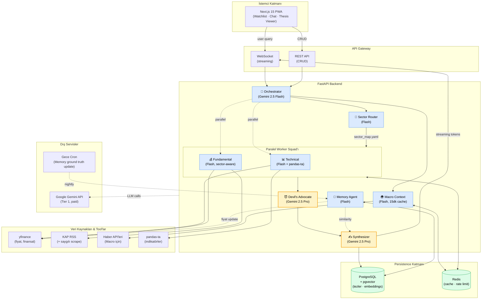
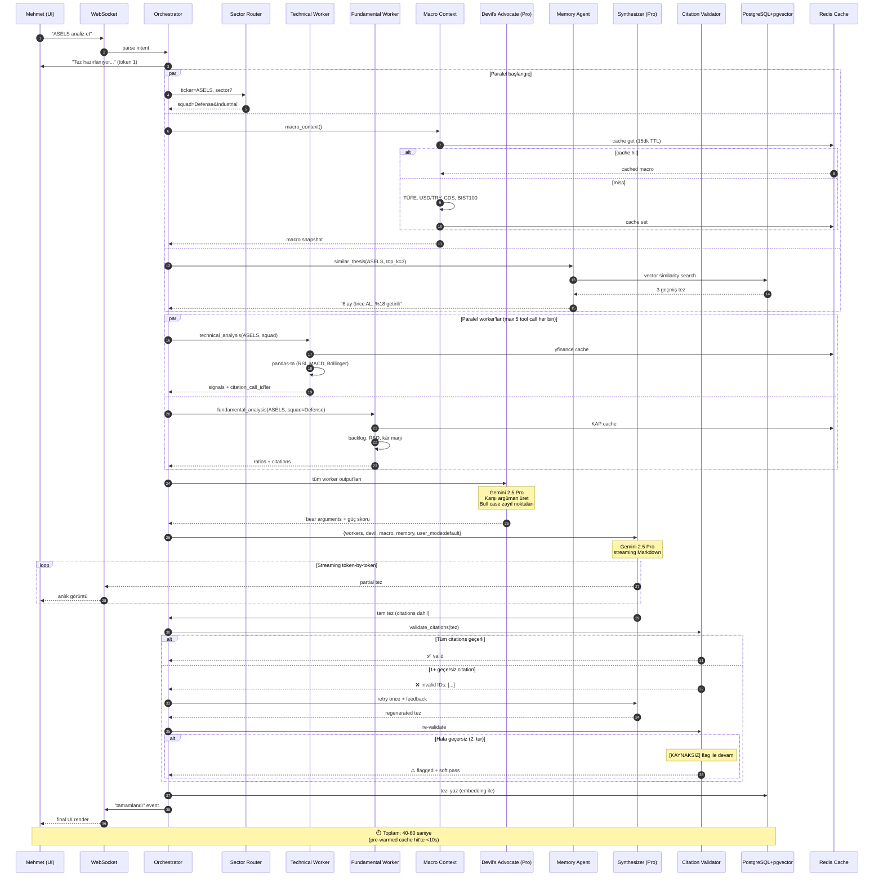
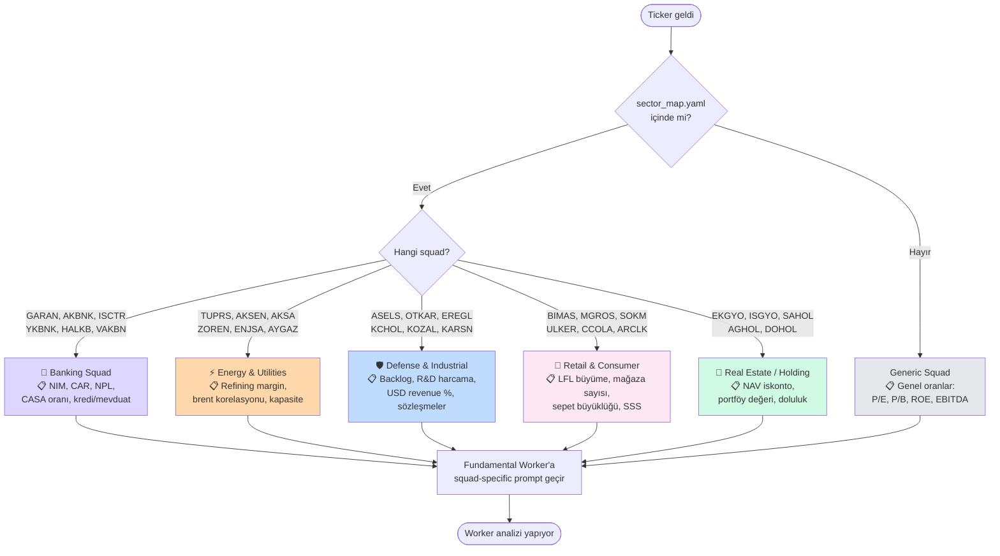
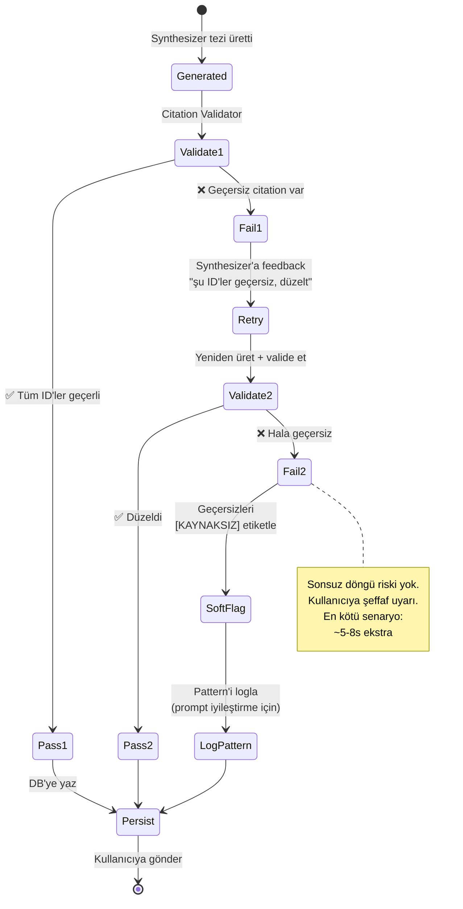
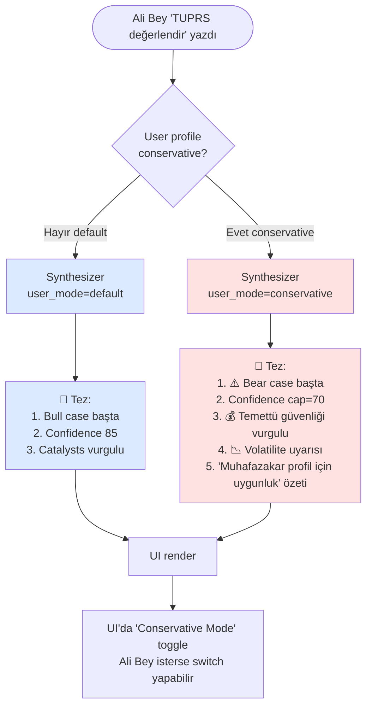
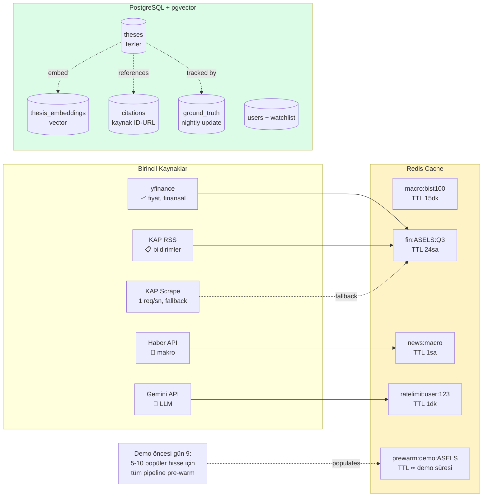
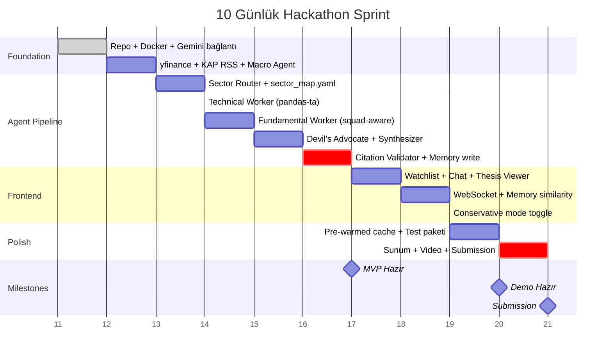
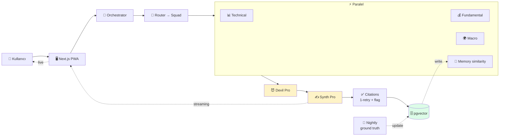

# ThesisForge — Uçtan Uca Akış Şemaları

> Bu dosya, `DECISIONS.md`'deki kararlara göre güncel proje akışını gösterir. Tüm diyagramlar Mermaid formatındadır; GitHub, VSCode (Markdown Preview Mermaid Support eklentisi) ve mermaid.live üzerinde render edilir.
>
> **Toplam ajan: 8** · **Paralel worker: 2** · **Vector store: pgvector** · **Tarih: 2026-05-10**

---

## 1. Üst Seviye Sistem Mimarisi

Kullanıcıdan veriye, ajanlardan persistence'a tüm bileşenler.



**Lejant:**
- 🟡 **Sarı (Gemini 2.5 Pro):** Devil's Advocate + Synthesizer
- 🔵 **Mavi (Gemini 2.5 Flash):** Diğer 6 ajan
- 🟢 **Yeşil:** Persistence

---

## 2. Uçtan Uca Tez Üretim Akışı (Sequence Diagram)

**Senaryo:** Kullanıcı (Mehmet, Persona 1) chat'e *"ASELS analiz et"* yazıyor. Persona default mode (conservative kapalı). Pre-warmed cache miss.



---

## 3. Sector Router & Squad Eşleme

Hangi hissenin hangi squad'a düştüğü, her squad'ın hangi metrikleri sorguladığı.



**Senaryo örnekleri:**
- `GARAN` → Banking → "NIM 4.8%, CAR 16.2%, NPL %2.1, mevduat büyümesi YoY %42"
- `TUPRS` → Energy → "Refining margin $8.2/varil, brent ile 0.78 korelasyon, kapasite kullanım %92"
- `ASELS` → Defense → "Backlog $9.1B (3.2x revenue), R&D %7, USD revenue %58"

---

## 4. Citation Enforcement (1-Retry + Soft Flag)



**Örnek `[KAYNAKSIZ]` çıktı:**
> "ASELS Q3'te %23 büyüdü [KAP-2024-Q3]. Yeni MILGEM sözleşmesi imzalandı [KAYNAKSIZ — doğrulanamadı]. R&D harcaması artıyor [KAP-2024-Q3]."

---

## 5. Memory Agent — Ground Truth & Similarity

İki paralel görev: yazma (real-time) ve okuma (similarity).

```mermaid
flowchart LR
    subgraph WriteFlow["Yazma Akışı (Real-time)"]
        S1[Synthesizer tez bitirdi] --> E1[Embed metni<br/>(text-embedding-3-large)]
        E1 --> W1[(pgvector'e yaz<br/>+ ticker, date, recommendation)]
    end

    subgraph ReadFlow["Okuma Akışı (Synthesizer'dan önce)"]
        Q1[Yeni tez talebi: ASELS] --> E2[Query embed]
        E2 --> S2[(pgvector similarity<br/>top_k=3)]
        S2 --> R1[3 geçmiş tez:<br/>ASELS 6 ay, KCHOL 3 ay, OTKAR 1 ay]
        R1 --> Inject[Synthesizer'a inject:<br/>'son 6 ay önce AL dedik, %18 getirili']
    end

    subgraph CronFlow["Gece Cron Akışı"]
        T1{{02:00 UTC<br/>her gece}} --> Fetch[DB'den tüm açık tezleri çek]
        Fetch --> Loop[Her tez için]
        Loop --> YF[yfinance: tarih sonrası fiyat]
        YF --> Calc[Getiri hesap:<br/>actual_return %]
        Calc --> Update[(DB update:<br/>ground_truth_return)]
        Update --> Loop
    end

    style WriteFlow fill:#fef3c7
    style ReadFlow fill:#dbeafe
    style CronFlow fill:#f3e8ff
```

**Senaryo — Memory inject örneği:**

Mehmet ASELS yazınca, Synthesizer prompt'una şu inject edilir:
```
[MEMORY CONTEXT]
- 6 ay önce ASELS için "AL @ 67₺" dedik. Bugün 79₺. Ground truth: +%18 getiri ✅
- 3 ay önce KCHOL (aynı squad) "TUT" dedik. Ground truth: +%2 getiri ✅
- Hisseyle ilgili tutarlılık: bull tezimiz tarihsel olarak doğrulandı.
```

---

## 6. Conservative Mode Akışı (Persona 3 — Ali Bey)



---

## 7. Veri Kaynakları & Cache Stratejisi



---

## 8. Tam Senaryo Karşılaştırması

Üç farklı kullanıcı, üç farklı akış.

```mermaid
flowchart TB
    subgraph S1["🧑 Senaryo 1: Mehmet (Persona 1) — ASELS"]
        M1[default mode] --> M2[8 ajan tam pipeline]
        M2 --> M3[Memory: 6 ay öncesi AL +%18]
        M3 --> M4[Devil's Pro: Bear güç=orta]
        M4 --> M5[Synth Pro streaming]
        M5 --> M6[⏱️ ~52s · Bull başta]
    end

    subgraph S2["👵 Senaryo 2: Ali Bey (Persona 3) — TUPRS"]
        A1[conservative mode ON] --> A2[Pipeline + user_mode=conservative]
        A2 --> A3[Synthesizer: Bear başa,<br/>confidence cap=70,<br/>temettü vurgulu]
        A3 --> A4[⏱️ ~48s · Bear başta · 💰]
    end

    subgraph S3["⚡ Senaryo 3: Demo Hisse — Pre-warmed"]
        D1[Demo öncesi cache hazır] --> D2[Cache hit: tez instant]
        D2 --> D3[Memory inject still live]
        D3 --> D4[⏱️ <8s · 'wow' factor]
    end

    style S1 fill:#dbeafe
    style S2 fill:#fee2e2
    style S3 fill:#dcfce7
```



---

## 9. Gün-Gün Sprint Akışı (Görselleştirilmiş)



---

## 10. Tüm Sistemin Tek Satırda Özeti



---

## Özet Notlar

1. **Streaming:** Synthesizer (Pro) tokenleri WebSocket üstünden anlık iletir → 60s'de bile kullanıcı 5s'de ilk başlığı görür.
2. **Cache stratejisi:** macro 15dk, finansal 24sa, demo hisseleri pre-warmed ∞.
3. **Resilient citation:** Sonsuz döngü riski yok, max 1 retry, sonra `[KAYNAKSIZ]` flag.
4. **Memory iki yönlü:** Yazma (tez biter bitmez), okuma (yeni tez başlamadan similarity), update (gece cron).
5. **8 ajanın 2'si Pro:** Maliyet-kalite dengesi (Devil's Advocate + Synthesizer kritik kalite noktaları).
6. **Conservative mode:** Tek parametre (`user_mode`), Synthesizer'da branch — bear başta, confidence cap, temettü vurgulu.
