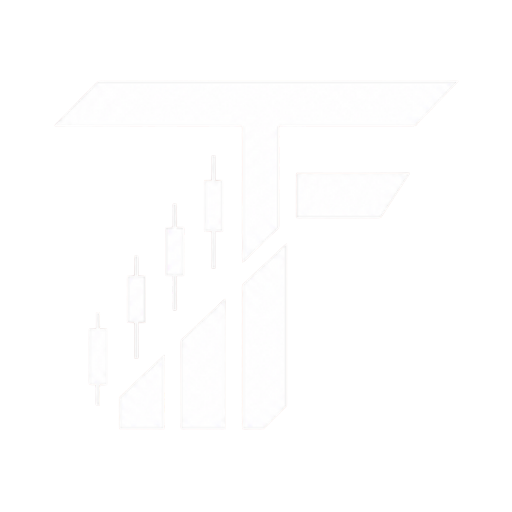
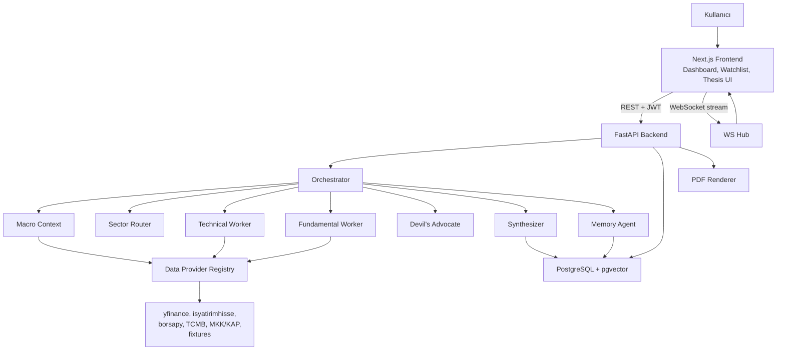
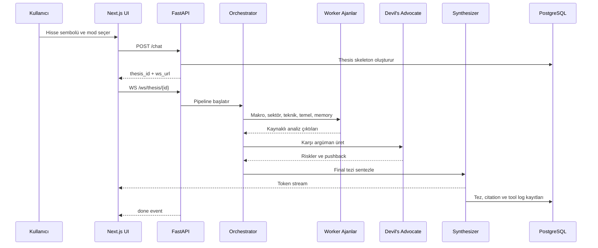

<p align="center">
  
</p>

# ThesisForge

ThesisForge, Borsa İstanbul hisseleri için kaynaklı ve tartışmalı yatırım tezi üreten multi-agent AI uygulamasıdır. Sistem tek bir "al/sat" sinyali vermek yerine teknik analiz, temel analiz, makro bağlam, geçmiş tez hafızası ve karşı argümanları bir araya getirerek kullanıcıya dengeli bir karar zemini sunar.

> ThesisForge bir portföy yönetimi veya otomatik işlem botu değildir. Bilgilendirme ve eğitim amaçlı bir araştırma yardımcısıdır; yatırım tavsiyesi vermez.

## İçindekiler

- [ThesisForge](#thesisforge)
  - [İçindekiler](#i̇çindekiler)
  - [Proje Özeti](#proje-özeti)
  - [Öne Çıkan Özellikler](#öne-çıkan-özellikler)
  - [Problem ve Yaklaşım](#problem-ve-yaklaşım)
  - [Kullanıcı Deneyimi](#kullanıcı-deneyimi)
  - [Ajan Komitesi](#ajan-komitesi)
  - [Güven ve Kaynaklandırma](#güven-ve-kaynaklandırma)
  - [Tez Raporu](#tez-raporu)
  - [Mimari](#mimari)
    - [Tez Üretim Akışı](#tez-üretim-akışı)
  - [Teknoloji Yığını](#teknoloji-yığını)
  - [Kurulum ve Hızlı Başlangıç](#kurulum-ve-hızlı-başlangıç)
    - [Gereksinimler](#gereksinimler)
    - [1. Backend Ortam Dosyasını Hazırla](#1-backend-ortam-dosyasını-hazırla)
    - [2. PostgreSQL ve PgBouncer'ı Başlat](#2-postgresql-ve-pgbouncerı-başlat)
    - [3. Backend'i Kur ve Migration Çalıştır](#3-backendi-kur-ve-migration-çalıştır)
    - [4. Frontend'i Başlat](#4-frontendi-başlat)
    - [5. Uygulamayı Kullan](#5-uygulamayı-kullan)
  - [Ortam Değişkenleri](#ortam-değişkenleri)
  - [API Kullanım Örneği](#api-kullanım-örneği)
  - [Proje Yapısı](#proje-yapısı)
  - [Test ve Kalite](#test-ve-kalite)
  - [Lisans ve Atıf](#lisans-ve-atıf)
  - [Yasal Uyarı](#yasal-uyarı)

## Proje Özeti

Türkiye'deki bireysel yatırımcılar bir hisseyi araştırırken çoğunlukla sosyal medya yorumları, parçalı haberler, tekil teknik indikatörler veya aracı kurum raporları arasında kalır. ThesisForge bu süreci bir yatırım komitesi gibi modeller:

1. Kullanıcı bir BIST sembolü için tez ister.
2. Backend sembolü doğrular, sektörü belirler ve ilgili ajanları çalıştırır.
3. Teknik ve temel analiz paralel üretilir.
4. Devil's Advocate ajanı tezin zayıf noktalarını sorgular.
5. Synthesizer ajanı bull case, bear case, katalizörler, riskler ve güven skorunu tek bir Markdown raporda birleştirir.
6. Her önemli iddia mümkün olduğunca `tool_call_logs` kaydına bağlanır ve citation olarak UI'da gösterilir.

## Öne Çıkan Özellikler

| Özellik | Açıklama |
|---|---|
| Multi-agent tez üretimi | Orchestrator, Macro Context, Sector Router, Technical Worker, Fundamental Worker, Devil's Advocate, Synthesizer ve Memory Agent birlikte çalışır. |
| Citation-grounded çıktı | Tool çağrıları UUID ile loglanır; rapordaki iddialar kaynak kayıtlarıyla eşleştirilir. |
| BIST odaklı veri katmanı | yfinance, isyatirimhisse, borsapy, TCMB EVDS, MKK/KAP ve fixture fallback katmanı kullanılır. |
| Sektör squad mantığı | Bankacılık, enerji, savunma, perakende, gayrimenkul ve generic squad'lar farklı temel metriklere odaklanır. |
| Conservative mode | Daha temkinli kullanıcılar için bear case öne çıkarılır ve güven skoru tavanı uygulanır. |
| Memory layer | Önceki tezler pgvector ile benzerlik aramasına dahil edilir. |
| Canlı stream deneyimi | WebSocket üzerinden ajan adımları ve tez token'ları frontend'e akar. |
| PDF export | Tamamlanan tezler server-side PDF olarak dışarı alınabilir. |

## Problem ve Yaklaşım

Borsa İstanbul tarafında bireysel yatırımcı için veri vardır, fakat veri çoğu zaman parçalıdır. Fiyat grafiği başka yerde, finansal tablo başka yerde, KAP bildirimi başka yerde, makro veri başka yerde, yorum ve haber akışı ise çoğunlukla bağlamdan kopuktur. Bu durum kullanıcıyı iki uçtan birine iter: ya tek bir göstergeye aşırı güvenir ya da çok fazla kaynağın arasında karar veremeden kalır.

ThesisForge bu problemi "tek cevap veren bot" olarak değil, "tartışmalı araştırma masası" olarak ele alır. Bir hisse için yalnızca olumlu tarafları sıralamaz; teknik görünümü, temel verileri, sektör bağlamını, makro şartları, geçmiş benzer tezleri ve karşı argümanları aynı raporda toplar. Kullanıcıya hazır bir karar dayatmak yerine, kararını daha bilinçli verebilmesi için kanıtları, belirsizlikleri ve riskleri görünür kılar.

Ürünün temel ayrımı burada başlar: ThesisForge bir sinyal üreticisi değil, tez üreticisidir. Çıktının hedefi "AL" veya "SAT" demek değil; "bu hisse hakkında hangi argümanlar güçlü, hangi varsayımlar kırılgan, hangi veriler kaynaklı, hangi noktalar dikkat gerektiriyor?" sorularını yanıtlamaktır.

## Kullanıcı Deneyimi

Uygulama iki ana yüzeyden oluşur: pazarlama/ürün anlatımı ve giriş sonrası yatırım araştırma paneli. Giriş yapan kullanıcı watchlist oluşturabilir, BIST şirketlerini arayabilir, yeni bir tez başlatabilir ve geçmiş tezlerini inceleyebilir.

Tez üretim ekranında kullanıcı bir hisse sembolü ve mod seçer. Default mode dengeli bir bull/bear anlatımı üretir. Conservative mode ise daha temkinli kullanıcılar için riskleri öne çıkarır, bear case'i daha görünür yapar ve güven skorunun aşırı yükselmesini engeller.

Pipeline çalışırken kullanıcı boş bir bekleme ekranı görmez. WebSocket akışı üzerinden ajanların hangi aşamada olduğu, hangi analiz parçalarının tamamlandığı ve final rapor token'ları canlı olarak UI'a akar. Tez tamamlandığında kullanıcı raporu okuyabilir, kaynak/citation detaylarını inceleyebilir, geçmiş tezlerle kıyaslayabilir ve isterse PDF çıktısı alabilir.

## Ajan Komitesi

ThesisForge ajanları bir yatırım komitesi rol dağılımıyla çalışır. Her ajan aynı hisseye farklı bir açıdan bakar ve final tez tek bir sentez katmanında toplanır.

| Ajan | Rol | Çıktıya Katkısı |
|---|---|---|
| Orchestrator | Süreci koordine eder | Ticker doğrulama, mod seçimi, paralel görev dağıtımı ve pipeline yönetimi. |
| Sector Router | Sektörü belirler | Hisseyi ilgili squad'a yönlendirir; bankacılık, enerji, savunma gibi sektör odaklarını seçer. |
| Macro Context | Makro resmi çıkarır | Faiz, kur, enflasyon, endeks ve genel piyasa bağlamını rapora taşır. |
| Technical Worker | Teknik analiz yapar | Fiyat geçmişi, momentum, destek/direnç, indikatör ve göreceli güç sinyallerini üretir. |
| Fundamental Worker | Temel analiz yapar | Finansallar, rasyolar, KAP/MKK verileri, temettü ve sektör karşılaştırmasını işler. |
| Devil's Advocate | Tezi sorgular | Teknik ve temel argümanlardaki zayıf noktaları, karşı kanıtları ve baz oran risklerini çıkarır. |
| Synthesizer | Nihai raporu yazar | Bull case, bear case, katalizörler, riskler, güven skoru ve disclaimer içeren Markdown tezi üretir. |
| Memory Agent | Geçmiş tezleri hatırlar | Benzer geçmiş tezleri pgvector ile bulur ve tarihsel bağlam sağlar. |

Bu yapı, tek modelden gelen düz bir metin yerine, farklı görevlerde uzmanlaşmış ajanların kontrollü biçimde katkı verdiği bir araştırma akışı sağlar.

## Güven ve Kaynaklandırma

Finansal metinlerde en büyük risklerden biri modelin sayı veya iddia uydurmasıdır. ThesisForge bu riski azaltmak için citation-grounded bir yapı kullanır. Veri sağlayıcılardan gelen her önemli tool çağrısı `tool_call_logs` tablosuna UUID `call_id` ile kaydedilir. Worker ajanları gözlemlerini bu çağrılara bağlar; Synthesizer final raporda kaynak referanslarını korur.

Citation sistemi dört prensibe dayanır:

1. Her veri çağrısı loglanır.
2. Worker çıktıları serbest metin yerine yapılandırılmış şemalarla taşınır.
3. Final rapordaki kaynak etiketleri tool log kayıtlarıyla doğrulanır.
4. Doğrulanamayan iddialar sessizce saklanmaz; `[KAYNAKSIZ]` gibi görünür işaretlerle kullanıcıya gösterilir.

Veri katmanında da benzer bir güvenlik yaklaşımı vardır. Canlı kaynaklar bozulduğunda veya rate limit'e takıldığında provider chain primary kaynaktan secondary kaynağa, oradan fixture fallback'e geçebilir. Bu sayede demo ve test ortamlarında pipeline tamamen canlı internete bağımlı kalmaz.

## Tez Raporu

Final rapor kullanıcının hızlı okuyabileceği ama gerektiğinde derine inebileceği şekilde tasarlanır.

| Bölüm | Amaç |
|---|---|
| TL;DR | Hissenin mevcut tezini kısa ve anlaşılır biçimde özetler. |
| Bull Case | Olumlu senaryoyu, güçlü verileri ve potansiyel destekleyici faktörleri açıklar. |
| Bear Case | Riskleri, zayıf varsayımları ve karşıt argümanları görünür yapar. |
| Anahtar Katalizörler | Yakın dönem olayları, bilanço, KAP, sektör veya makro tetikleyicileri listeler. |
| Tarihsel Bağlam | Memory Agent'ın bulduğu benzer geçmiş tezleri ve sonuçlarını gösterir. |
| Güven Skoru | Veri kalitesi, teknik/temel skor, makro uyum ve karşı argüman gücünden oluşan açıklanabilir skor üretir. |
| Kaynaklar ve Disclaimer | Citation detaylarını ve yatırım tavsiyesi olmadığını açıkça belirtir. |

## Mimari

ThesisForge üç ana parça üzerinde çalışır: Next.js frontend, FastAPI backend ve PostgreSQL/pgvector veri katmanı. Lokal geliştirmede Docker Compose yalnızca PostgreSQL ve PgBouncer altyapısını ayağa kaldırır; backend ve frontend ayrı dev server olarak çalıştırılır.



### Tez Üretim Akışı



## Teknoloji Yığını

| Katman | Teknolojiler |
|---|---|
| Frontend | Next.js 16, React 19, TypeScript, Tailwind CSS 4, shadcn-style UI, Recharts/ECharts, Framer Motion |
| Backend | Python 3.11+, FastAPI, Uvicorn, Pydantic v2, SQLAlchemy async, Alembic |
| Agent runtime | Strands Agents, Gemini modelleri, Pydantic structured output |
| Veri | yfinance, isyatirimhisse, borsapy, pandas-ta, TCMB EVDS, MKK/KAP, fixture store |
| Veritabanı | PostgreSQL 16, pgvector, PgBouncer |
| Auth | Email/şifre, bcrypt, JWT access/refresh token |
| Export | Markdown rapor, WeasyPrint tabanlı PDF çıktı |

## Kurulum ve Hızlı Başlangıç

Bu bölüme kadar olan kısım projenin ne yaptığını ve nasıl çalıştığını anlatır. Aşağıdaki adımlar projeyi kendi makinesinde çalıştırmak isteyen geliştiriciler içindir.

### Gereksinimler

- Python 3.11 veya üzeri
- Node.js ve npm
- Docker Desktop veya Docker Engine + Compose
- Gemini API anahtarı
- Opsiyonel: TCMB EVDS, MKK API anahtarları

### 1. Backend Ortam Dosyasını Hazırla

```bash
cp backend/.env.example backend/.env
```

`backend/.env` içinde en az şu alanları doldurun:

```env
ENV=dev
THESISFORGE_MODE=live
CACHE_BACKEND=memory
DATABASE_URL=postgresql+asyncpg://tf:tf@localhost:5433/thesisforge
GEMINI_API_KEY=...
GEMINI_MODEL_PRO=gemini-2.5-flash
GEMINI_MODEL_FLASH=gemini-2.5-flash
GEMINI_EMBED_MODEL=text-embedding-004
GEMINI_EMBED_DIMENSIONS=768
```

Not: Gemini free tier'da `gemini-2.5-pro` kotası sınırlı olabilir. Lokal demo için `GEMINI_MODEL_PRO=gemini-2.5-flash` kullanmak daha stabil bir başlangıç sağlar.

### 2. PostgreSQL ve PgBouncer'ı Başlat

```bash
docker compose up -d postgres pgbouncer
```

Servisler:

| Servis | Lokal adres |
|---|---|
| PostgreSQL | `localhost:5433` |
| PgBouncer | `localhost:6432` |

Varsayılan `DATABASE_URL` doğrudan PostgreSQL portu olan `5433` ile çalışır. PgBouncer kullanmak isterseniz `backend/.env` içinde `localhost:6432` yazabilirsiniz.

### 3. Backend'i Kur ve Migration Çalıştır

```bash
cd backend
python3 -m venv .venv
source .venv/bin/activate
pip install -e ".[dev]"
alembic upgrade head
DYLD_FALLBACK_LIBRARY_PATH=/opt/homebrew/lib uvicorn app.main:app --host 127.0.0.1 --port 8000 --workers 1 --log-level info
```

PDF export WeasyPrint kullanır. macOS/Homebrew ortamında Pango dylib'leri
bulunamazsa `brew install pango` çalıştırın ve backend'i yukarıdaki
`DYLD_FALLBACK_LIBRARY_PATH` ile başlatın.

Sağlık kontrolü:

```bash
curl -sS http://127.0.0.1:8000/health
```

Beklenen yanıt:

```json
{"status":"ok","env":"dev"}
```

### 4. Frontend'i Başlat

Ayrı bir terminalde:

```bash
cd frontend
npm install
npm run dev
```

Frontend varsayılan olarak `http://localhost:3003` adresinde çalışır. Backend adresi değiştiyse `frontend/.env.local` içinde şu değerleri kullanabilirsiniz:

```env
NEXT_PUBLIC_API_BASE_URL=http://localhost:8000
NEXT_PUBLIC_WS_BASE_URL=ws://localhost:8000
NEXT_PUBLIC_USE_MOCKS=0
```

### 5. Uygulamayı Kullan

1. Tarayıcıda `http://localhost:3003` adresini açın.
2. Kayıt olun veya giriş yapın.
3. `/app/thesis/new` ekranından `ASELS`, `GARAN`, `TUPRS` gibi bir sembol için tez üretin.
4. Tamamlanan tezleri geçmiş, watchlist ve detay ekranlarından inceleyin.

## Ortam Değişkenleri

Backend ayarları `backend/app/core/config.py` üzerinden okunur. Backend önce repo kökündeki `.env.probe`, sonra `backend/.env` dosyasını okur; aynı anahtar iki dosyada varsa `backend/.env` daha önceliklidir.

| Değişken | Zorunlu | Açıklama |
|---|---:|---|
| `ENV` | Hayır | `dev`, `demo` veya `production`. |
| `THESISFORGE_MODE` | Hayır | `live` veya `fixture`. Fixture modu canlı veri yerine fixture katmanını kullanır. |
| `DATABASE_URL` | Evet | Async SQLAlchemy PostgreSQL bağlantısı. |
| `GEMINI_API_KEY` | Evet | Agent pipeline için Google Gemini anahtarı. |
| `GEMINI_MODEL_PRO` | Hayır | Devil's Advocate ve Synthesizer modeli. |
| `GEMINI_MODEL_FLASH` | Hayır | Daha hızlı ajanlar için model. |
| `GEMINI_EMBED_MODEL` | Hayır | Memory embedding modeli. |
| `TCMB_EVDS_KEY` | Hayır | Makro veri için TCMB EVDS anahtarı. Boş kalırsa fallback devreye girer. |
| `MKK_API_KEY`, `MKK_API_SECRET` | Hayır | MKK/KAP structured veri için kullanılır. |
| `CACHE_BACKEND` | Hayır | Şu an lokal için `memory`; Redis destekli deploy için `redis`. |
| `JWT_SECRET` | Production'da evet | JWT imzalama anahtarı. Production'da mutlaka değiştirilmelidir. |

## API Kullanım Örneği

Frontend login akışı token yönetimini otomatik yapar. API'yi elle denemek için önce kullanıcı oluşturup access token alın:

```bash
TOKEN=$(curl -sS -X POST http://127.0.0.1:8000/api/auth/register \
  -H "Content-Type: application/json" \
  -d '{"email":"demo@example.com","password":"demo-pass-123","name":"Demo"}' \
  | jq -r .access_token)
```

Eğer kullanıcı zaten varsa login endpoint'ini kullanın:

```bash
TOKEN=$(curl -sS -X POST http://127.0.0.1:8000/api/auth/login \
  -H "Content-Type: application/json" \
  -d '{"email":"demo@example.com","password":"demo-pass-123"}' \
  | jq -r .access_token)
```

Tez pipeline'ını başlatma:

```bash
curl -sS -X POST http://127.0.0.1:8000/chat \
  -H "Authorization: Bearer $TOKEN" \
  -H "Content-Type: application/json" \
  -d '{"message":"ASELS analiz et","ticker":"ASELS","mode":"default"}'
```

Yanıt `thesis_id` ve `ws_url` döndürür. WebSocket stream:

```bash
wscat -c "ws://127.0.0.1:8000/ws/thesis/<THESIS_ID>"
```

Tamamlanan tezi alma:

```bash
curl -sS http://127.0.0.1:8000/api/thesis/<THESIS_ID> \
  -H "Authorization: Bearer $TOKEN"
```

Ana endpoint'ler:

| Endpoint | Metot | Auth | Amaç |
|---|---|---:|---|
| `/health` | GET | Hayır | Backend sağlık kontrolü. |
| `/api/auth/register` | POST | Hayır | Yeni kullanıcı ve token üretimi. |
| `/api/auth/login` | POST | Hayır | Access/refresh token alma. |
| `/api/auth/me` | GET | Evet | Aktif kullanıcı bilgisi. |
| `/chat` | POST | Evet | Yeni tez pipeline'ı başlatır. |
| `/ws/thesis/{id}` | WS | Hayır | Tez event/token stream'i. |
| `/api/theses` | GET | Evet | Kullanıcı tez geçmişi. |
| `/api/thesis/{id}` | GET | Evet | Tek tez detayı. |
| `/api/thesis/{id}/citations` | GET | Evet | Citation ve tool result bilgileri. |
| `/api/thesis/{id}/pdf` | GET | Evet | Tezi PDF olarak döndürür. |
| `/api/watchlist` | GET/POST | Evet | Kullanıcı watchlist'i. |
| `/api/companies` | GET | Hayır | BIST sembol arama ve filtreleme. |
| `/api/market/history/{ticker}` | GET | Hayır | Fiyat geçmişi. |
| `/api/market/quote/{ticker}` | GET | Hayır | Güncel fiyat özeti. |

## Proje Yapısı

```text
.
├── backend/
│   ├── app/
│   │   ├── agents/          # Orchestrator, worker'lar, prompts, runtime
│   │   ├── api/             # FastAPI REST ve WebSocket router'ları
│   │   ├── citations/       # Citation doğrulama ve numaralandırma
│   │   ├── core/            # Config, logging, security
│   │   ├── data/            # Provider registry, cache, fixtures
│   │   ├── db/              # SQLAlchemy modelleri, repo, session
│   │   └── pdf/             # Server-side PDF render
│   ├── alembic/             # Migration dosyaları
│   ├── fixtures/            # Demo/fallback veri snapshot'ları
│   ├── scripts/             # Smoke, seed, backtest ve demo yardımcıları
│   └── tests/               # Unit ve integration testleri
├── frontend/
│   ├── src/app/             # Next.js App Router sayfaları
│   ├── src/components/      # Uygulama, shell, marketing ve UI bileşenleri
│   ├── src/lib/             # API client, auth, adapters, mock data, websocket
│   └── public/              # Logo ve statik varlıklar
├── docs/                    # Ürün, mimari, veri, test, demo ve roadmap dokümanları
├── scripts/product/         # Provider'ların wrap ettiği veri toplama modülleri
├── docker-compose.yml       # Postgres + PgBouncer
└── mkk_companies.csv        # BIST şirket listesi
```

## Test ve Kalite

Backend testleri:

```bash
cd backend
source .venv/bin/activate
pytest tests/unit -v
pytest tests/integration -v
```

Frontend kontrolleri:

```bash
cd frontend
npm run lint
npm run build
```

Gerçek LLM ve canlı provider kullanan smoke testleri kota ve ağ durumuna bağlıdır. Demo öncesi önce fixture/live ayarlarını, sonra Gemini quota durumunu kontrol edin.

## Lisans ve Atıf

Bu proje BTK Hackathon 2026 kapsamında geliştirilmiştir. Kullanılan ana açık kaynak paketler ve servisler:

- `fastapi`, `uvicorn`, `sqlalchemy`, `alembic`
- `next`, `react`, `tailwindcss`
- `strands-agents`, `google-genai`
- `yfinance`, `isyatirimhisse`, `borsapy`, `pandas-ta`
- `pgvector`, `weasyprint`

`borsa-mcp` projesi endpoint ve veri katmanı araştırmasında referans olarak incelenmiştir; bu repoya kod kopyalanmamıştır.

## Yasal Uyarı

ThesisForge tarafından üretilen raporlar bilgi, eğitim ve araştırma amaçlıdır. Uygulama SPK lisanslı yatırım danışmanlığı hizmeti sunmaz, al/sat tavsiyesi vermez ve finansal sonuç garantisi sağlamaz. Yatırım kararları kullanıcının kendi sorumluluğundadır; gerekirse lisanslı bir yatırım danışmanından destek alınmalıdır.
