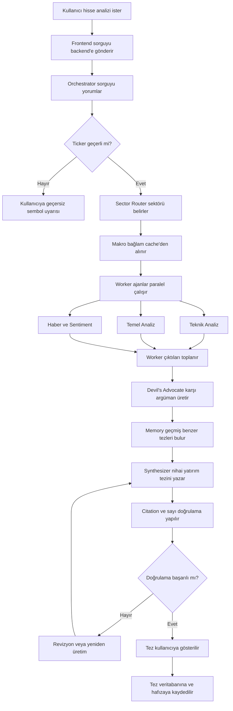

# ThesisForge Proje Raporu

## 1. Projenin Genel Mantığı

### 1.1 Kısa özet

ThesisForge, bireysel yatırımcıların bir hisse senedi hakkında daha dengeli, kaynaklı ve çok yönlü bir yatırım tezi oluşturmasına yardımcı olan yapay zeka destekli bir karar destek sistemidir.

Projenin temel fikri, profesyonel yatırım komitelerinde görülen çok perspektifli değerlendirme sürecini yazılım ortamına taşımaktır. Sistem tek bir cevap üretmek yerine teknik analiz, temel analiz, haber/sentiment analizi, makro görünüm, geçmiş tez hafızası ve karşı argüman üretimi gibi farklı bakış açılarını bir araya getirir. Sonuçta kullanıcıya "al" veya "sat" gibi doğrudan emir veren bir yapı değil, bull case, bear case, katalizörler, riskler, kaynaklar ve güven skoru içeren açıklanabilir bir yatırım tezi sunulur.

Bu yaklaşımın ana değeri şudur: Kullanıcı sosyal medya, haber siteleri, KAP bildirimleri, finansal tablolar ve grafikler arasında dağılmış bilgiyi tek başına yorumlamak zorunda kalmaz. ThesisForge bu verileri toplar, yapılandırır, farklı ajanlar üzerinden tartıştırır ve anlaşılır bir karar destek raporuna dönüştürür.

### 1.2 Çözülmek istenen problem

Türkiye'de bireysel yatırımcı sayısı son yıllarda ciddi şekilde artmıştır. Ancak bu yatırımcıların önemli bir kısmı finansal tablo okuma, KAP bildirimi yorumlama, teknik gösterge değerlendirme, haber etkisini ölçme ve riskleri ayrıştırma konusunda yeterli deneyime sahip değildir.

Mevcut durumda yatırımcılar genellikle şu kaynaklara başvurur:

| Kullanılan yöntem | Temel sorun |
|---|---|
| Sosyal medya ve Telegram grupları | Manipülasyona, söylentiye ve pump-dump etkisine açıktır. |
| YouTube ve influencer içerikleri | Çıkar çatışması, gecikmiş bilgi ve yüzeysel yorum riski taşır. |
| Aracı kurum raporları | Genellikle tek kurum perspektifidir, her yatırımcı için erişilebilir veya güncel olmayabilir. |
| Kendi araştırması | Zaman, finansal okuryazarlık ve veri birleştirme becerisi gerektirir. |
| Genel amaçlı yapay zeka araçları | Türk piyasasına özel veri araçları, kaynak zorunluluğu ve yatırım tezi hafızası olmayabilir. |

Asıl problem tek bir veriye ulaşamamak değil, çok sayıdaki veriyi doğru bağlama oturtup dengeli bir yatırım tezi oluşturabilmektir. ThesisForge bu nedenle yalnızca bilgi toplayan bir sistem değil, yatırım fikrini farklı açılardan sınayan bir analiz komitesi olarak tasarlanmalıdır.

### 1.3 Proje ne için kullanılacak?

ThesisForge aşağıdaki kullanım amaçlarına hizmet eder:

| Kullanım alanı | Açıklama |
|---|---|
| Hisse araştırması | Kullanıcı belirli bir BIST hissesi için yapılandırılmış yatırım tezi alır. |
| Watchlist takibi | Kullanıcının takip ettiği hisseler belirli aralıklarla yeniden değerlendirilir. |
| Risk farkındalığı | Sistem yalnızca olumlu argümanları değil, karşı argümanları ve zayıf noktaları da gösterir. |
| Eğitim ve finansal okuryazarlık | Kullanıcı neden-sonuç ilişkisini, hangi verinin hangi yoruma yol açtığını görür. |
| Analist ön çalışması | Junior analistler veya finans öğrencileri ilk araştırma taslağını hızlıca çıkarabilir. |
| Karar destek | Kullanıcı nihai kararı kendisi verir, sistem karar sürecini daha bilinçli hale getirir. |

### 1.4 Proje ne değildir?

ThesisForge'un regülasyon, güven ve ürün konumlandırması açısından sınırları net çizilmelidir:

| ThesisForge değildir | ThesisForge olmalıdır |
|---|---|
| Kullanıcı yerine işlem yapan bot | Kullanıcıya bilgi ve analiz sunan karar destek sistemi |
| Kesin fiyat tahmin makinesi | Varsayımlara dayalı yatırım tezi üretici |
| "Al", "sat", "tut" emri veren danışman | Bull case, bear case, risk ve katalizör gösteren analiz aracı |
| Kaynaksız yorum üreten black-box sistem | Her önemli iddiayı kaynağa bağlayan açıklanabilir sistem |
| Kısa vadeli HFT veya intraday işlem aracı | Orta vadeli araştırma, swing trade ve uzun vadeli yatırım destek aracı |

Bu ayrım önemlidir. Finansal ürünlerde kullanıcıya doğrudan yatırım tavsiyesi vermek regülasyon riski doğurabilir. Bu nedenle ürün dili "tavsiye" değil, "bilgi amaçlı analiz" ve "yatırım tezi" ekseninde kurulmalıdır.

### 1.5 Hedef kullanıcılar

#### Bireysel yatırımcı

Bu kullanıcı BIST'te işlem yapar, birkaç hisseden oluşan portföyü vardır, ancak her hisse için detaylı araştırmaya yeterli zamanı yoktur. ThesisForge ona hızlı, kaynaklı ve dengeli bir özet sağlar.

#### Finans öğrencisi veya junior analist

Bu kullanıcı finansal analiz öğrenmekte veya profesyonel analiz üretmeye çalışmaktadır. ThesisForge onun için araştırma başlangıç noktası, kör nokta kontrolü ve tez taslağı üreticisi olarak çalışır.

#### Koruyucu yatırımcı

Bu kullanıcı özellikle riskleri görmek ister. Temettü, bilanço kalitesi, borçluluk, makro riskler ve kötü senaryo analizi onun için ön plandadır. ThesisForge içinde "conservative mode" gibi bir kullanım modu bu kullanıcıya uygun olabilir.

#### Kurumsal potansiyel kullanıcı

Aracı kurumlarda, portföy yönetim şirketlerinde veya araştırma ekiplerinde çalışan junior analistler sistemi sabah toplantısı hazırlığı, hızlı brifing ve ilk taslak üretimi için kullanabilir. Bu, uzun vadede B2B gelir modeline dönüşebilir.

### 1.6 Sistemin üreteceği ana çıktı

Kullanıcı bir hisse sorduğunda sistemin nihai çıktısı şu başlıklardan oluşmalıdır:

1. Kısa özet
2. Bull case
3. Bear case
4. Anahtar katalizörler
5. Teknik görünüm
6. Temel görünüm
7. Haber ve sentiment özeti
8. Makro bağlam
9. Geçmiş benzer tezlerle karşılaştırma
10. Risk uyarıları
11. Güven skoru ve skorun nasıl hesaplandığı
12. Kaynaklar
13. "Yatırım tavsiyesi değildir" uyarısı

Buradaki kritik nokta, raporun yalnızca güzel yazılmış bir metin olmamasıdır. Her iddia mümkün olduğunca kaynak, araç çıktısı veya veri noktasıyla ilişkilendirilmelidir.

## 2. Örnek Kullanıcı Akışı

### 2.1 Örnek senaryo

Kullanıcı uygulamaya girer ve şu sorguyu yazar:

```text
ASELS için güncel yatırım tezini çıkar.
```

Sistem aşağıdaki işlemleri yürütür:

1. Kullanıcı sorgusu alınır.
2. Hisse sembolü doğrulanır.
3. Hissenin sektörü belirlenir.
4. İlgili sektör ajan grubu seçilir.
5. Makro ekonomik bağlam yüklenir.
6. Teknik analiz ajanı fiyat/hacim verilerini inceler.
7. Temel analiz ajanı finansal tabloları, oranları ve KAP bildirimlerini inceler.
8. Haber ve sentiment ajanı son haberleri ve piyasa algısını değerlendirir.
9. Devil's Advocate ajanı diğer ajanların iddialarını sorgular.
10. Memory ajanı geçmiş benzer tezleri ve sonuçlarını kontrol eder.
11. Synthesizer ajanı tüm çıktıları tek raporda birleştirir.
12. Citation validator her önemli iddianın kaynağını kontrol eder.
13. Nihai tez kullanıcıya gösterilir ve veritabanına kaydedilir.

### 2.2 Örnek akış şeması



### 2.3 Ekranda beklenen kullanıcı deneyimi

İyi bir demo deneyimi için kullanıcı yalnızca final raporu bekleyen pasif bir ekranda kalmamalıdır. Ajanların çalışma süreci canlı gösterilirse ürün daha anlaşılır olur.

Önerilen kullanıcı deneyimi:

| Zaman | Kullanıcıya gösterilecek durum |
|---|---|
| 0-1 saniye | "Komite toplanıyor" mesajı, ticker doğrulama |
| 1-3 saniye | Seçilen sektör ve makro özet |
| 3-10 saniye | Teknik, temel ve sentiment ajanlarının canlı durumları |
| 10-15 saniye | Devil's Advocate'in bulduğu zayıf noktalar |
| 15-20 saniye | Geçmiş tez hafızası ve benzer örnekler |
| 20+ saniye | Nihai raporun parça parça ekrana yazılması |

Bu yaklaşım hem bekleme süresini daha kabul edilebilir hale getirir hem de ürünün "çok ajanlı komite" fikrini görsel olarak güçlendirir.

## 3. Genel Ürün Mantığı

### 3.1 Temel ürün fikri

ThesisForge'un ana iddiası şudur:

> Bireysel yatırımcı, tek bir yapay zeka cevabı yerine, farklı uzman rollerinin tartışmasından oluşan kaynaklı ve dengeli bir yatırım tezi görmelidir.

Bu nedenle sistemin merkezinde "multi-agent investment committee" fikri vardır. Her ajan farklı bir uzmanlığı temsil eder:

| Ajan | Rol |
|---|---|
| Orchestrator | Süreci yönetir, görevi böler, çıktıları toplar. |
| Sector Router | Hissenin sektörünü belirler ve doğru uzman grubunu seçer. |
| Macro Context Agent | Faiz, kur, enflasyon, BIST genel görünümü gibi makro bağlamı sağlar. |
| Technical Analyst | Fiyat, hacim, trend ve indikatörleri analiz eder. |
| Fundamental Analyst | Finansal tablolar, oranlar, değerleme ve KAP bildirimlerini inceler. |
| Sentiment & News Analyst | Haber akışı ve piyasa algısını değerlendirir. |
| Devil's Advocate | Diğer ajanların iddialarına karşı argüman üretir. |
| Memory Agent | Geçmiş tezleri ve benzer pattern sonuçlarını hatırlar. |
| Synthesizer | Tüm çıktıları kullanıcıya okunabilir nihai rapora dönüştürür. |
| Backtest Validator | Geçmiş tarihli simülasyonlarla sistemin iddialarını test eder. |

### 3.2 Neden multi-agent yaklaşımı mantıklı?

Tek bir büyük modelden "ASELS analiz et" yanıtı almak hızlıdır, ancak ciddi riskler taşır:

- Model hangi veriye dayandığını açıkça göstermeyebilir.
- Olumlu veya olumsuz tek taraflı yorum yapabilir.
- Teknik, temel ve haber verilerini birbirine karıştırabilir.
- Riskleri yeterince ayrıştırmayabilir.
- Kullanıcıya güven veren ama doğruluğu belirsiz cümleler üretebilir.

Multi-agent yaklaşımı bu riskleri azaltır. Her ajan belirli bir görevden sorumlu olur. Teknik analiz ajanı sadece fiyat ve indikatörlere, temel analiz ajanı finansal kaliteye, sentiment ajanı haber akışına, Devil's Advocate ise zayıf noktalara odaklanır. Synthesizer bu parçaları birleştirir.

Bu tasarım, ürünün değer önerisini güçlendirir: "Yapay zeka tek başına tahmin yaptı" algısı yerine "bir yatırım komitesi farklı açılardan tartıştı" algısı oluşur.

### 3.3 Başarılı ürün için temel ilkeler

ThesisForge'un güvenilir olması için şu ilkeler korunmalıdır:

| İlke | Açıklama |
|---|---|
| Kaynaklılık | Her önemli sayı ve iddia kaynakla ilişkilendirilmeli. |
| Dengelilik | Bull case ve bear case birlikte sunulmalı. |
| Açıklanabilirlik | Güven skoru ve sonuç mantığı açık olmalı. |
| Regülasyon duyarlılığı | Sistem doğrudan yatırım tavsiyesi dili kullanmamalı. |
| Veri tazeliği | Kullanıcı hangi verinin hangi tarihli olduğunu görmeli. |
| Belirsizlik yönetimi | Sistem emin olmadığı konularda bunu açıkça söylemeli. |
| Hafıza | Geçmiş tezler saklanmalı ve zamanla performans ölçülmeli. |

## 4. Teknik Detaylar

### 4.1 Önerilen üst seviye mimari

Sistem katmanlı bir mimariyle tasarlanmalıdır:

```text
Frontend
  Next.js PWA, dashboard, tez görüntüleyici, watchlist, canlı ajan durumu

API ve Uygulama Katmanı
  FastAPI, REST endpoint'leri, WebSocket stream, kimlik doğrulama

Agent Orchestration Katmanı
  Strands Agents, Orchestrator, sektör router, worker ajanlar, synthesizer

Data ve Tool Katmanı
  KAP, yfinance, TCMB EVDS, haber kaynakları, teknik indikatör hesaplayıcıları

Persistence Katmanı
  PostgreSQL, pgvector veya ChromaDB, Redis, obje depolama

Observability ve Güvenlik
  Loglama, trace, tool call kayıtları, rate limit, audit trail
```

Bu mimari hem hackathon demosu için sadeleştirilebilir hem de ileride üretim ortamına taşınabilecek şekilde genişletilebilir.

### 4.2 Teknoloji yığını

| Katman | Önerilen teknoloji | Kullanım amacı |
|---|---|---|
| Frontend | Next.js | Dashboard, PWA, server rendering ve modern web deneyimi |
| UI | Tailwind CSS, shadcn/ui | Hızlı ve tutarlı arayüz geliştirme |
| Grafikler | Recharts veya TradingView widget | Fiyat grafiği, indikatör ve performans gösterimi |
| Backend | Python 3.11+, FastAPI | API, WebSocket, async iş akışı |
| Agent framework | Strands Agents | Multi-agent orkestrasyon |
| LLM provider | Gemini Flash/Pro veya eşdeğer modeller | Ajan muhakemesi ve rapor üretimi |
| Veri işleme | pandas | Finansal veri temizleme ve hesaplama |
| Teknik analiz | TA-Lib veya pandas-ta | RSI, MACD, ATR, Bollinger gibi indikatörler |
| HTTP istemci | httpx | Harici veri kaynaklarına async erişim |
| Scraping | BeautifulSoup4 | Haber ve KAP sayfalarından veri çıkarma |
| Veritabanı | PostgreSQL | Kullanıcı, watchlist, tez, kaynak ve log kayıtları |
| Vektör arama | pgvector veya ChromaDB | Geçmiş tezlerin anlamsal benzerlik araması |
| Cache/Queue | Redis | Cache, rate limit, ajan durumu, pub/sub |
| Gözlemlenebilirlik | OpenTelemetry, structlog | Agent trace, tool log ve hata takibi |
| Deploy | Docker Compose, Vercel, Railway/Fly.io, Supabase, Upstash | Demo ve üretime yakın dağıtım |

Not: Vektör veritabanı için hem ChromaDB hem pgvector aynı anda kullanılırsa mimari gereksiz karmaşıklaşabilir. MVP aşamasında PostgreSQL + pgvector seçmek daha sade olabilir. ChromaDB daha hızlı prototipleme için tercih edilecekse PostgreSQL tarafında ayrıca pgvector kullanmaya gerek olmayabilir.

### 4.3 Backend mimarisi

Backend'in ana sorumlulukları şunlardır:

1. Kullanıcı sorgularını almak.
2. Hisse sembolünü doğrulamak.
3. Agent pipeline'ı başlatmak.
4. Harici veri araçlarını güvenli şekilde çağırmak.
5. Ajanların ara çıktısını WebSocket ile frontend'e stream etmek.
6. Nihai tezi veritabanına kaydetmek.
7. Kaynak doğrulama ve sayı kontrolü yapmak.
8. Kullanıcının geçmiş tezlerini ve watchlist'ini yönetmek.

Önerilen temel modül yapısı:

```text
backend/
  app/
    main.py
    api/
      routes_auth.py
      routes_thesis.py
      routes_watchlist.py
      routes_backtest.py
    agents/
      orchestrator.py
      sector_router.py
      macro_agent.py
      technical_agent.py
      fundamental_agent.py
      sentiment_agent.py
      devils_advocate.py
      memory_agent.py
      synthesizer.py
    tools/
      market_data.py
      kap.py
      news.py
      tcmb.py
      indicators.py
      citations.py
    models/
      user.py
      thesis.py
      tool_log.py
      watchlist.py
    schemas/
      thesis.py
      analysis.py
      citations.py
    services/
      thesis_service.py
      cache_service.py
      stream_service.py
    db/
      session.py
      migrations/
```

### 4.4 Frontend mimarisi

Frontend yalnızca rapor gösteren basit bir ekran olmamalıdır. Ürünün farklılaştırıcı tarafı olan "komite süreci" görünür hale getirilmelidir.

Önerilen ana ekranlar:

| Ekran | Açıklama |
|---|---|
| Dashboard | Watchlist, son tezler, piyasa özeti |
| Thesis Request | Kullanıcının hisse analizi başlattığı ekran |
| Live Committee View | Ajanların canlı çalışma durumunu gösteren ekran |
| Thesis Viewer | Nihai bull/bear/catalyst raporunu gösterir |
| Source Drawer | Her claim'in hangi kaynak veya tool çıktısına dayandığını gösterir |
| History | Geçmiş tezler ve sonuçları |
| Watchlist | Takip edilen hisseler ve güncelleme uyarıları |
| Backtest Demo | Seçili hisselerde geçmiş tarihli simülasyon |

Özellikle demo için "Live Committee View" güçlü bir etki yaratır. Teknik, temel ve sentiment ajanları ayrı kolonlarda çalışırken kullanıcı her birinin hangi veriyi işlediğini görebilir.

### 4.5 API taslağı

MVP için temel endpoint'ler şöyle olabilir:

| Method | Endpoint | Açıklama |
|---|---|---|
| POST | `/api/theses` | Yeni yatırım tezi başlatır. |
| GET | `/api/theses/{id}` | Tez detayını getirir. |
| GET | `/api/theses` | Kullanıcının geçmiş tezlerini listeler. |
| WS | `/ws/theses/{id}` | Ajan durumlarını ve çıktı stream'ini gönderir. |
| POST | `/api/watchlist` | Watchlist'e hisse ekler. |
| GET | `/api/watchlist` | Watchlist'i getirir. |
| POST | `/api/backtests/demo` | Demo amaçlı geçmiş tarihli simülasyon başlatır. |
| GET | `/api/sources/{claim_id}` | Belirli claim'in kaynaklarını gösterir. |

### 4.6 Veri kaynakları ve araçlar

Sistemin güvenilirliği büyük ölçüde veri kaynaklarının kalitesine bağlıdır.

| Veri tipi | Kaynak önerisi | Kullanım |
|---|---|---|
| Fiyat ve hacim | yfinance, lisanslı piyasa veri API'leri | OHLCV, trend, indikatör |
| KAP bildirimleri | KAP web sitesi veya resmi servisler | Özel durum açıklamaları, finansal tablolar |
| Makro veri | TCMB EVDS | Faiz, enflasyon, kur, makro göstergeler |
| Haber | Bloomberg HT, Mynet Finans, Bigpara vb. | Haber akışı ve olay tespiti |
| Sosyal sentiment | X/Twitter veya alternatif sosyal veri sağlayıcıları | Piyasa algısı ve momentum |
| Finansal tablolar | KAP, Finnet/Matriks benzeri lisanslı kaynaklar | Temel analiz ve oran hesaplama |

Hackathon aşamasında ücretsiz kaynaklarla demo yapılabilir. Üretim ortamında ise veri lisansı, kullanım şartları, rate limit ve kaynak doğruluğu ayrıca değerlendirilmelidir.

### 4.7 Agent tasarımı

#### Orchestrator

Orchestrator sistemin yöneticisidir. Kullanıcı sorgusunu alır, ticker'ı çıkarır, geçerliliğini kontrol eder, sektör router'ı çağırır, worker ajanları paralel çalıştırır ve sonuçları Synthesizer'a gönderir.

Orchestrator çok derin finansal yorum yapmak zorunda değildir. Ana görevi doğru işi doğru ajana yönlendirmek, süreci izlemek ve hata durumlarında fallback uygulamaktır.

#### Sector Router

Sector Router hissenin sektörünü belirler. Örneğin bankacılık hisselerinde NIM, takipteki alacaklar ve sermaye yeterliliği önemliyken, savunma sanayi hisselerinde sipariş büyüklüğü, backlog, jeopolitik risk ve kamu ihaleleri daha önemlidir.

MVP'de statik bir BIST sektör eşleştirme tablosu yeterlidir. Daha sonra sektör verisi otomatik güncellenebilir.

#### Macro Context Agent

Makro ajan son faiz, kur, enflasyon, BIST genel eğilimi ve küresel risk iştahını kısa bir bağlam olarak üretir. Bu çıktı her tez için tekrar tekrar üretilmemeli, belirli süre Redis'te cache'lenmelidir.

Önerilen cache süresi:

| Veri | Cache süresi |
|---|---|
| Makro özet | 15-60 dakika |
| Günlük fiyat verisi | 5-15 dakika |
| KAP bildirimleri | 5-15 dakika |
| Haberler | 10-30 dakika |
| Geçmiş tez araması | Anlık veya kısa TTL |

#### Technical Analyst

Teknik analiz ajanı fiyat ve hacim verisini yorumlar. Göstergeler model tarafından uydurulmamalı, araç fonksiyonlarıyla hesaplanmalıdır.

Bakması gereken temel noktalar:

- Kısa ve orta vadeli trend
- Destek ve direnç bölgeleri
- RSI
- MACD
- ATR ve volatilite
- Hacim değişimi
- Bollinger Band genişliği
- Sektöre veya BIST 100'e göre relatif güç

#### Fundamental Analyst

Temel analiz ajanı şirketin finansal kalitesini ve değerleme durumunu değerlendirir.

Bakması gereken temel noktalar:

- Gelir büyümesi
- Net kar ve FAVÖK trendi
- Brüt ve operasyonel marjlar
- Borçluluk
- Özsermaye karlılığı
- Fiyat/kazanç ve piyasa değeri/defter değeri
- Sektör benzerleriyle karşılaştırma
- KAP bildirimleri
- Temettü geçmişi

Sektöre göre özel metrikler eklenmelidir. Bankalarda NIM ve takipteki alacak oranı, sanayi şirketlerinde kapasite kullanımı ve ihracat oranı, perakendede aynı mağaza büyümesi gibi metrikler önemlidir.

#### Sentiment & News Analyst

Bu ajan son haberleri, sosyal medya algısını ve önemli olayları analiz eder. Türkçe sentiment analizi hataya açık olabileceği için skorlar kesin sonuç gibi sunulmamalıdır.

Önerilen çıktı:

- Son 30 günün önemli haberleri
- Pozitif, negatif ve nötr haber ayrımı
- Önemli olay bayrakları
- Sentiment skoru
- Sentiment skorunun güven düzeyi

#### Devil's Advocate

Devil's Advocate sistemin en ayırt edici bileşenidir. Bu ajan diğer ajanların ürettiği argümanları sorgular.

Görevleri:

- Teknik analizin zayıf noktalarını bulmak
- Temel analizin alternatif yorumlarını üretmek
- Haber momentumunun abartılı olup olmadığını sorgulamak
- Makro veya sektör risklerini öne çıkarmak
- Confirmation bias riskini azaltmak
- Varsa geçmişte benzer pattern'lerin başarısız olduğu örnekleri bulmak

Bu ajan yalnızca olumsuz konuşan bir yapı olmamalıdır. Amacı tezi bozmak değil, tezi daha sağlam hale getirmektir.

#### Memory Agent

Memory Agent geçmiş tezleri saklar ve yeni tezle benzer olanları bulur. Bu, sistemin zamanla daha değerli hale gelmesini sağlar.

Saklanması gereken bilgiler:

- Ticker
- Tez tarihi
- O tarihteki fiyat
- Bull argümanları
- Bear argümanları
- Katalizörler
- Güven skoru
- Kaynaklar
- 7 gün, 30 gün ve 90 gün sonraki fiyat değişimi
- Tez sonucunun doğru, kısmi veya yanlış sınıflaması

Bu yapı sayesinde sistem ileride "benzer tezler geçmişte yüzde kaç başarılı oldu?" sorusuna cevap verebilir.

#### Synthesizer

Synthesizer tüm ajan çıktılarından kullanıcıya okunabilir nihai raporu üretir. Bu aşamada dil kalitesi, denge ve kaynak disiplini çok önemlidir.

Synthesizer şu kurallara uymalıdır:

- Doğrudan al/sat tavsiyesi vermemeli.
- Her önemli iddiayı kaynak etiketiyle ilişkilendirmeli.
- Bull ve bear tarafını dengeli sunmalı.
- Belirsizliği açıkça belirtmeli.
- Güven skorunu açıklamalı.
- Sayı uydurmamalı.
- Disclaimer eklemeli.

#### Backtest Validator

Backtest Validator hackathon demosu için güçlü bir bonus özelliktir. Ancak doğru yapılması zordur. Geçmiş tarihli analizde sistem o tarihten sonraki veriyi görmemelidir. Buna time leakage denir.

Bu nedenle MVP'de gerçek zamanlı genel backtest yerine, birkaç hisse için önceden hesaplanmış ve doğrulanmış demo backtest kullanmak daha güvenlidir.

### 4.8 Veri modeli taslağı

MVP için temel tablolar:

```text
users
  id
  email
  created_at

watchlist_items
  id
  user_id
  ticker
  created_at

theses
  id
  user_id
  ticker
  status
  thesis_markdown
  confidence_score
  created_at
  price_at_creation

claims
  id
  thesis_id
  agent_id
  claim_text
  claim_type
  confidence
  source_ref

tool_call_logs
  id
  thesis_id
  agent_id
  tool_name
  arguments_json
  result_json
  created_at

thesis_outcomes
  id
  thesis_id
  price_7d
  price_30d
  price_90d
  outcome_label
  updated_at

embeddings
  id
  thesis_id
  embedding_vector
```

Bu modelde `tool_call_logs` kritik önemdedir. Çünkü son rapordaki iddiaların hangi araç çıktısına dayandığını kanıtlamak için bu kayıtlar gerekir.

### 4.9 Citation ve halüsinasyon kontrolü

Finansal yapay zeka sistemlerinde en büyük risklerden biri hatalı sayı veya kaynaksız iddia üretimidir. Bu riski azaltmak için çok katmanlı kontrol gerekir.

Önerilen savunma katmanları:

| Katman | Açıklama |
|---|---|
| Tool provenance | Her araç çağrısı loglanır. |
| Structured output | Worker ajanlar serbest metin yerine şemalı çıktı üretir. |
| Citation enforcement | Her claim kaynak ID'siyle ilişkilendirilir. |
| Numeric sanity check | Rapordaki sayılar tool log sonuçlarıyla karşılaştırılır. |
| Confidence calibration | Model emin değilse düşük güven skoru üretir. |
| Regeneration veya soft warning | Kaynağı doğrulanamayan claim revize edilir veya uyarı alır. |

Burada "halüsinasyon pratik olarak imkansız olur" gibi kesin bir iddia kullanılmamalıdır. Daha doğru ifade şudur: Bu kontroller halüsinasyon riskini ciddi şekilde azaltır, ancak tamamen sıfırlamaz. Bu nedenle özellikle finansal sayılarda insan denetimi ve kaynak gösterimi korunmalıdır.

### 4.10 Güven skoru nasıl hesaplanmalı?

Güven skoru yalnızca modelin kendini ne kadar emin hissettiğini göstermemelidir. Birden çok faktörden hesaplanmalıdır.

Örnek formül:

```text
Güven Skoru =
  0.25 * Veri Kalitesi
+ 0.20 * Teknik Analiz Tutarlılığı
+ 0.20 * Temel Analiz Tutarlılığı
+ 0.15 * Haber/Sentiment Tutarlılığı
+ 0.10 * Memory Base Rate
+ 0.10 * Devil's Advocate Sonrası Dayanıklılık
```

Örnek yorum:

| Skor aralığı | Anlam |
|---|---|
| 0-39 | Düşük güven, veri eksik veya argümanlar çelişkili |
| 40-59 | Orta-düşük güven, takip edilmeli |
| 60-74 | Orta güven, tez makul ama riskler belirgin |
| 75-89 | Yüksek güven, veriler güçlü ve karşı argümanlar sınırlı |
| 90-100 | Çok yüksek güven, pratikte nadir kullanılmalı |

90 üzeri skorların nadir verilmesi daha gerçekçidir. Finansal piyasalarda belirsizlik yüksek olduğu için sistem aşırı kesinlik üretmemelidir.

### 4.11 Deployment planı

Hackathon için pratik deployment:

| Bileşen | Öneri |
|---|---|
| Frontend | Vercel |
| Backend | Railway veya Fly.io |
| PostgreSQL | Supabase |
| Redis | Upstash |
| ChromaDB | Backend container içinde embedded mode veya pgvector alternatifi |
| Local geliştirme | Docker Compose |

Docker Compose servisleri:

```text
postgres
redis
backend
frontend
chromadb veya pgvector destekli postgres
```

### 4.12 Güvenlik ve regülasyon

Bu proje finans alanında olduğu için teknik güvenlik kadar hukuki konumlandırma da önemlidir.

Dikkat edilmesi gerekenler:

- Her raporda "yatırım tavsiyesi değildir" uyarısı bulunmalı.
- Sistem doğrudan "al", "sat", "hedef fiyat" dili kullanmamalı.
- Kullanıcının risk profiline özel tavsiye veriliyorsa regülasyon riski artar.
- Kullanıcı verileri şifreli saklanmalı.
- API key'ler frontend'e sızmamalı.
- Tool call log'ları audit amacıyla korunmalı.
- Veri kaynaklarının kullanım şartları kontrol edilmeli.
- Sosyal medya scraping işlemleri platform kurallarına uygun olmalı.

## 5. MVP Kapsam Önerisi

Prompt içindeki proje kapsamı güçlü ancak 10 günlük hackathon için oldukça geniştir. MVP'nin daha dar ve sağlam seçilmesi gerekir.

### 5.1 İlk MVP'de olmalı

1. BIST'ten sınırlı sayıda hisse desteği
2. Ticker doğrulama
3. Teknik analiz ajanı
4. Temel analiz ajanı
5. Haber/sentiment ajanı
6. Devil's Advocate ajanı
7. Synthesizer
8. Kaynak etiketi ve basit citation kontrolü
9. Tez geçmişi kaydı
10. Canlı ajan durumu gösteren frontend

### 5.2 İlk MVP'de ertelenebilir

| Özellik | Neden ertelenebilir? |
|---|---|
| Genel backtest motoru | Time leakage riski ve veri hazırlığı zordur. |
| Tam sosyal medya entegrasyonu | API erişimi, maliyet ve veri kalitesi sorun çıkarabilir. |
| Çok gelişmiş memory base rate | Önce yeterli geçmiş tez birikmesi gerekir. |
| Çok sayıda sektör squad'ı | İlk demo için 3 sektör ve generic fallback yeterlidir. |
| PDF export | Ürün değerini doğrudan kanıtlamaz, sonradan eklenebilir. |
| Kurumsal B2B özellikleri | Hackathon demosu için gerekli değildir. |

### 5.3 Önerilen demo kapsamı

Demo için 3-5 hisse seçilmesi daha doğru olur:

- ASELS
- GARAN veya AKBNK
- BIMAS
- TUPRS
- EREGL

Bu hisseler farklı sektörleri temsil eder. Böylece Sector Router ve sector-specific prompt fikri daha iyi gösterilir.

## 6. Proje İncelemesi ve Yorumlar

### 6.1 Güçlü taraflar

#### Net problem alanı

Proje gerçek ve anlaşılır bir probleme odaklanıyor. Bireysel yatırımcıların bilgiye ulaşması kolaylaşmış olsa da kaliteli sentez üretmesi hala zordur.

#### Güçlü ürün hikayesi

"Profesyonel yatırım komitesini bireysel yatırımcının cebine taşımak" ifadesi ürünün değerini iyi anlatır. Bu cümle hackathon sunumunda ana mesaj olarak kullanılabilir.

#### Multi-agent yapı doğru konumlandırılmış

Teknik, temel, sentiment ve risk perspektiflerinin ayrılması mantıklı. Bu yapı hem yazılım mimarisi hem ürün anlatımı açısından güçlüdür.

#### Devil's Advocate iyi bir farklılaştırıcı

Çoğu finansal yapay zeka aracı kullanıcıya tek taraflı yanıt verir. Devil's Advocate ajanı confirmation bias riskini azaltır ve ürünü daha profesyonel gösterir.

#### Hafıza fikri uzun vadeli değer yaratır

Geçmiş tezlerin saklanması ve sonuçlarının ölçülmesi, ürünü zaman içinde daha güvenilir hale getirebilir. Bu aynı zamanda kullanıcı bağlılığı yaratır.

### 6.2 Düzeltilmesi veya netleştirilmesi gereken noktalar

#### 1. Regülasyon dili daha dikkatli olmalı

Prompt'ta ürünün yatırım tavsiyesi olmadığı belirtilmiş, bu doğru. Ancak yalnızca disclaimer eklemek yeterli olmayabilir. Ürün dilinin tamamı buna göre tasarlanmalıdır.

Öneri:

- "Al", "sat", "tut" yerine "olumlu senaryo", "olumsuz senaryo", "izlenmesi gereken koşullar" kullanılmalı.
- "Hedef fiyat" MVP kapsamından çıkarılmalı veya çok dikkatli ele alınmalı.
- Kullanıcıya "bu hisse size uygundur" gibi kişiselleştirilmiş tavsiye verilmemeli.
- Her raporda veri tarihi ve kaynak bilgisi gösterilmeli.

#### 2. Veri kaynakları üretim için zayıf kalabilir

yfinance ve scraping hackathon için yeterli olabilir, ancak üretim ortamında veri kalitesi, gecikme ve kullanım şartları sorun çıkarabilir.

Öneri:

- Demo için cache'lenmiş veri seti hazırlanmalı.
- KAP scraping kırılırsa fallback static dataset kullanılmalı.
- Üretim planında lisanslı veri sağlayıcı opsiyonu belirtilmeli.
- Kullanıcıya verinin güncellik zamanı gösterilmeli.

#### 3. ChromaDB ve pgvector birlikte kullanımı sadeleştirilmeli

Prompt'ta hem ChromaDB hem pgvector geçiyor. İkisini birden kullanmak mimariyi gereksiz karmaşıklaştırabilir.

Öneri:

- MVP için PostgreSQL + pgvector seçilsin.
- Çok hızlı prototip istenirse ChromaDB seçilsin.
- İki vektör store aynı anda kullanılmasın.

#### 4. "Halüsinasyon imkansız" iddiası yumuşatılmalı

Citation ve numeric check çok faydalı olsa da finansal yapay zekada hata riski tamamen sıfırlanmaz.

Öneri:

- "Halüsinasyon riskini ciddi ölçüde azaltır" ifadesi kullanılmalı.
- Doğrulanamayan claim'ler kullanıcıya gösterilmeden önce soft warning veya regeneration sürecinden geçmeli.
- Sayısal verilerde kaynağa tıklanabilir görünüm sağlanmalı.

#### 5. Hackathon kapsamı fazla geniş

Prompt'taki sistem tam haliyle güçlü ama 10 günlük hackathon için fazla büyük. Çok fazla ajan, veri kaynağı, backtest, memory ve citation sistemi aynı anda geliştirilmeye çalışılırsa demo riske girer.

Öneri:

- İlk demo için 5 ajan yeterli olabilir: Orchestrator, Technical, Fundamental, Sentiment, Synthesizer.
- Devil's Advocate mutlaka eklenmeli çünkü ürün farkını gösterir.
- Memory basit geçmiş tez kaydıyla başlatılmalı.
- Backtest sadece önceden hazırlanmış örnek olarak gösterilmeli.

#### 6. Sosyal medya sentiment'i dikkatli kullanılmalı

Türkçe sosyal medya verisi manipülasyona çok açıktır. Bot hesaplar, organize paylaşımlar ve düşük kaliteli veri sentiment skorunu bozabilir.

Öneri:

- Sentiment skoru raporda ana karar faktörü olmamalı.
- Haber sentiment'i ve sosyal sentiment ayrı gösterilmeli.
- Sosyal sentiment için güven düzeyi belirtilmeli.
- Manipülasyon şüphesi olan olağan dışı hacimler ayrıca işaretlenmeli.

#### 7. Maliyet tahminleri doğrulanmalı

Prompt'ta tez başı maliyet gibi tahminler verilmiş. Bu değerler model fiyatlarına, token miktarına ve tool kullanımına bağlı olarak değişir.

Öneri:

- Maliyetler kesin rakam yerine tahmini aralık olarak yazılmalı.
- Her ajan için token ve süre loglanmalı.
- Model seçimi maliyet/kalite testlerinden sonra kesinleştirilmeli.

#### 8. Güven skoru manipülatif algılanmamalı

Kullanıcılar güven skorunu kesin başarı olasılığı gibi yorumlayabilir.

Öneri:

- Skorun "yatırımın başarılı olma ihtimali" olmadığı açıkça belirtilmeli.
- Skor "veri kalitesi ve tez tutarlılığı" olarak tanımlanmalı.
- Skorun bileşenleri ayrı ayrı gösterilmeli.

#### 9. Backtest modülü dikkatli sunulmalı

Backtest yanlış tasarlanırsa yanıltıcı güven yaratır. Özellikle geçmiş tarihte gelecekteki verinin kullanılması ciddi hatadır.

Öneri:

- Demo backtest için veri tarihleri net kilitlenmeli.
- "Bu geçmiş performans gelecek sonucu garanti etmez" uyarısı eklenmeli.
- İlk sürümde genel backtest motoru yerine kontrollü örnekler kullanılmalı.

#### 10. Output kalitesi için şema zorunlu olmalı

Eğer ajanlar serbest metin üretirse Synthesizer'ın doğru sentez yapması zorlaşır.

Öneri:

- TechnicalAnalysis, FundamentalAnalysis, SentimentAnalysis ve Critique için Pydantic şemaları tanımlanmalı.
- Synthesizer yalnızca bu şemalı çıktıları kullanmalı.
- Boş veya eksik alanlar kullanıcıya "veri bulunamadı" olarak yansıtılmalı.

## 7. Önerilen Geliştirme Sırası

### Aşama 1: Temel altyapı

1. FastAPI projesi kurulumu
2. PostgreSQL ve Redis bağlantısı
3. Ticker doğrulama
4. Basit tez tablosu
5. Frontend temel dashboard

### Aşama 2: Veri araçları

1. Fiyat verisi çekme
2. Teknik indikatör hesaplama
3. KAP bildirimlerini çekme veya demo dataset hazırlama
4. Haber çekme veya cache dataset kullanma
5. Makro veri özetleme

### Aşama 3: Agent pipeline

1. Orchestrator
2. Technical Agent
3. Fundamental Agent
4. Sentiment Agent
5. Devil's Advocate
6. Synthesizer

### Aşama 4: Güvenilirlik

1. Tool call log
2. Claim kaynak ID'si
3. Numeric sanity check
4. Kaynağı doğrulanamayan claim için uyarı
5. Rapor disclaimer sistemi

### Aşama 5: Demo deneyimi

1. Live Committee View
2. Stream edilen ajan durumları
3. Örnek 3-5 hisse
4. Önceden hazırlanmış backtest örnekleri
5. Sunum için kısa senaryo

## 8. Sonuç

ThesisForge, doğru daraltılmış kapsamla hackathon için güçlü bir projedir. Fikir hem gerçek bir kullanıcı problemini hedefler hem de multi-agent yapay zeka yaklaşımını anlamlı bir ürün senaryosuna yerleştirir.

Projenin en güçlü tarafı, finansal yapay zekayı "tahmin yapan bot" olarak değil, "kaynaklı yatırım tezi üreten karar destek komitesi" olarak konumlandırmasıdır. Bu yaklaşım regülasyon riskini azaltır, kullanıcı güvenini artırır ve demo anlatısını güçlendirir.

En kritik başarı koşulları şunlardır:

1. Kapsamı MVP için dar tutmak.
2. Kaynak ve citation disiplinini korumak.
3. Devil's Advocate ajanını görünür ve etkili yapmak.
4. Doğrudan yatırım tavsiyesi dilinden kaçınmak.
5. Veri kaynaklarının güncellik ve doğruluk bilgisini kullanıcıya açık göstermek.

Bu şartlar sağlanırsa ThesisForge hem hackathon demosu hem de ileride ürünleşme potansiyeli açısından güçlü bir proje haline gelebilir.
