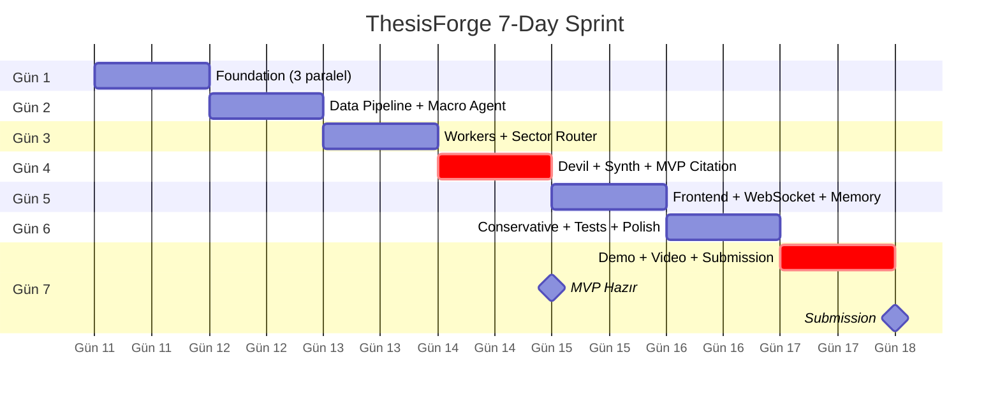
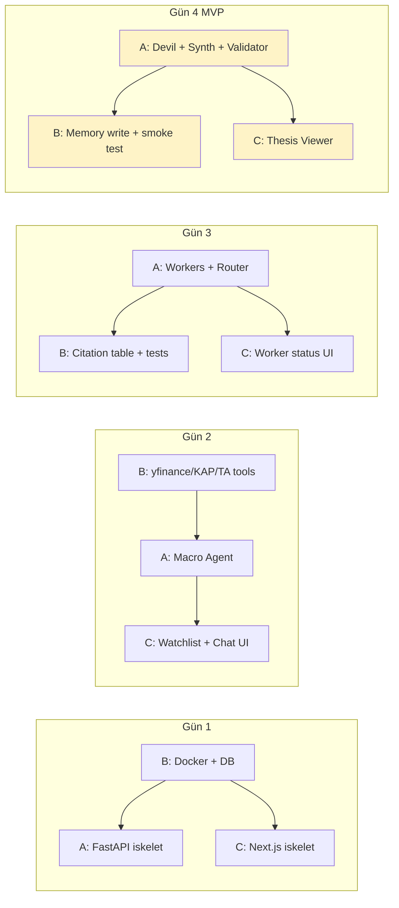

# ThesisForge — 7 Günlük Sprint Planı (3 Kişilik Ekip)

> Bu dosya `DECISIONS.md` ve `FLOW.md` ile uyumludur. 10-günlük plan 7 güne sıkıştırılmıştır; bazı nice-to-have'ler MVP sonrasına alınmıştır.
>
> **Ekip:** 3 kişi · **Süre:** 7 gün · **MVP:** Gün 4 sonu · **Demo:** Gün 7

---

## Ekip Rolleri

| Rumuz | Rol | Sorumluluk Alanı | Ana Stack |
|---|---|---|---|
| **A — Agent Lead** | Backend / LLM / Agents | FastAPI, ajan promptları, Gemini entegrasyonu, Synthesizer, Devil's Advocate, citation logic | Python, FastAPI, Gemini SDK, pydantic |
| **B — Data Lead** | Data / Persistence / DevOps | yfinance, KAP RSS, pandas-ta, PostgreSQL+pgvector, Redis, Docker, CI, testler | Python, SQL, Docker, GitHub Actions |
| **C — Frontend Lead** | UI / UX / Demo | Next.js PWA, WebSocket client, chat/watchlist/thesis viewer, conservative toggle, sunum | Next.js 15, Tailwind, shadcn/ui, recharts |

> **Not:** Roller "lead" — ana sahiplik o kişide; pair programming ve cross-review serbest. Daily standup 15dk (sabah).

---

## Üst Seviye Akış (7 Gün)

---

## Gün 1 — Foundation & Setup

**Hedef:** Herkesin makinesinde sistem ayağa kalkıyor, Gemini bağlantı testi geçiyor, ilk "hello world" agent yanıt veriyor.

| Kişi | Görevler | Çıktı |
|---|---|---|
| **A** | • Repo iskeleti (`backend/`, `frontend/`, `docker/`) • FastAPI iskelet + `/health` endpoint • Gemini SDK kurulumu, **Tier 1 paid plan** aktif • İlk dummy agent (`echo`) — Gemini'ye "selam" der, cevap döner | `POST /chat` çalışıyor, Gemini'ye gerçek istek gidiyor |
| **B** | • `docker-compose.yml`: postgres+pgvector, redis, backend, frontend • `.env.example` + secrets stratejisi • PostgreSQL şema migration framework (`alembic`) • İlk migration: `users`, `theses`, `thesis_embeddings`, `citations` tabloları • GitHub Actions iskelet (lint + test placeholder) | `docker compose up` ile tüm servisler ayakta |
| **C** | • Next.js 15 + Tailwind + shadcn/ui kurulumu • Layout: header, sidebar (watchlist placeholder), main (chat placeholder) • Mock data ile chat UI (gerçek backend yok) • Tasarım sistemi: renk, tipografi, componentler | `npm run dev` ile statik UI render | 

**Senkron noktası (gün sonu):** Herkes `docker compose up` ile sistemi ayağa kaldırıp `/health` 200 alıyor mu?

---

## Gün 2 — Data Pipeline & İlk Worker

**Hedef:** yfinance + KAP RSS + pandas-ta tool'ları yazılı, Macro Context Agent çalışıyor, ilk veri Redis'e cache'leniyor.

| Kişi | Görevler | Çıktı |
|---|---|---|
| **A** | • Agent base class (`BaseAgent` — Gemini call, prompt template, tool calling) • **Macro Context Agent**: TÜFE, USD/TRY, CDS, BIST100 özet (Flash, 15dk cache) • Orchestrator iskeleti (henüz tek-ajanlık) • Prompt registry (`prompts/` klasörü, model-mode mapping) | Macro Context günlük JSON snapshot üretiyor |
| **B** | • `tools/yfinance_tool.py`: fiyat, finansal, oran • `tools/kap_rss_tool.py`: RSS feed parse, ticker filter • `tools/pandas_ta_tool.py`: RSI, MACD, Bollinger, ATR • Redis cache wrapper (`@cache(ttl=...)` decorator) • `sector_map.yaml` — BIST 50 mapping (5+1 squad) • Unit test: `compute_ratios()` GARAN için doğru NIM | Tool'lar çağrılınca JSON dönüyor, cache hit'lerde Redis kullanılıyor |
| **C** | • Backend'le ilk gerçek bağlantı: `/api/macro` endpoint'i çağır, UI'da göster • "Watchlist" component'i (mock + ekleme/çıkarma) • Chat input + send button (henüz WebSocket yok, REST polling) • Loading states + skeleton UI | Watchlist'e ASELS eklenebiliyor, makro panel sağ üstte canlı görünüyor |

**Senkron noktası:** B'nin tool'ları A'nın Macro Agent'ında çalışıyor mu?

---

## Gün 3 — Workers + Sector Router

**Hedef:** Technical + Fundamental Worker paralel çalışıyor, Sector Router doğru squad'a yönlendiriyor.

| Kişi | Görevler | Çıktı |
|---|---|---|
| **A** | • **Sector Router Agent** (`sector_map.yaml` lookup, fallback Generic) • **Technical Worker** prompt + Gemini integration (pandas-ta tool kullanır, max 5 tool call) • **Fundamental Worker** prompt — squad-specific (5 farklı sub-prompt: Banking/Energy/Defense/Retail/RealEstate/Generic) • Orchestrator: paralel worker dispatch (`asyncio.gather`) | ASELS için Technical+Fundamental aynı anda çalışıp JSON dönüyor |
| **B** | • KAP scraper fallback (RSS yetmezse, 1 req/sn) • Worker output şeması (`pydantic` model: signals, citations, metrics) • `citations` tablosu yazma logic'i (her tool call → citation_call_id) • Unit test: Sector Router 50 BIST hissesi için doğru squad mı dönüyor (BIST 50 fixture) • yfinance/KAP cache TTL ayarları | Citation tablosu doluyor, sector router test'leri yeşil |
| **C** | • "Thesis Viewer" component iskeleti (Markdown render, recharts grafik placeholder) • Worker output'ları için "thinking" UI (her worker için ayrı kart, status: pending/done/error) • Sektör badge component'i (squad'a göre renkli etiket) • Mobile responsive ilk geçiş | Worker durumları UI'da canlı görünür |

**Senkron noktası:** ASELS isteği geldiğinde Sector Router → 2 worker paralel → JSON çıktı UI'da görünüyor mu?

---

## Gün 4 — Devil's Advocate + Synthesizer + Citation = MVP 🎯

**Hedef:** **MVP** — End-to-end ilk tam tez (citation-grounded) DB'ye yazılıyor.

| Kişi | Görevler | Çıktı |
|---|---|---|
| **A** | • **Devil's Advocate Agent** (Gemini 2.5 **Pro**) — worker output'larını okur, bear argümanları üretir • **Synthesizer Agent** (Gemini 2.5 **Pro**) — streaming Markdown çıktı • Synthesizer prompt'u: bull/bear/catalysts/risks/confidence formatı • `user_mode` parametresi taslağı (default'a göre çalışıyor, conservative gün 6'da) • Citation Validator: ID-bazlı deterministik kontrol + 1-retry policy + `[KAYNAKSIZ]` flag | İlk tam tez Markdown olarak üretiliyor (terminal log'da) |
| **B** | • Tezi DB'ye yaz: `theses` tablosu + embedding (`text-embedding-3-large`) + `thesis_embeddings` (pgvector) • **Memory Agent — write only** (similarity henüz yok) • `compute_ratios()` integration test (3 farklı squad için) • Citation Validator için unit test (bilerek bozuk citation fixture) • Smoke test scripti (CLI'dan tek hisse e2e) | Tez DB'ye yazılıyor, embedding hesaplanıyor, smoke test geçiyor |
| **C** | • Thesis Viewer — Markdown stream render (token-by-token görünüm) • Bull/Bear collapsible bölümler • Citation tooltip (hover ile kaynak gösterimi) • Confidence bar component (recharts) • `[KAYNAKSIZ]` flag'i için uyarı stilleri | UI'da gerçek tez render ediliyor (REST üstünden) |

**🎯 MVP Tanımı (Gün 4 sonu):**
1. Tek hisse için bull/bear/catalysts/risks tezi.
2. Citation-grounded (1-retry + soft flag).
3. Memory Agent yazıyor (similarity henüz yok).
4. Smoke test 3 farklı hisse için yeşil.

**Senkron noktası:** ASELS, GARAN, TUPRS için end-to-end demo. Her biri 60s altı çıkıyor mu?

---

## Gün 5 — Frontend Tamamlama + WebSocket + Memory Similarity

**Hedef:** UI canlı, gerçek streaming, geçmiş tezler benzerlik ile injecte ediliyor.

| Kişi | Görevler | Çıktı |
|---|---|---|
| **A** | • WebSocket endpoint (`/ws/thesis`) — streaming token push • **Memory similarity search** integration: yeni tez başlamadan önce top_k=3 geçmiş tez Synthesizer'a inject • Memory inject prompt template ("son 6 ay önce ASELS için AL +%18 getirili...") • Orchestrator refactor: WebSocket-aware (her aşamada event push) | Streaming token-by-token akıyor, similarity inject çalışıyor |
| **B** | • Memory Agent **read** path: `similar_thesis(ticker, top_k)` — pgvector cosine similarity • Gece cron iskeleti (henüz çalışmıyor, scheduled): ground truth update query • 3 fake tez insert + similarity test: beklenen sıra dönüyor mu? • Integration test: e2e pipeline mock LLM ile • GitHub Actions: PR'da unit + integration | Memory similarity testi yeşil, CI yeşil |
| **C** | • WebSocket client + reconnect logic • Streaming UI: typing animation, token buffer • "Geçmiş Tezler" panel — ticker için tüm tezleri zaman çizelgesinde göster • Similarity sonuçları ("6 ay önce şöyle yazmıştık") collapsible kart • Watchlist gerçek backend bağlantısı (CRUD endpoint'ler) | UI tamamen canlı, streaming akıcı, geçmiş tezler görünür |

**Senkron noktası:** Demo akışı tam çalışıyor mu? (watchlist'ten tıkla → stream gör → geçmiş tezler gör → tez DB'ye yazıldı)

---

## Gün 6 — Conservative Mode + Tests + Polish

**Hedef:** Conservative mode çalışıyor, test coverage hedefe ulaştı, demo polish yapıldı.

| Kişi | Görevler | Çıktı |
|---|---|---|
| **A** | • Conservative mode tam implementasyon (Synthesizer prompt branch):   – Bear case başa   – Confidence cap=70   – Temettü güvenliği vurgusu   – Volatilite uyarısı   – "Muhafazakar profil için uygunluk" özeti • Edge case'ler: zayıf veri durumunda graceful degradation • Pre-warmed cache mekanizması (5-10 demo hissesi için tüm pipeline'ı önceden çalıştır, cache'le) | Conservative mode TUPRS için farklı çıktı veriyor |
| **B** | • Coverage hedefine git (kritik path >%70):   – `validate_citations` ek test'ler   – Sector Router edge case'ler   – Memory similarity sıralama   – Pipeline integration • Smoke test 5 hisse (gerçek LLM, manuel tetikli ama scripted) • Gece cron çalışır hale getir (en azından local'de manuel çalıştırılabilir) • Production env değişkenleri + secrets review • Demo deploy (Railway/Fly.io veya Vercel + Supabase) | Tüm test'ler yeşil, deploy edilmiş URL var |
| **C** | • Conservative mode UI toggle (kullanıcı profilinde + sağ üstte) • Persona-3 default conservative ayarı • Demo polish: animasyonlar, micro-interactions • Boş durum (empty state) UI'lar • Hata durumları (error boundary, retry button) • Mobile son geçiş + tablet | UI demo-ready, conservative toggle çalışıyor, deploy'da görünüyor |

**Senkron noktası:** End-to-end demo dry run (sanki judge'a anlatıyormuş gibi). Her şey çalışıyor mu? Bug listesi çıkar, gün 7 öncesi düzeltilebilenler düzeltilir.

---

## Gün 7 — Demo, Video, Submission 🎬

**Hedef:** Sunum mükemmel, video kayıt edildi, submission yapıldı.

| Kişi | Görevler | Çıktı |
|---|---|---|
| **A** | • Sunum'un teknik kısmı: mimari slide'ları, ajan ailesi, Gemini Pro/Flash split • Backend canlı demo akışı senaryoları (3 farklı persona) • Edge case fallback'leri test (cache miss, citation fail, rate limit) • Q&A hazırlığı: judge sorularına cevap notları | Sunum teknik bölüm hazır, fallback senaryolar çalışıyor |
| **B** | • Production smoke test (deploy'da 5 hisse için tam pipeline) • Pre-warmed cache final populate (demo hisseleri) • `README.md` — kurulum, çalıştırma, mimari özet • `DECISIONS.md` ve `FLOW.md`'yi finalize et (referans olarak) • GitHub repo'yu submission için temizle (gizli secret yok mu kontrol) | Repo submission-ready, production stabil |
| **C** | • Sunum'un ürün kısmı: persona'lar, problem, değer önerisi • **Demo video kaydı** (3-5dk, scripted):   1. Mehmet ASELS senaryosu (default mode, streaming)   2. Ali Bey TUPRS senaryosu (conservative mode)   3. Memory similarity ("6 ay önce ne demiştik") • Landing page polish (varsa) • Submission paketleme | Video YouTube/Drive'da, sunum dosyası hazır |

**Submission Checklist (gün sonu):**
- [ ] GitHub repo public + README açıklayıcı
- [ ] Demo video link
- [ ] Canlı demo URL (deploy edilmiş)
- [ ] Sunum slide'ları (PDF)
- [ ] DECISIONS.md + FLOW.md + SPRINT.md kontrole hazır
- [ ] Submission formu dolduruldu

---

## Risk & Buffer Yönetimi

7 gün sıkı; gecikme olursa şu sırayla feda edilir:

| Öncelik | Feature | Eğer Gecikirse |
|---|---|---|
| 🔴 **Vazgeçilmez** | Tek hisse tam tez + citation + DB write | MVP yok demek, ertelenemez |
| 🟡 **Önemli** | WebSocket streaming, Memory similarity | REST polling fallback'e dön |
| 🟡 **Önemli** | Conservative mode | Sadece UI toggle yapılır, backend default'a düşer |
| 🟢 **Nice-to-have** | Pre-warmed cache | Demo'da canlı 60s göster |
| 🟢 **Nice-to-have** | Coverage >%70 | Sadece citation + sector router test'leri |
| 🟢 **Nice-to-have** | Production deploy | Local demo + screen share |

**v2'ye atılan (zaten karar):** Sentiment Worker, Backtest Validator, A2A protocol, Multi-user, Twitter sentiment.

---

## Daily Ritüeller

- **09:00** — 15dk standup (dün ne yaptım / bugün ne yapacağım / blocker)
- **12:30** — Hızlı sync (öğle, blocker varsa)
- **18:00** — Demo dry run mini (gün 4'ten itibaren her gün, en az 5dk)
- **22:00** — Soft cutoff (commit + push, ertesi güne hazırlık)

---

## Bağımlılık Haritası (Kim kimi bekliyor?)

> **A bottleneck riski:** A her gün hem backend orchestrator hem prompt yazıyor. Gerekirse B citation/memory tarafına daha çok zaman ayırıp A'yı destekler. Pair programming özellikle Gün 4'te kritik.

---

## Özet

- **Gün 1-2:** Foundation, herkes paralel kuruyor.
- **Gün 3:** Pipeline %60 tamam — ajanlar paralel çalışıyor.
- **Gün 4 (MVP):** Citation-grounded tam tez DB'ye yazılıyor. **Bu kritik milestone.**
- **Gün 5-6:** UI canlı + memory + conservative + test + deploy.
- **Gün 7:** Sunum + video + submission.

Bu plan kararlarımıza (`DECISIONS.md`) ve mimariye (`FLOW.md`) tam uyumlu; sentiment + backtest scope dışı, 8 ajan + 2 paralel worker + 5+1 squad, pgvector + paid Gemini.
