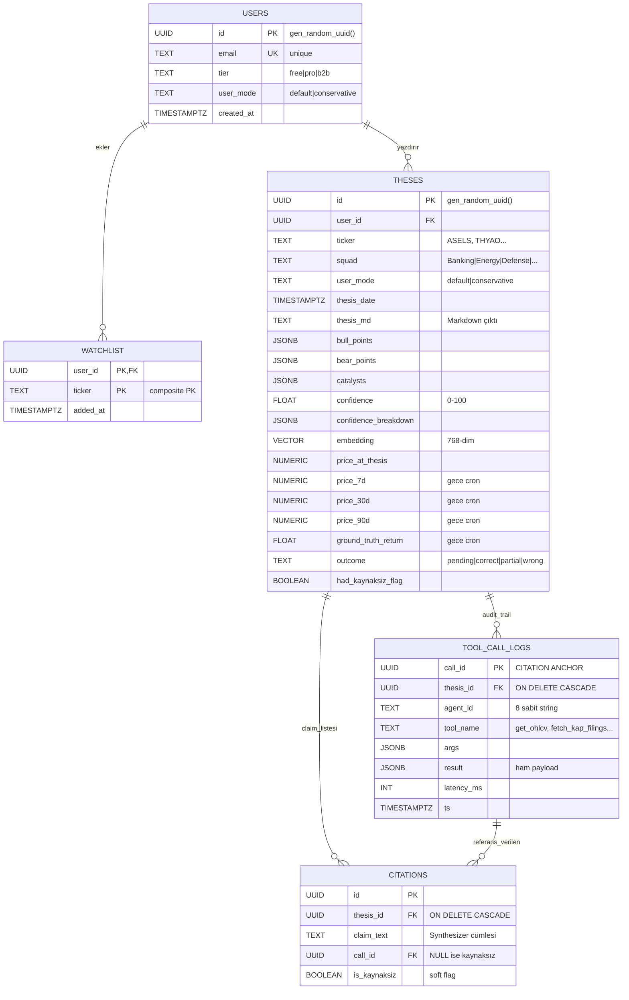
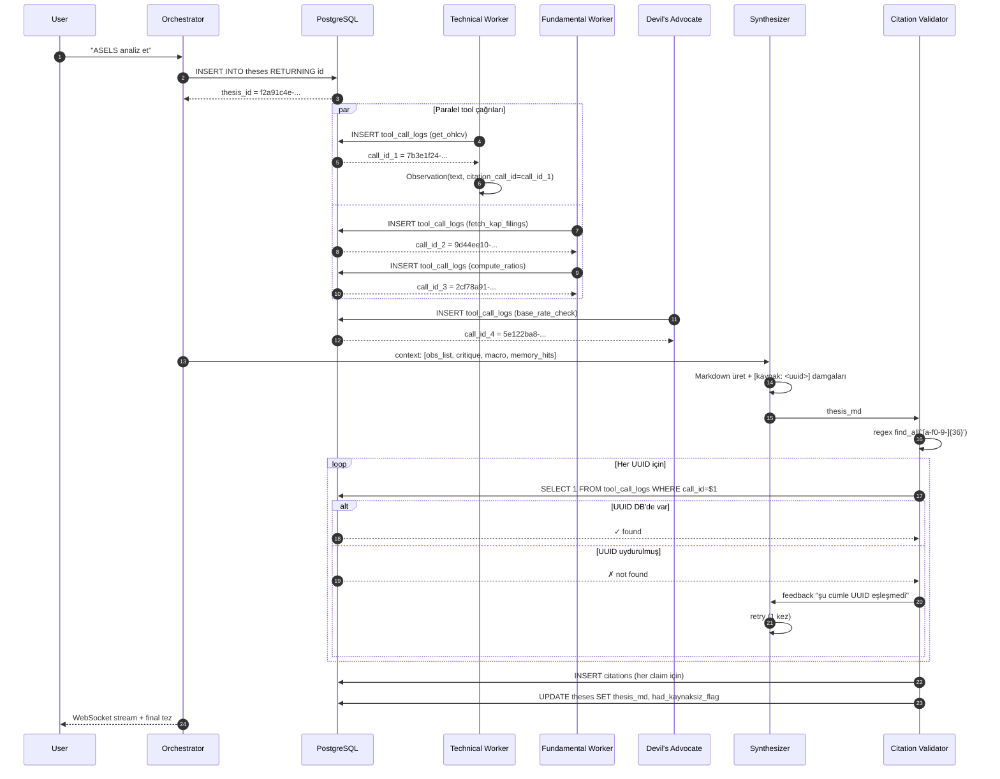
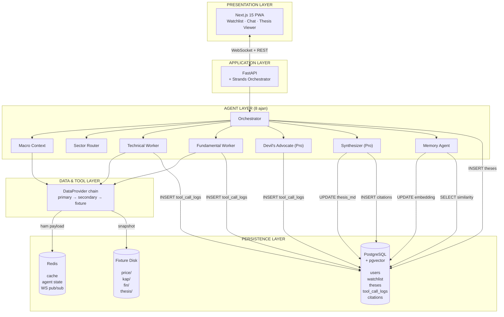
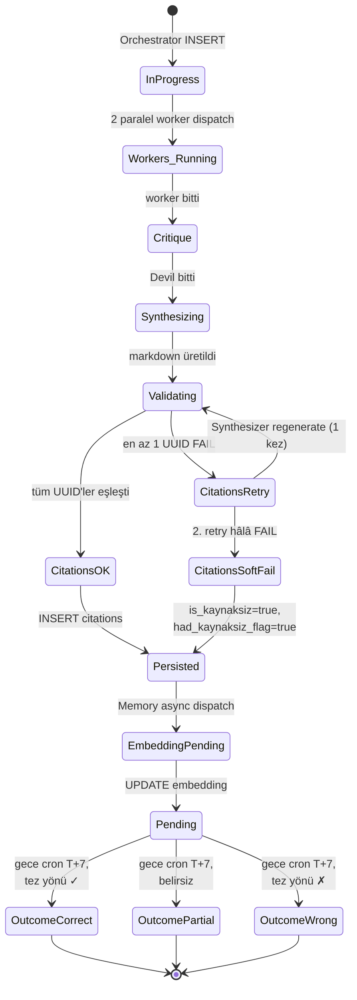
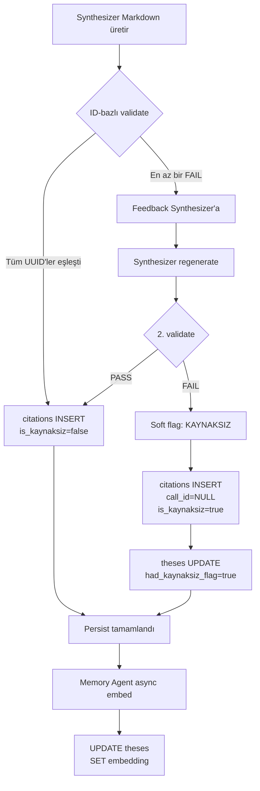
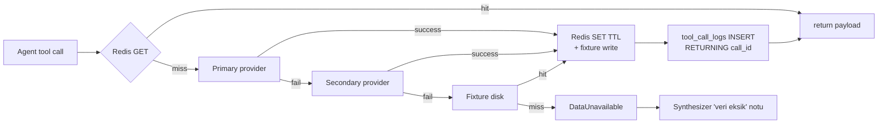

# ThesisForge — Veritabanı Detaylı Tasarım Dokümanı

> Bu doküman `docs/database.md`'nin **derin teknik açılımıdır**. Özellikle agent UUID damgalama (citation provenance), pgvector kullanımı, tablo bazlı veri yaşam döngüsü ve cross-document tutarlılık burada toparlanmıştır. Tüm SQL, akış, Mermaid diyagramları bu dosyada toplanmıştır.
>
> **İlgili truth file'lar:** [`database.md`](database.md) (kısa şema) · [`agents.md`](agents.md) §4 (citation mimarisi) · [`architecture.md`](architecture.md) §3.5 (persistence katmanı) · [`flows.md`](flows.md) §3 (validation loop) · [`data.md`](data.md) §1 (provider chain).
>
> Sürüm: 1.0 · Tarih: 2026-05-14

---

## İçindekiler

1. [Tasarım Felsefesi ve Karar Matrisi](#1-tasarım-felsefesi-ve-karar-matrisi)
2. [Persistence Katmanı Genel Görünüm](#2-persistence-katmanı-genel-görünüm)
3. [PostgreSQL Şeması — Tablo Detayları](#3-postgresql-şeması--tablo-detayları)
4. [Agent UUID Damgalama Mekanizması (Citation Provenance)](#4-agent-uuid-damgalama-mekanizması-citation-provenance)
5. [İndeksleme Stratejisi](#5-indeksleme-stratejisi)
6. [pgvector & Memory Agent](#6-pgvector--memory-agent)
7. [Redis Şeması ve TTL Politikası](#7-redis-şeması-ve-ttl-politikası)
8. [Fixture Store (Disk)](#8-fixture-store-disk)
9. [Mermaid Diyagramları](#9-mermaid-diyagramları)
10. [Sorgu Kalıpları (SQL)](#10-sorgu-kalıpları-sql)
11. [Veri Yaşam Döngüsü](#11-veri-yaşam-döngüsü)
12. [Tutarlılık, Transaction ve Retry Politikası](#12-tutarlılık-transaction-ve-retry-politikası)
13. [Migration ve Lokal Geliştirme](#13-migration-ve-lokal-geliştirme)
14. [Açık Sorular ve v2 Roadmap](#14-açık-sorular-ve-v2-roadmap)

---

## 1. Tasarım Felsefesi ve Karar Matrisi

ThesisForge'un persistence katmanı **üç ana sorumluluğu** üstlenir:

1. **Provenance (kanıt zinciri):** Hangi agent, hangi tool'u, hangi argümanlarla çağırdı, neyi döndürdü? Citation-grounded mimarinin omurgası.
2. **Memory (hafıza):** Geçmişte yazılmış tezler ve gerçekleşen getirileri saklamak; yeni tezlere "tarihsel bağlam" enjekte etmek.
3. **Cache (hız):** 40–60 sn'lik pipeline'ı pre-warm fixture/cache ile <8 sn'ye düşürmek.

### 1.1 Karar Matrisi (Niye böyle)

| Karar | Alternatif | Neden alternatif değil |
|---|---|---|
| Tek PostgreSQL + pgvector | Postgres + Pinecone/Weaviate | İki servis = iki deploy, iki yedek, iki erişim katmanı. pgvector 1000 tezde <100 ms cosine, hackathon scope'a fazlasıyla yeter. |
| `embedding VECTOR(768)` `theses` tablosunda inline | Ayrı `thesis_embeddings` tablosu | Her similarity sorgusu JOIN gerektirir. Inline → tek SELECT + filter + ORDER BY. |
| `tool_call_logs.call_id` UUID primary key | BIGSERIAL / hash(args) | UUID 128 bit → tahmin edilemez, LLM uyduramaz. Sıralı integer Synthesizer'ın "1,2,3" diye uydurmasına davetiye. Hash(args) → aynı tool aynı args ile iki kez çağrılırsa tek kayıt, ama bizim **her çağrıyı ayrı log'lamamız** lazım (cache miss vs hit ayrımı için). |
| `citations` ayrı tablo, JSONB array değil | `theses.citations JSONB[]` | Postgres'te JSONB içinde indeksli `WHERE call_id = ?` aramaları zayıf. Normalize tablo + B-tree indeks → 10× hızlı UI tooltip sorgusu. |
| `is_kaynaksiz` BOOLEAN + `had_kaynaksiz_flag` ikiz alan | Sadece NULL `call_id` | NULL'a göre "kaynaksız mı?" sorgusu indekssiz. Boolean ile UI sorgusu (`WHERE had_kaynaksiz_flag = true`) hızlı + semantik açık. |
| `outcome` 4-state enum (`pending/correct/partial/wrong`) | 2-state (true/false) | Memory Agent "5'ten 3'ü doğru, 1 kısmen, 1 yanlış" gibi istatistik basabilsin diye 4 state. |
| Redis ayrı servis | Postgres `LISTEN/NOTIFY` | LISTEN/NOTIFY tek connection per subscriber, WebSocket fan-out için ölçeklenmiyor. Upstash free serverless Redis yeter. |
| Fixture disk (S3 değil) | S3 / R2 | Hackathon = tek container, container disk'i yeter. Kaybolursa `scripts/refresh_fixtures.py` doldurur. v2'de S3'e replicate. |

### 1.2 Anchor Felsefesi: "Her sayı bir UUID'ye bağlı"

ThesisForge'un en güçlü iddiası: **"Bu tez içinde hiçbir sayı uydurma değil."** Bu iddianın somut karşılığı şudur:

> Synthesizer markdown çıktısındaki her `[kaynak: <uuid>]` etiketi, `tool_call_logs` tablosunda **gerçekten var olan bir tool çağrısının** sonucuna bağlanır. UUID 128 bit olduğu için Synthesizer (LLM) bu ID'yi uyduramaz; sadece kendisine context olarak verilenler arasından seçebilir.

Bu, regex/string benzerliği değil **PK lookup** ile doğrulanır → deterministik, atlatılamaz.

---

## 2. Persistence Katmanı Genel Görünüm

```
┌───────────────────────────────────────────────────────────────┐
│                     PERSISTENCE LAYER                         │
│                                                               │
│  ┌─────────────────┐   ┌──────────────┐   ┌───────────────┐   │
│  │  PostgreSQL     │   │   Redis      │   │  Fixture Disk │   │
│  │  + pgvector     │   │              │   │               │   │
│  │                 │   │  cache +     │   │  fixtures/    │   │
│  │  users          │   │  agent state │   │  ├─ price/    │   │
│  │  watchlist      │   │  + ws pubsub │   │  ├─ kap/      │   │
│  │  theses         │   │              │   │  ├─ fin/      │   │
│  │  tool_call_logs │   │  TTL'li      │   │  ├─ macro/    │   │
│  │  citations      │   │  key-value   │   │  └─ thesis/   │   │
│  │                 │   │              │   │     (demo)    │   │
│  │  (Supabase)     │   │  (Upstash)   │   │               │   │
│  └─────────────────┘   └──────────────┘   └───────────────┘   │
│        ↑                      ↑                   ↑           │
│        │                      │                   │           │
│  Source of truth      Hot cache              Cold fallback    │
│  Audit + memory       (15dk–24h TTL)         (48h snapshot)   │
└───────────────────────────────────────────────────────────────┘
```

| Katman | Rolü | TTL/Ömür |
|---|---|---|
| PostgreSQL | Source of truth — tezler, kullanıcı, audit log | Süresiz |
| Redis | Hot cache — son 15 dk/saat/gün verisi | 15 dk – 24 saat |
| Fixture disk | Cold fallback — provider chain'in son halkası | 48 saat snapshot, demo'da sınırsız |

---

## 3. PostgreSQL Şeması — Tablo Detayları

### 3.1 Extension

```sql
CREATE EXTENSION IF NOT EXISTS vector;          -- pgvector (cosine, l2, inner product)
CREATE EXTENSION IF NOT EXISTS pgcrypto;        -- gen_random_uuid() için
```

Supabase free tier'da her ikisi de pre-installed.

---

### 3.2 `users`

**Rolü:** Kullanıcı kimliği, tier (free/pro/b2b), persona modu (default/conservative).

```sql
CREATE TABLE users (
  id           UUID PRIMARY KEY DEFAULT gen_random_uuid(),
  email        TEXT UNIQUE NOT NULL,
  tier         TEXT NOT NULL DEFAULT 'free'
                 CHECK (tier IN ('free','pro','b2b')),
  user_mode    TEXT NOT NULL DEFAULT 'default'
                 CHECK (user_mode IN ('default','conservative')),
  created_at   TIMESTAMPTZ DEFAULT now()
);
```

**Alan-alan:**

| Alan | Tip | Anlamı | Niye |
|---|---|---|---|
| `id` | UUID | Birincil anahtar | `theses.user_id`, `watchlist.user_id` FK'leri buna bağlanır. UUID → cross-table merge'lerde güvenli. |
| `email` | TEXT UNIQUE | Giriş anahtarı | Magic link/OAuth için. UNIQUE constraint duplicate'ı önler. |
| `tier` | TEXT (enum) | `free` \| `pro` \| `b2b` | Hackathon'da hep `free`; v2 B2B için hazır iskelet. |
| `user_mode` | TEXT (enum) | `default` \| `conservative` | Ali Bey persona → `conservative`. Synthesizer'a flag olarak geçer; bear-case başa, confidence ≤70. |
| `created_at` | TIMESTAMPTZ | Kayıt tarihi | Cohort analizi için. |

**Persona-mod ilişkisi:** Persona seçimi UI'da toggle'dır; backend'e geldiğinde `users.user_mode` UPDATE edilir. Orchestrator her tez başlangıcında bu kolonu okur ve Synthesizer prompt'una inject eder.

---

### 3.3 `watchlist`

**Rolü:** Bir kullanıcının takip ettiği hisseler.

```sql
CREATE TABLE watchlist (
  user_id    UUID REFERENCES users(id) ON DELETE CASCADE,
  ticker     TEXT NOT NULL,
  added_at   TIMESTAMPTZ DEFAULT now(),
  PRIMARY KEY (user_id, ticker)
);
```

**Tasarım kararları:**

- **Composite PK (`user_id, ticker`)** → aynı kullanıcı aynı hisseyi iki kez ekleyemez. Ayrı `id` kolonuna gerek yok; `(user_id, ticker)` zaten benzersiz.
- **`ON DELETE CASCADE`** → kullanıcı silinirse watchlist'i de silinir. GDPR/KVKK için temiz.
- **Index gerekmez** — composite PK zaten `(user_id, ticker)` üzerinde B-tree indeks oluşturur; `WHERE user_id = ?` sorgusu o indeksin sol-prefix'ini kullanır.

---

### 3.4 `theses` — Ana iş tablosu

**Rolü:** Üretilen her tezin tam kayıt satırı. Sistemin "ürün" çıktısı.

```sql
CREATE TABLE theses (
  id                       UUID PRIMARY KEY DEFAULT gen_random_uuid(),
  user_id                  UUID REFERENCES users(id),
  ticker                   TEXT NOT NULL,
  squad                    TEXT NOT NULL,
  user_mode                TEXT NOT NULL,
  thesis_date              TIMESTAMPTZ DEFAULT now(),
  thesis_md                TEXT NOT NULL,
  bull_points              JSONB,
  bear_points              JSONB,
  catalysts                JSONB,
  confidence               FLOAT,
  confidence_breakdown     JSONB,
  embedding                VECTOR(768),
  price_at_thesis          NUMERIC,
  price_7d                 NUMERIC,
  price_30d                NUMERIC,
  price_90d                NUMERIC,
  ground_truth_return      FLOAT,
  outcome                  TEXT CHECK (outcome IN ('correct','partial','wrong','pending'))
                                DEFAULT 'pending',
  had_kaynaksiz_flag       BOOLEAN DEFAULT false
);
```

**Alan-alan:**

| Alan | Tip | Doluş anı | Anlamı |
|---|---|---|---|
| `id` | UUID PK | Pipeline başında, Orchestrator INSERT eder | Tezin kimliği. Child tablolar (`tool_call_logs`, `citations`) FK olarak referans verir. |
| `user_id` | UUID FK | INSERT | Hangi kullanıcı için üretildi. |
| `ticker` | TEXT | INSERT | BIST sembolü (`ASELS`, `THYAO`...). Index: `idx_theses_ticker_date`. |
| `squad` | TEXT | INSERT | `Banking` \| `Energy` \| `Defense` \| `Retail` \| `RealEstate` \| `Generic`. Sector Router belirler. |
| `user_mode` | TEXT | INSERT | `default` \| `conservative` — tezin hangi modda üretildiği. Replay/audit için (kullanıcı sonradan modunu değiştirse bile geçmiş tez `conservative` olarak kalır). |
| `thesis_date` | TIMESTAMPTZ | INSERT (default now()) | Üretim zamanı. Gece cron'un "7 gün öncesi" sorgusunun anchor'ı. |
| `thesis_md` | TEXT | Synthesizer biter bitmez UPDATE | Tam Markdown çıktı. Token-by-token stream sonrası tek seferde yazılır. |
| `bull_points` | JSONB | Synthesizer UPDATE | `[{point: "...", call_id: "<uuid>"}, ...]`. UI'da bullet liste için. |
| `bear_points` | JSONB | Synthesizer UPDATE | Bear case bulletları, aynı yapı. |
| `catalysts` | JSONB | Synthesizer UPDATE | `[{date: "2026-06-15", event: "Q2 sonuç açıklaması", impact: "high"}]`. UI'da takvim için. |
| `confidence` | FLOAT | Synthesizer UPDATE | 0–100 arası. Conservative mode'da ≤70 cap'li. |
| `confidence_breakdown` | JSONB | Synthesizer UPDATE | `{data_quality: 80, technical: 65, fundamental: 75, news_macro: 60, memory_base: 70, devil_inverse: 50}`. UI'da bar chart için. |
| `embedding` | VECTOR(768) | Memory Agent async UPDATE | `text-embedding-3-large` 768-dim. Tez metnini embed eder. pgvector index'i bu kolonu kullanır. |
| `price_at_thesis` | NUMERIC | INSERT (Orchestrator) | Tezin yazıldığı andaki kapanış. Gece cron'un getiri hesabı için baseline. |
| `price_7d` | NUMERIC | Gece cron UPDATE (7 gün sonra) | T+7 kapanış. |
| `price_30d` | NUMERIC | Gece cron UPDATE (30 gün sonra) | T+30 kapanış. |
| `price_90d` | NUMERIC | Gece cron UPDATE (90 gün sonra) | T+90 kapanış. |
| `ground_truth_return` | FLOAT | Gece cron UPDATE | `(price_X - price_at_thesis) / price_at_thesis * 100`. X = sentezleme parametresi (default 30). |
| `outcome` | TEXT (enum) | Gece cron UPDATE | `pending` → `correct` / `partial` / `wrong`. Memory Agent base-rate hesabı için. |
| `had_kaynaksiz_flag` | BOOLEAN | Citation Validator UPDATE | `citations` tablosunda en az bir `is_kaynaksiz=true` varsa `true`. UI'da turuncu rozet için filtre. |

**Outcome kuralları (Gece cron, [`flows.md`](flows.md) §4.3):**

| Bull/Bear toplam yön | `ground_truth_return` | `outcome` |
|---|---|---|
| Bull > Bear | > +5% | `correct` |
| Bull > Bear | -5% < x < +5% | `partial` |
| Bull > Bear | < -5% | `wrong` |
| Bear > Bull | < -5% | `correct` |
| Bear > Bull | -5% < x < +5% | `partial` |
| Bear > Bull | > +5% | `wrong` |

Burada "Bull > Bear" tez yönü = pozitif demektir; Synthesizer çıktısında `confidence_breakdown` ve cümle skorlarına göre belirlenir.

**Index'ler:**

```sql
CREATE INDEX idx_theses_embedding
  ON theses USING ivfflat (embedding vector_cosine_ops);

CREATE INDEX idx_theses_ticker_date
  ON theses (ticker, thesis_date DESC);
```

- **`idx_theses_embedding`** → pgvector `<=>` cosine distance için ivfflat. `lists=100` default (1000 tez varsayımı için yeterli).
- **`idx_theses_ticker_date`** → "ASELS son tezleri" sorgusu. `DESC` order, en yeni başta dönsün.

İlave (önerilen, hackathon scope dışı):

```sql
CREATE INDEX idx_theses_user_date    ON theses (user_id, thesis_date DESC);
CREATE INDEX idx_theses_outcome      ON theses (outcome) WHERE outcome = 'pending';
```

İkincisi gece cron'un "pending tezleri bul" sorgusunu hızlandırır; partial index (`WHERE outcome = 'pending'`) sayesinde ufak kalır.

---

### 3.5 `tool_call_logs` — Citation kaynak tablosu

**Rolü:** Sistemde gerçekleşen **her tool çağrısının** ham kaydı. Citation-grounded mimarinin anchor'ı.

```sql
CREATE TABLE tool_call_logs (
  call_id      UUID PRIMARY KEY DEFAULT gen_random_uuid(),
  thesis_id    UUID REFERENCES theses(id) ON DELETE CASCADE,
  agent_id     TEXT NOT NULL,
  tool_name    TEXT NOT NULL,
  args         JSONB,
  result       JSONB,
  latency_ms   INT,
  ts           TIMESTAMPTZ DEFAULT now()
);

CREATE INDEX idx_tool_call_logs_thesis ON tool_call_logs (thesis_id);
```

**Alan-alan:**

| Alan | Tip | Anlamı | Örnek değer |
|---|---|---|---|
| `call_id` | UUID PK | **Citation anchor.** Synthesizer `[kaynak: <uuid>]` ile bu ID'yi etiketler. | `7b3e1f24-9c2a-4f8b-bc91-aaabbbcccddd` |
| `thesis_id` | UUID FK → theses | Hangi teze ait. CASCADE → tez silinince log'lar da gider. | `f2a91...` |
| `agent_id` | TEXT | Çağrıyı yapan agent'ın **kimlik string'i**. UUID değil. | `technical_worker`, `fundamental_worker`, `macro_context`, `devils_advocate`, `synthesizer`, `memory_agent`, `orchestrator`, `sector_router` |
| `tool_name` | TEXT | Çağrılan fonksiyon adı | `get_ohlcv`, `fetch_kap_filings`, `compute_ratios`, `find_disconfirming_evidence`, `calculate_indicators` |
| `args` | JSONB | Tool argümanları | `{"ticker": "ASELS", "period": "90d"}` |
| `result` | JSONB | Provider'dan dönen **ham payload**. Audit + replay için. | `{"rows": 61, "last_close": 307.5, "ohlcv": [...]}` |
| `latency_ms` | INT | Tool yürütme süresi | `1870` |
| `ts` | TIMESTAMPTZ | Çağrı zamanı | `2026-05-14T13:31:05.123Z` |

**Önemli detay — `agent_id` neden TEXT, UUID değil?**

8 ajan sabit string ID ile kataloglanmıştır ([`agents.md`](agents.md) §1):

```
orchestrator, macro_context, sector_router, technical_worker,
fundamental_worker, devils_advocate, synthesizer, memory_agent
```

UUID olsaydı her deploy'da rastgele üretilir veya manuel sabitlenirdi. TEXT enum'ı versiyon kontrolünde sabit kalıyor; aynı zamanda log gözlemleyenler `agent_id = 'synthesizer'` filtreleyebiliyor.

**ON DELETE CASCADE:** Bir tez silinirse tüm tool log'ları otomatik silinir. Audit istek varsa silmek yerine `theses.deleted_at` soft delete yapılmalı (v2).

**Index:** `idx_tool_call_logs_thesis` → "bu tezin tüm log'ları" sorgusu için. Citation join'leri buna dayanır.

İlave (önerilen):

```sql
CREATE INDEX idx_tool_call_logs_agent_tool ON tool_call_logs (agent_id, tool_name);
```

Observability için: "fundamental_worker'ın get_kap_filings ortalama latency'si" gibi sorgular.

---

### 3.6 `citations` — Claim → tool call mapping

**Rolü:** Synthesizer'ın markdown çıktısındaki **her bir claim cümlesi** için bir satır. UI tooltip + audit + soft-flag göstergesi.

```sql
CREATE TABLE citations (
  id             UUID PRIMARY KEY DEFAULT gen_random_uuid(),
  thesis_id      UUID REFERENCES theses(id) ON DELETE CASCADE,
  claim_text     TEXT NOT NULL,
  call_id        UUID REFERENCES tool_call_logs(call_id),
  is_kaynaksiz   BOOLEAN DEFAULT false
);
```

**Alan-alan:**

| Alan | Tip | Anlamı |
|---|---|---|
| `id` | UUID PK | Citation'ın kendi kimliği. UI'da bir tooltip'i diğerinden ayırmak için. |
| `thesis_id` | UUID FK | Hangi teze ait. CASCADE. |
| `claim_text` | TEXT | Synthesizer'ın yazdığı **gerçek cümle**. Örn: `"ASELS Q3 net kârı %23 büyüdü."` |
| `call_id` | UUID FK → tool_call_logs | Hangi tool çağrısının sonucuna dayanıyor. **`is_kaynaksiz=true` ise NULL** olabilir. |
| `is_kaynaksiz` | BOOLEAN | `true` → 1-retry sonrası eşleşemedi, soft pass. UI'da turuncu rozet. |

**FK constraint detayı:** `call_id` NULL'a izin verir çünkü `is_kaynaksiz=true` durumunda tool çağrısı yok ama claim hâlâ kayıtlı. Bu **bilinçli tasarım** — kayıtsız (kaynaksız) iddiaları görünür tutmak için.

**İlave constraint (önerilen):**

```sql
ALTER TABLE citations ADD CONSTRAINT chk_kaynaksiz_consistency
  CHECK (
    (is_kaynaksiz = true  AND call_id IS NULL) OR
    (is_kaynaksiz = false AND call_id IS NOT NULL)
  );
```

Mantığı: ya kaynak var (`call_id != NULL`, `is_kaynaksiz=false`), ya yok (`call_id = NULL`, `is_kaynaksiz=true`). Yarı dolu satır olmasın.

**Index (önerilen):**

```sql
CREATE INDEX idx_citations_thesis ON citations (thesis_id);
CREATE INDEX idx_citations_call   ON citations (call_id) WHERE call_id IS NOT NULL;
```

İlki UI'nın "bu tezin tüm citation'ları" sorgusu için (en sık erişim). İkincisi "bu tool çağrısı kaç citation'a referans veriyor?" gibi audit sorguları için.

---

### 3.7 İlişki Diyagramı (ASCII)

```
                   ┌─────────┐
                   │  users  │ (UUID PK)
                   └────┬────┘
                        │
            ┌───────────┼─────────────────┐
            │                             │
            ▼                             ▼
      ┌──────────┐                  ┌──────────┐
      │watchlist │                  │  theses  │ (UUID PK, embedding 768)
      │(composite│                  └────┬─────┘
      │   PK)    │                       │
      └──────────┘                       │
                                         ├──────────────┐
                                         │              │
                                         ▼              ▼
                                ┌────────────────┐  ┌───────────┐
                                │tool_call_logs  │  │ citations │
                                │ (UUID PK)      │◄─┤ (UUID PK) │
                                │ agent_id TEXT  │  │ FK→call_id│
                                └────────────────┘  └───────────┘
                                       ▲                  │
                                       └──────────────────┘
                                       (citations.call_id
                                        FK to tool_call_logs)
```

---

## 4. Agent UUID Damgalama Mekanizması (Citation Provenance)

> **Bu bölüm projenin teknik kalbidir.** Halüsinasyon savunmasının 4 katmanından 1. ve 3. katmanı bu mekanizmayla çalışır.

### 4.1 Tanım: "UUID damgası" nedir?

Bir **UUID damgası** = `tool_call_logs.call_id`. Her başarılı tool çağrısı bu tabloya bir satır ekler ve karşılığında bir UUID (`call_id`) döndürür. Bu UUID:

1. Çağrıyı yapan agent'ın elinde tutulur (Pydantic `Observation` modeli içinde),
2. Worker raporları üzerinden Synthesizer'a aktarılır,
3. Synthesizer markdown çıktısında `[kaynak: <call_id>]` etiketi olarak basılır,
4. Validator tarafından `SELECT 1 FROM tool_call_logs WHERE call_id = ?` ile **PK lookup** ile doğrulanır.

UUID 128 bit olduğundan **LLM tahmin edemez veya uyduramaz**. Bu, citation enforcement'ı regex-tabanlı (kolay aldatılır) yerine **deterministik** kılar.

### 4.2 UUID Üreten 3 Yer

| UUID | Üreten | Üretildiği an |
|---|---|---|
| `theses.id` | Postgres `gen_random_uuid()` | Pipeline başında Orchestrator INSERT |
| `tool_call_logs.call_id` | Postgres `gen_random_uuid()` | **Her tool çağrısında** otomatik (provider chain `fetch()` sonrası) |
| `citations.id` | Postgres `gen_random_uuid()` | Validator her claim için INSERT |

### 4.3 `agent_id` Sözlüğü (Sabit String'ler)

`agent_id` TEXT, UUID değil. 8 sabit değer:

| `agent_id` | Hangi ajan | Tipik `tool_name`'leri |
|---|---|---|
| `orchestrator` | Orchestrator (coordinator) | `validate_ticker`, `dispatch_workers`, `save_thesis` |
| `macro_context` | Macro Context Agent | `get_tcmb_indicators`, `get_bist_index_state`, `get_recent_macro_news` |
| `sector_router` | Sector Router | `lookup_sector`, `select_squad` |
| `technical_worker` | Technical Worker | `get_ohlcv`, `calculate_indicators`, `detect_patterns`, `find_support_resistance`, `relative_strength` |
| `fundamental_worker` | Fundamental Worker | `fetch_kap_filings`, `get_financial_statements`, `compute_ratios`, `get_sector_peers`, `compare_to_peers`, `get_dividend_history` |
| `devils_advocate` | Devil's Advocate | `query_workers`, `find_disconfirming_evidence`, `base_rate_check` |
| `synthesizer` | Synthesizer | (genelde tool çağırmaz, sadece markdown üretir — ama `query_workers` follow-up için çağırabilir) |
| `memory_agent` | Memory Agent | `embed_text`, `similarity_search`, `write_thesis_embedding` |

### 4.4 Uçtan Uca UUID Akışı

```
ADIM 0 — Pipeline başlangıcı
  Orchestrator:
    INSERT INTO theses (user_id, ticker, squad, user_mode, price_at_thesis)
      VALUES (...) RETURNING id;
    → thesis_id = "f2a91c4e-..."

ADIM 1 — Technical Worker çağrı
  Worker → ChainedDataProvider.fetch("get_ohlcv", ticker="ASELS", period="90d")
    │
    │ provider chain: yfinance → isyatirim → fixture
    │ success: yfinance, payload = {"rows": 61, "last_close": 307.5, ...}
    │
    ↓
  INSERT INTO tool_call_logs (
      thesis_id, agent_id, tool_name, args, result, latency_ms)
    VALUES (
      'f2a91c4e-...',
      'technical_worker',
      'get_ohlcv',
      '{"ticker":"ASELS","period":"90d"}',
      '{"rows":61,"last_close":307.5,...}',
      1870)
    RETURNING call_id;
    → call_id_1 = "7b3e1f24-9c2a-4f8b-bc91-..."
    │
    ↓
  Worker bu call_id_1'i Pydantic Observation içinde tutar:
    Observation(
      text="RSI 67, aşırı alım sınırı",
      citation_call_id="7b3e1f24-..."
    )

ADIM 2 — Fundamental Worker çağrı (paralel)
  Worker → fetch("fetch_kap_filings", ticker="ASELS")
    → call_id_2 = "9d44ee10-..."
  Worker → fetch("compute_ratios", ticker="ASELS")
    → call_id_3 = "2cf78a91-..."

ADIM 3 — Devil's Advocate çağrı
  Devil → fetch("base_rate_check", squad="Defense", direction="bull")
    → call_id_4 = "5e122ba8-..."

ADIM 4 — Synthesizer
  Tüm worker output (Observation listeleri) + Devil critique
  context olarak Synthesizer prompt'una verilir.

  Synthesizer Markdown üretir:
    "RSI 67 ile aşırı alım sınırında [kaynak: 7b3e1f24-9c2a-4f8b-bc91-...]."
    "Q3 net kârı %23 büyüdü [kaynak: 9d44ee10-...]."
    "Defense squad'da 5 yıllık base rate +%12 [kaynak: 5e122ba8-...]."

ADIM 5 — Citation Validator
  Markdown'u regex ile tara:
    pattern = r'\[kaynak:\s*([a-f0-9-]{36})\]'
    found_uuids = re.findall(pattern, thesis_md)

  Her UUID için:
    SELECT 1 FROM tool_call_logs
      WHERE call_id = $1 AND thesis_id = $2;

  ✓ PASS  → citations satırı yaz
  ✗ FAIL  → retry (1 kez), feedback ile Synthesizer'a geri gönder
            ✗ tekrar FAIL → is_kaynaksiz=true ile citations satırı yaz,
                            had_kaynaksiz_flag=true UPDATE

ADIM 6 — Citations INSERT (her claim için)
  INSERT INTO citations (thesis_id, claim_text, call_id, is_kaynaksiz)
    VALUES
      ('f2a91c4e-...', 'RSI 67 ile aşırı alım sınırında', '7b3e1f24-...', false),
      ('f2a91c4e-...', 'Q3 net kârı %23 büyüdü',           '9d44ee10-...', false),
      ('f2a91c4e-...', 'Defense squad base rate +%12',     '5e122ba8-...', false);

ADIM 7 — Memory Agent async write
  embedding = openai.embed("text-embedding-3-large", thesis_md)
  UPDATE theses SET embedding = $1 WHERE id = 'f2a91c4e-...';
```

### 4.5 UUID Üretim Garantisi

`tool_call_logs.call_id` her INSERT'te Postgres tarafından üretildiği için:

- **Aplikasyon kodunun UUID üretmesine gerek yok** — `RETURNING call_id` ile geri okunur.
- **Collision riski yok** — UUID v4 128 bit, pratik collision oranı sıfır.
- **Transaction safety** — INSERT başarısızsa UUID üretilmez, agent elinde sahte ID kalmaz.

### 4.6 Synthesizer'a Context Verme Formatı

Synthesizer prompt'una observation'lar şu şekilde verilir (örnek):

```
TOOL CALL CONTEXT (use only these for [kaynak: ...] tags):

call_id=7b3e1f24-9c2a-4f8b-bc91-aaabbbcccddd
  agent=technical_worker tool=get_ohlcv
  args={"ticker":"ASELS","period":"90d"}
  observations:
    - "RSI(14)=67, son 90 günde 70'i 3 kez aştı"
    - "MACD histogram -1.43 negative"
    - "Bollinger üst banttan %2 uzakta"

call_id=9d44ee10-...
  agent=fundamental_worker tool=fetch_kap_filings
  ...

INSTRUCTION:
For every numeric claim or factual statement, append [kaynak: <call_id>]
where <call_id> is from the list above. Do NOT invent UUIDs.
If you cannot ground a claim, omit the sentence entirely.
```

### 4.7 Hata Senaryoları ve Tedbirleri

| Senaryo | Davranış | Detay |
|---|---|---|
| Synthesizer UUID uydurursa | Validator FAIL → retry | LLM'in formatı dolduran ama gerçek olmayan UUID basması. Validator yakalar. |
| Synthesizer hiç `[kaynak:]` koymazsa | Tüm cümleler `is_kaynaksiz=true` | UI bütün tezi turuncu rozetli gösterir — bariz bir başarısızlık sinyali. |
| `tool_call_logs` yazımı başarısızsa | Provider chain'in kendisi exception fırlatır, agent o claim'i üretmez | DataProvider INSERT'i bizim sorumluluk dışı (Postgres tx). |
| 2 agent aynı tool'u aynı args ile çağırırsa | İki ayrı `call_id` üretilir | Bu **bilinçli**: cache hit/miss ayrımı + audit için. |
| Bir tool çağrısı 0 sonuç dönerse | Yine log'lanır, `result={}` veya `null` | Agent o claim'i üretmemeyi seçer; ama log var. |

---

## 5. İndeksleme Stratejisi

### 5.1 Mevcut indeksler

| Tablo | İndeks | Tip | Niye |
|---|---|---|---|
| `theses` | `idx_theses_embedding` | ivfflat (vector_cosine_ops) | pgvector benzerlik sorgusu |
| `theses` | `idx_theses_ticker_date` | B-tree (ticker, thesis_date DESC) | "ASELS son tezler" |
| `tool_call_logs` | `idx_tool_call_logs_thesis` | B-tree (thesis_id) | "bu tezin tüm log'ları" |

### 5.2 Önerilen ek indeksler (production-ready)

```sql
-- Kullanıcı dashboard'u
CREATE INDEX idx_theses_user_date
  ON theses (user_id, thesis_date DESC);

-- Gece cron — pending tezleri bul (partial, küçük)
CREATE INDEX idx_theses_outcome_pending
  ON theses (thesis_date) WHERE outcome = 'pending';

-- UI tooltip
CREATE INDEX idx_citations_thesis
  ON citations (thesis_id);

-- Kaynaksızlık istatistiği
CREATE INDEX idx_citations_kaynaksiz
  ON citations (thesis_id) WHERE is_kaynaksiz = true;

-- Observability (agent başarısı, latency)
CREATE INDEX idx_tool_call_logs_agent_tool
  ON tool_call_logs (agent_id, tool_name);

-- "ASELS için tüm tool log'ları" (cross-thesis audit)
-- Note: ticker tool_call_logs'ta yok, args içinde JSONB
-- Eğer sık sorgu olacaksa: ALTER TABLE ile ticker kolonu ekle
```

### 5.3 ivfflat tuning

```sql
CREATE INDEX idx_theses_embedding
  ON theses USING ivfflat (embedding vector_cosine_ops)
  WITH (lists = 100);
```

- **lists=100**: rule of thumb `lists = rows / 1000`. 1k–100k satırda 100 mantıklı.
- 1M+ satırda HNSW'e geçilir (`USING hnsw`); hackathon scope dışı.

`probes` (query-time):

```sql
SET ivfflat.probes = 10;  -- recall artırır, latency artar
```

Default 1; benzerlik kalitesi düşükse 10'a çek.

---

## 6. pgvector & Memory Agent

### 6.1 Embedding üretimi

```python
import openai
emb = openai.embeddings.create(
    model="text-embedding-3-large",
    input=thesis_md,
    dimensions=768   # 3072 default; 768'e indir (ucuz + hızlı)
).data[0].embedding   # list[float], len=768
```

`text-embedding-3-large` default 3072-dim üretir. `dimensions=768` parametresiyle truncate edilir (Matryoshka embedding — kaliteyi büyük ölçüde korur).

### 6.2 Yazma (Synthesizer biten tez)

```sql
UPDATE theses
SET embedding = $1::vector
WHERE id = $2;
```

Async — Synthesizer çıktısı kullanıcıya gönderildikten sonra background task olarak yazılır.

### 6.3 Okuma (Synthesizer öncesi similarity)

```sql
SELECT
    id,
    ticker,
    thesis_date,
    thesis_md,
    outcome,
    ground_truth_return,
    embedding <=> $1::vector AS distance
FROM theses
WHERE
    (ticker = $2 OR squad = $3)
    AND outcome != 'pending'      -- sadece sonuçlanmış olanlar
    AND thesis_date >= now() - interval '2 years'
ORDER BY embedding <=> $1::vector
LIMIT 3;
```

**Parametreler:**
- `$1` — yeni sorgu embedding (768-dim)
- `$2` — current ticker (örn. `ASELS`)
- `$3` — current squad (örn. `Defense`)

**Operatörler:**
- `<=>` cosine distance (0 = aynı, 2 = zıt)
- `<->` L2 (Euclidean) distance
- `<#>` inner product (negatif)

ThesisForge cosine kullanır (yön + magnitude değil, **anlam benzerliği**).

### 6.4 Synthesizer prompt'una inject

```
TARİHSEL BAĞLAM (memory):

1. 6 ay önce (2025-11-12), ASELS için "AL" tezi yazılmıştı.
   Outcome: correct, ground_truth_return: +18%
   Özet: "Yeni MILGEM sözleşmesi ve R&D yatırımı..."

2. 1 yıl önce (2025-05-10), KCHOL (Defense squad) için "TUT" tezi.
   Outcome: partial, ground_truth_return: +2%
   ...

3. ...
```

### 6.5 Base rate hesabı

Memory Agent confidence breakdown'ın "Memory Base Rate" komponentini hesaplar:

```sql
SELECT
    AVG(ground_truth_return)               AS avg_return,
    COUNT(*) FILTER (WHERE outcome='correct') * 1.0
        / NULLIF(COUNT(*), 0)              AS success_rate
FROM theses
WHERE
    squad = $1
    AND outcome != 'pending'
    AND thesis_date >= now() - interval '1 year';
```

Sonuç `confidence_breakdown.memory_base` alanına yazılır.

---

## 7. Redis Şeması ve TTL Politikası

### 7.1 Key tablosu

| Pattern | TTL | İçerik | Üreten | Tüketen |
|---|---|---|---|---|
| `macro:context` | 15 dk | JSON makro paragraf | Macro Context Agent | Orchestrator (her tez başlangıcında) |
| `macro:bist` | 15 dk | BIST endeks state | Macro Context Agent | Macro Context paragrafı yazarken |
| `price:<TICKER>:ohlcv:90d` | 15 dk | OHLCV DataFrame JSON | Technical Worker | Technical Worker (cache hit) |
| `price:<INDEX>:ohlcv:90d` | 15 dk | Endeks OHLCV (XU100, XBANK) | Technical Worker | Technical Worker |
| `fin:<TICKER>:<Q>` | 24 saat | Çeyreklik IFRS tablosu | Fundamental Worker | Fundamental Worker |
| `kap:<TICKER>:filings:30d` | 1 saat | Son 30 gün KAP filings array | Fundamental Worker | Fundamental Worker |
| `analyst:<TICKER>` | 24 saat | Analist konsensüs (AL/TUT/SAT + hedef) | Fundamental Worker | Fundamental Worker |
| `peers:<SQUAD>` | 24 saat | Sektör peer scanner sonucu | Fundamental Worker | Fundamental Worker |
| `dividend:<TICKER>` | 24 saat | Temettü geçmişi | Fundamental Worker | Fundamental Worker |
| `news:<TICKER>` | 1 saat | Hisse haberi (Mynet scrape) | News scrape | Synthesizer prompt context |
| `news:macro` | 1 saat | Makro haber | Macro Context | Macro Context |
| `demo:warm:<TICKER>` | ∞ | Pre-warmed full thesis | `scripts/warmup.py` | Demo modu (kill-switch) |
| `agent:state:<session_id>` | session boyu | Strands agent state | Orchestrator | Follow-up sorgular |
| `ws:channel:<user_id>` | bağlantı boyu | WebSocket pub/sub channel | FastAPI | Frontend stream |
| `ratelimit:gemini:<minute>` | 60 sn | Gemini RPM counter | Orchestrator pre-check | Orchestrator (throttle) |

### 7.2 Naming convention

```
<domain> : <entity> : <modifier>
```

Kurallar:

- Hep küçük harf (`price`, `fin`, `macro`).
- `:` separator (hierarchical, Upstash/Redis Insight'ta klasör görünümü).
- TICKER **büyük harf** (BIST standardı: `ASELS`, `GARAN`, `THYAO`).
- Bileşke alanlar: `<TICKER>:ohlcv:90d` → "ticker bazlı, OHLCV, 90 günlük".

### 7.3 Invalidation politikası

| Tip | Politika |
|---|---|
| TTL-based | Çoğu key (15 dk – 24 saat) doğal expire ile gider. |
| Demo pre-warm | `∞` TTL → `scripts/refresh_fixtures.py` öncesi manuel `DEL demo:warm:*` |
| KAP webhook (v2) | Yeni filing geldiğinde `kap:<TICKER>:filings:30d` invalidate |
| Manuel | `redis-cli FLUSHDB` (development only) |

### 7.4 Cluster davranışı

Upstash serverless Redis → cluster yok, tek node. Hackathon scope için yeterli. Production v2'de Redis Cluster gerekirse key'lerin `{}` slot hash tag'leriyle co-locate edilmesi düşünülmeli.

### 7.5 Cache check sırası (provider chain ile entegrasyon)

```
1. Redis GET key → hit? return
2. miss → DataProvider chain (primary → secondary → fixture)
3. success → Redis SET key (TTL) + fixture writer (disk)
4. tüm chain fail → DataUnavailable exception
                  → Synthesizer "veri eksik" notu üretir
```

---

## 8. Fixture Store (Disk)

### 8.1 Dizin yapısı

```
fixtures/
├── price/
│   ├── ASELS.json          # Son 90 gün OHLCV
│   ├── TUPRS.json
│   └── ...
├── kap/
│   ├── ASELS.json          # Son 30 gün filings
│   └── ...
├── fin/
│   ├── ASELS/
│   │   ├── Q1.json
│   │   ├── Q2.json
│   │   └── Q3.json
│   └── ...
├── analyst/
│   └── <TICKER>.json
├── peers/
│   └── <SQUAD>.json        # Defense.json, Banking.json...
├── news/
│   └── <TICKER>.json
├── macro/
│   └── latest.json
└── thesis/                 # Demo kill-switch için pre-baked tez
    ├── ASELS/
    │   └── 2026-05-12.json
    ├── TUPRS/
    │   └── 2026-05-12.json
    └── ...
```

### 8.2 Dosya formatı

```json
{
  "key": "price:ASELS:ohlcv:90d",
  "provider": "yfinance",
  "fetched_at": "2026-05-12T09:30:00Z",
  "ttl_hours": 48,
  "payload": {
    "rows": 61,
    "last_close": 307.5,
    "ohlcv": [...]
  }
}
```

**Alan-alan:**

| Alan | Niye |
|---|---|
| `key` | Redis key ile birebir → cache replay test'i için |
| `provider` | Hangi DataProvider üretti — audit |
| `fetched_at` | Tazelik check'i |
| `ttl_hours` | 48 saat → sonrası stale, refresh önerilir |
| `payload` | Provider'ın ham çıktısı |

### 8.3 Fixture writer

Her başarılı `ChainedDataProvider.fetch()` sonrası (demo mode değilse) snapshot yazılır:

```python
def write_fixture(key: str, provider: str, payload: dict):
    domain, entity, modifier = key.split(":", 2)
    path = f"fixtures/{domain}/{entity}.json"
    Path(path).parent.mkdir(parents=True, exist_ok=True)
    with open(path, "w") as f:
        json.dump({
            "key": key,
            "provider": provider,
            "fetched_at": datetime.utcnow().isoformat() + "Z",
            "ttl_hours": 48,
            "payload": payload,
        }, f, ensure_ascii=False, indent=2)
```

### 8.4 Demo refresh

`scripts/refresh_fixtures.py` — demo'dan 24 saat önce çalıştır:

```bash
python scripts/refresh_fixtures.py --tickers ASELS,TUPRS,THYAO,GARAN,KCHOL
```

10 pre-warm hisse için tüm fixture'ları taze hale getirir. Liste: [`demo.md`](demo.md) §2.

### 8.5 Backup

Fixture'lar backend container disk'inde. Container yeniden deploy'da kaybolur — `scripts/refresh_fixtures.py` yeniden doldurur. Production v2: S3'e replicate.

---

## 9. Mermaid Diyagramları

### 9.1 ER Diyagramı (Entity-Relationship)



### 9.2 UUID Damgalama Sequence Diyagramı



### 9.3 Veri Akışı + Persistence Diyagramı



### 9.4 Tez Yaşam Döngüsü



### 9.5 Citation Enforcement Loop



### 9.6 Cache + Provider Chain



---

## 10. Sorgu Kalıpları (SQL)

### 10.1 Memory Similarity (Synthesizer öncesi)

```sql
SELECT
    id,
    ticker,
    thesis_date,
    thesis_md,
    outcome,
    ground_truth_return,
    embedding <=> $1::vector AS distance
FROM theses
WHERE
    (ticker = $2 OR squad = $3)
    AND outcome != 'pending'
    AND thesis_date >= now() - interval '2 years'
ORDER BY embedding <=> $1::vector
LIMIT 3;
```

### 10.2 Tezin Tüm Citation'ları (UI tooltip)

```sql
SELECT
    c.id AS citation_id,
    c.claim_text,
    c.is_kaynaksiz,
    t.tool_name,
    t.agent_id,
    t.args,
    t.result,
    t.ts AS tool_call_ts,
    t.latency_ms
FROM citations c
LEFT JOIN tool_call_logs t ON c.call_id = t.call_id
WHERE c.thesis_id = $1
ORDER BY c.id;
```

`LEFT JOIN` — `is_kaynaksiz=true` durumunda `t.*` NULL döner.

### 10.3 Gece Cron — Pending Tezleri Bul

```sql
SELECT id, ticker, thesis_date, price_at_thesis
FROM theses
WHERE outcome = 'pending'
  AND thesis_date <= now() - interval '7 days'
ORDER BY thesis_date
LIMIT 100;
```

`idx_theses_outcome_pending` partial index'ini kullanır.

### 10.4 Gece Cron — Outcome Update

```sql
UPDATE theses
SET
    price_7d = $1,
    price_30d = $2,
    price_90d = $3,
    ground_truth_return = $4,
    outcome = $5
WHERE id = $6
  AND outcome = 'pending';
```

`AND outcome = 'pending'` — idempotent (aynı cron iki kez çalışsa bile race condition'da bozulmaz).

### 10.5 Bir Agent'ın Performansı (observability)

```sql
SELECT
    agent_id,
    tool_name,
    COUNT(*) AS total_calls,
    AVG(latency_ms) AS avg_latency,
    PERCENTILE_CONT(0.95) WITHIN GROUP (ORDER BY latency_ms) AS p95_latency,
    COUNT(*) FILTER (WHERE result IS NULL OR result = '{}'::jsonb) AS fail_count
FROM tool_call_logs
WHERE ts >= now() - interval '24 hours'
GROUP BY agent_id, tool_name
ORDER BY total_calls DESC;
```

### 10.6 Kaynaksızlık İstatistiği (sistem güveni metriği)

```sql
SELECT
    DATE_TRUNC('day', thesis_date) AS day,
    COUNT(*) AS total_theses,
    COUNT(*) FILTER (WHERE had_kaynaksiz_flag = true) AS with_kaynaksiz,
    100.0 * COUNT(*) FILTER (WHERE had_kaynaksiz_flag = true) / COUNT(*) AS pct
FROM theses
WHERE thesis_date >= now() - interval '30 days'
GROUP BY 1
ORDER BY 1 DESC;
```

### 10.7 Squad Bazlı Base Rate (Confidence için)

```sql
SELECT
    squad,
    COUNT(*) AS n,
    AVG(ground_truth_return) AS avg_return,
    COUNT(*) FILTER (WHERE outcome = 'correct') * 1.0
        / NULLIF(COUNT(*), 0) AS success_rate
FROM theses
WHERE outcome != 'pending'
  AND thesis_date >= now() - interval '1 year'
GROUP BY squad
ORDER BY success_rate DESC;
```

### 10.8 Tezin "Replay" — Provider Ham Veriyle Yeniden Üretim

```sql
SELECT
    t.id AS thesis_id,
    t.ticker,
    t.thesis_date,
    json_agg(
        json_build_object(
            'call_id', l.call_id,
            'agent_id', l.agent_id,
            'tool_name', l.tool_name,
            'args', l.args,
            'result', l.result,
            'ts', l.ts
        ) ORDER BY l.ts
    ) AS tool_calls
FROM theses t
LEFT JOIN tool_call_logs l ON l.thesis_id = t.id
WHERE t.id = $1
GROUP BY t.id;
```

Bu sorgu **deterministik replay** için kullanılır: aynı tezin tüm tool çağrıları + ham payload'ları → Synthesizer'ı tekrar koşturmak mümkün.

---

## 11. Veri Yaşam Döngüsü

### 11.1 Bir tez satırının ömrü

```
T+0      Orchestrator INSERT theses (price_at_thesis, outcome='pending')
                                     ↓
T+0..50s Tool çağrıları → tool_call_logs INSERT'ler (call_id'ler üretilir)
                                     ↓
T+50s    Synthesizer UPDATE thesis_md + bull_points + bear_points + ...
                                     ↓
T+51s    Citation Validator INSERT citations + UPDATE had_kaynaksiz_flag
                                     ↓
T+55s    Memory Agent async UPDATE embedding
                                     ↓
T+7d     Gece cron: UPDATE price_7d
T+30d    Gece cron: UPDATE price_30d + ground_truth_return + outcome
T+90d    Gece cron: UPDATE price_90d
```

### 11.2 Cache key'lerinin ömrü

```
0s       Tool call → cache miss → provider chain → payload
0s       Redis SET (TTL 15dk) + fixture write
0..15dk  Sonraki tool call'lar → cache hit
15dk     TTL expire → Redis key silinir
15dk+ε   Yeni tool call → cache miss → tekrar fetch
```

### 11.3 Demo pre-warm key'leri

```
Demo'dan 24h önce:
  scripts/refresh_fixtures.py çalışır
  10 hisse için tüm tool çağrılarını koşturur
  Redis SET demo:warm:<TICKER> (TTL ∞)
  Fixture disk'e snapshot

Demo sırasında:
  Pipeline başlar → cache hit → <8s tez

Demo bittikten sonra:
  redis-cli DEL demo:warm:*
```

---

## 12. Tutarlılık, Transaction ve Retry Politikası

### 12.1 Transaction sınırları

| Operasyon | Transaction | Niye |
|---|---|---|
| `INSERT theses + ilk tool_call` | Hayır (ayrı tx) | tool_call_logs.thesis_id FK'sini sağlamak için theses commit olmalı |
| `INSERT citations (N satır)` | Evet (tek tx) | Ya hepsi yazılsın ya hiçbiri — UI'da yarı dolu citation listesi olmasın |
| `UPDATE theses (thesis_md + bull/bear + citations) | Evet (tek tx) | Synthesizer çıktısı atomik olarak görünür |
| `UPDATE theses + INSERT citations` (validator sonu) | Evet (tek tx) | had_kaynaksiz_flag ile citations.is_kaynaksiz aynı anda yazılır |
| Memory embedding UPDATE | Hayır | Async, ayrı task; kullanıcıya tez zaten gönderildi |
| Gece cron UPDATE | Tek satır per tx | Idempotency için `WHERE outcome='pending'` guard |

### 12.2 Retry politikası

| Hata | Strateji | Max retry |
|---|---|---|
| Tool call timeout (provider) | Exponential backoff (1s, 2s, 4s) | 2 |
| Tool call HTTP 5xx | Exponential backoff | 2 |
| Tool call HTTP 4xx | Fail-fast (auth/key sorunu) | 0 |
| Citation validation FAIL | Synthesizer feedback regenerate | 1 |
| Postgres deadlock | Tek retry | 1 |
| Postgres connection drop | Pool reconnect | otomatik |
| OpenAI embedding fail | Skip (Memory async, tez kullanıcıya gitti) | 0 |
| Redis connection fail | Cache-miss olarak davran (provider chain'e git) | 0 |

### 12.3 Concurrency: Aynı kullanıcı 2 tez aynı anda

Senaryo: Mehmet "ASELS analiz et" yazar, sonra hemen "TUPRS analiz et" yazar.

- İki ayrı `thesis_id` → ayrı `tool_call_logs`, ayrı `citations`
- WebSocket channel kullanıcı başına (`ws:channel:<user_id>`); iki stream paralel düşer
- Frontend her tez için ayrı viewer tab/section

Çakışma yok çünkü tüm satırlar UUID PK + FK ile izole.

### 12.4 Race condition: Citation validator + Memory async write

- Synthesizer biter → validator çalışır (sync)
- Validator biter → kullanıcıya tez gösterilir (WebSocket close)
- Memory async task tetiklenir (Postgres'e embedding UPDATE)
- Bu sırada kullanıcı follow-up sorabilir → yeni Synthesizer çağrısı
- Yeni çağrı memory similarity sorgusu yapar
- Embedding henüz yazılmamış olabilir → yeni tezin kendisi result'ta yok (sorun değil, zaten current tez)

---

## 13. Migration ve Lokal Geliştirme

### 13.1 Alembic

```
backend/
└── migrations/
    ├── env.py
    ├── alembic.ini
    └── versions/
        ├── 001_initial_schema.py
        ├── 002_add_outcome_partial_index.py
        └── ...
```

**Politika:**

- Her şema değişikliği yeni migration dosyası
- Production deploy: `alembic upgrade head`
- Hackathon: Supabase SQL editöründe manuel koşmak yerine alembic disiplini → 3 kişi tutarlı şema

### 13.2 İlk migration (`001_initial_schema.py`)

```python
def upgrade():
    op.execute("CREATE EXTENSION IF NOT EXISTS vector")
    op.execute("CREATE EXTENSION IF NOT EXISTS pgcrypto")

    op.create_table('users', ...)
    op.create_table('watchlist', ...)
    op.create_table('theses', ...)
    op.create_table('tool_call_logs', ...)
    op.create_table('citations', ...)

    op.create_index('idx_theses_embedding', 'theses',
                    ['embedding'],
                    postgresql_using='ivfflat',
                    postgresql_ops={'embedding': 'vector_cosine_ops'})
    op.create_index('idx_theses_ticker_date', 'theses',
                    ['ticker', sa.text('thesis_date DESC')])
    op.create_index('idx_tool_call_logs_thesis', 'tool_call_logs',
                    ['thesis_id'])
```

### 13.3 Lokal Docker

```yaml
# docker-compose.yml
services:
  postgres:
    image: pgvector/pgvector:pg16
    environment:
      POSTGRES_DB: thesisforge
      POSTGRES_USER: tf
      POSTGRES_PASSWORD: tf
    ports: ["5432:5432"]
    volumes:
      - pgdata:/var/lib/postgresql/data

  redis:
    image: redis:7-alpine
    ports: ["6379:6379"]

volumes:
  pgdata:
```

```bash
docker compose up -d
cd backend && alembic upgrade head
```

### 13.4 Seed data (Memory wow-factor için)

`scripts/seed_memory.py`:

```python
# 6 ay önce yazılmış sahte ASELS tezi
# outcome=correct, ground_truth_return=+18%
# Demo Senaryo 3'te similarity hit verecek

insert_thesis(
    ticker="ASELS",
    squad="Defense",
    user_mode="default",
    thesis_date="2025-11-12T10:00:00Z",
    thesis_md="...",  # önceden hazır
    confidence=72,
    embedding=embed_text("..."),  # OpenAI ile gerçekten embed et
    price_at_thesis=145.0,
    price_30d=171.1,
    ground_truth_return=18.0,
    outcome="correct",
)
```

---

## 14. Açık Sorular ve v2 Roadmap

### 14.1 Bilinen sorunlar / TBD

| Konu | Detay | Hackathon kararı |
|---|---|---|
| Soft delete | `theses` silinince audit log gider | v2: `deleted_at TIMESTAMPTZ` ekle, fiziksel silme yok |
| Ticker kolonu `tool_call_logs`'ta | Çoğu `args` içinde JSONB, sorgulamak yavaş | Şimdilik JSONB içinden çek; v2'de denormalize |
| Multi-language embedding | `text-embedding-3-large` Türkçe %95 ok ama daha iyi modeller var | TBD — sprint sonunda eval testi |
| Confidence formülü ağırlıkları | %25, %20, %20, %15, %10, %10 sezgisel | v2: 50 tez sonra hyperparam tuning |
| `thesis_md` MAX boyutu | Postgres TEXT teorik 1GB; pratikte 50KB | Sınır koymaya gerek yok |

### 14.2 v2 Şema değişiklikleri

```sql
-- Follow-up tezlerin parent referansı
ALTER TABLE theses ADD COLUMN parent_thesis_id UUID REFERENCES theses(id);

-- Soft delete
ALTER TABLE theses ADD COLUMN deleted_at TIMESTAMPTZ;

-- Ticker denormalize
ALTER TABLE tool_call_logs ADD COLUMN ticker TEXT;
CREATE INDEX idx_tool_call_logs_ticker ON tool_call_logs(ticker);

-- Embedding versiyonu (model değişirse)
ALTER TABLE theses ADD COLUMN embedding_model TEXT
  DEFAULT 'text-embedding-3-large@768';

-- Backtest validator (9. ajan) için as-of date
ALTER TABLE tool_call_logs ADD COLUMN data_as_of_date TIMESTAMPTZ;
```

### 14.3 v2 Yeni tablolar

```sql
-- Sentiment Worker (3. paralel worker)
CREATE TABLE social_signals (
  id UUID PRIMARY KEY DEFAULT gen_random_uuid(),
  ticker TEXT NOT NULL,
  source TEXT,  -- 'twitter' | 'reddit' | 'eksi' | 'telegram'
  sentiment FLOAT,  -- -1.0 .. +1.0
  volume INT,
  ts TIMESTAMPTZ DEFAULT now()
);

-- B2B tier — kurum hesapları
CREATE TABLE organizations (
  id UUID PRIMARY KEY DEFAULT gen_random_uuid(),
  name TEXT NOT NULL,
  plan TEXT,
  created_at TIMESTAMPTZ DEFAULT now()
);

ALTER TABLE users ADD COLUMN org_id UUID REFERENCES organizations(id);

-- Webhook deliveries (KAP push)
CREATE TABLE webhook_events (
  id UUID PRIMARY KEY DEFAULT gen_random_uuid(),
  source TEXT,  -- 'kap'
  payload JSONB,
  processed BOOLEAN DEFAULT false,
  ts TIMESTAMPTZ DEFAULT now()
);
```

---

## 15. Özet Kontrol Listesi

Bu doküman okunduğunda **şu soruların cevabı net olmalı**:

- ✅ Hangi tablo neyi tutar?
- ✅ UUID nasıl üretilir, nereye damgalanır, nasıl doğrulanır?
- ✅ `agent_id` neden TEXT, UUID neden değil?
- ✅ Synthesizer'ın `[kaynak: <uuid>]` etiketi nasıl deterministik validate edilir?
- ✅ `is_kaynaksiz=true` ile `had_kaynaksiz_flag=true` ilişkisi nedir?
- ✅ pgvector embedding hangi modelden, kaç boyutlu, hangi distance metric'iyle aranır?
- ✅ Redis key isimlendirme convention'ı nedir, TTL'ler ne?
- ✅ Fixture disk store nasıl çalışır, demo kill-switch'le nasıl entegre?
- ✅ Gece cron neyi günceller, hangi sorguyla bulur?
- ✅ Tutarlılık için transaction sınırları nedir?
- ✅ Migration politikası ve lokal geliştirme nasıl?

---

**Doküman sonu.** Bu dosya `database.md`'nin **derinleştirilmiş ekidir** — `database.md` özet truth file, bu dosya teknik derinlik referansıdır. Çelişki olursa: kısa kurallar `database.md`, açıklama ve gerekçe bu dosyadan.
