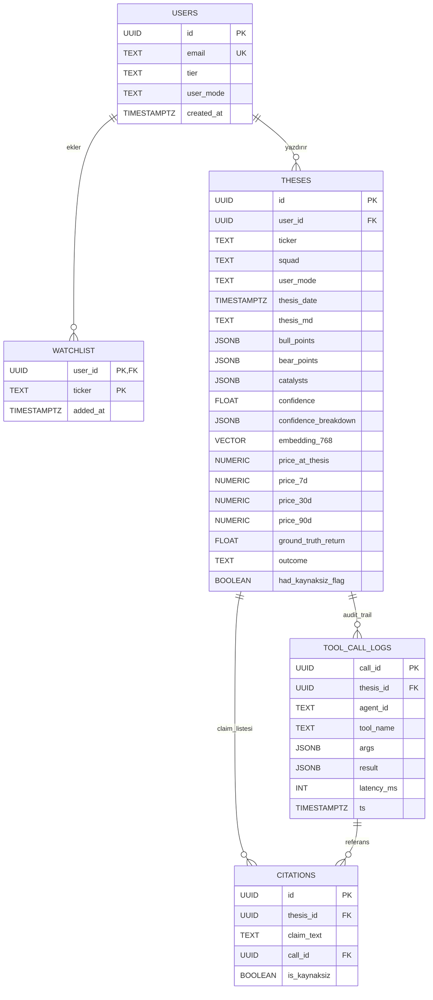
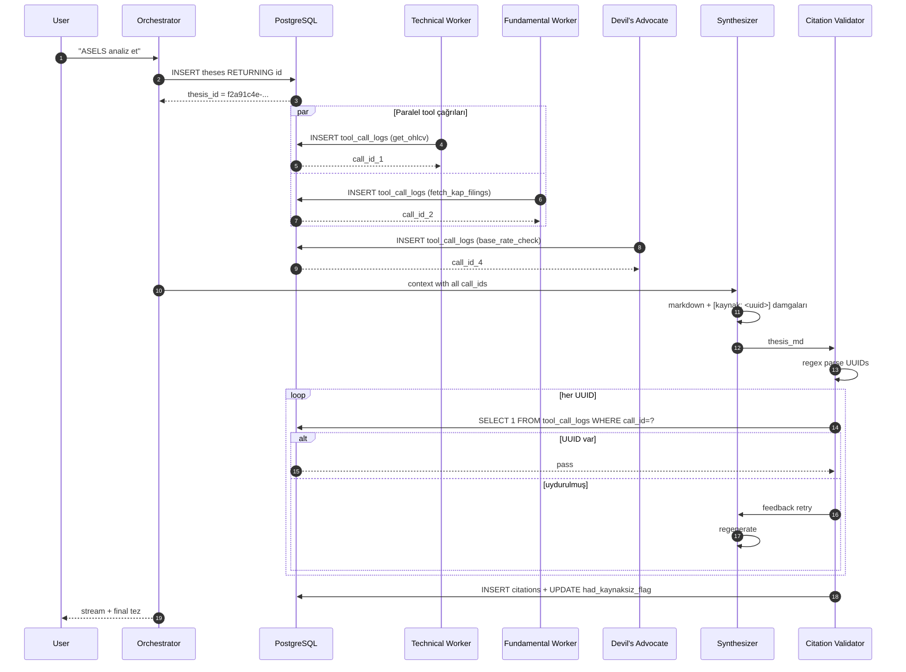
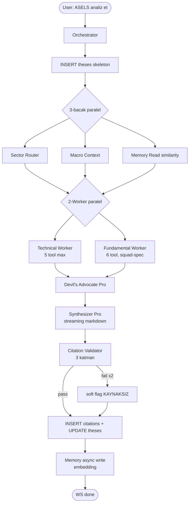
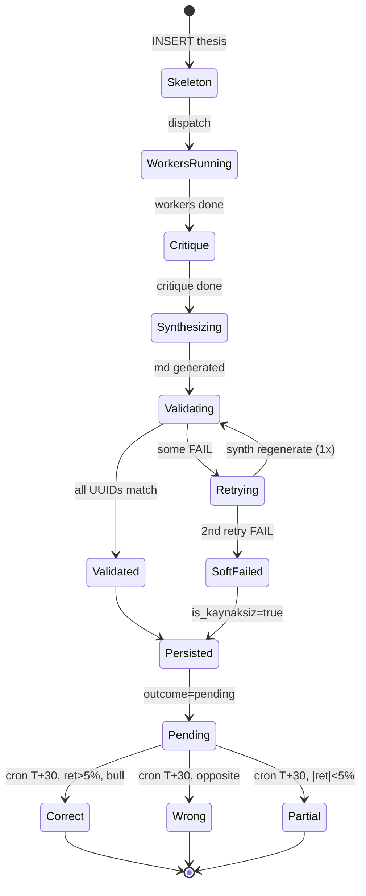

# ThesisForge — Implementation Spec (AI Agent Build Guide)

> **Bu doküman bir AI coding agent'a verilmek üzere hazırlanmıştır.** Projenin sıfırdan kodlanması için gereken tüm teknik kararları, şemaları, dosya yapısını, sınıf imzalarını ve adım adım uygulama sırasını içerir. Doküman self-contained'dir; ama gerektiğinde diğer truth file'lara işaret eder.
>
> **Hedef:** BTK 26 hackathon için **citation-grounded multi-agent BIST analiz sistemi**. Tek bir hisse için 8 ajan paralel çalışıp, halüsinasyon savunması olan, kaynak-bağlı bir yatırım tezi üretir.
>
> **Kapsam:** Backend (FastAPI + Strands + Postgres + pgvector) + DataProvider katmanı + Citation enforcement + Memory + Nightly cron. Frontend ayrı doküman.
>
> **Sürüm:** 1.0 · Tarih: 2026-05-14
>
> **İlgili dosyalar:** [`agents.md`](agents.md) · [`architecture.md`](architecture.md) · [`data.md`](data.md) · [`database.md`](database.md) · [`database-detailed.md`](database-detailed.md) · [`flows.md`](flows.md) · [`stack.md`](stack.md) · [`testing.md`](testing.md)

---

## İçindekiler

1. [Proje Özeti ve Hedefler](#1-proje-özeti-ve-hedefler)
2. [Tech Stack ve Karar Matrisi](#2-tech-stack-ve-karar-matrisi)
3. [Geliştirme Ortamı (Docker yok, Redis yok)](#3-geliştirme-ortamı)
4. [Dosya Yapısı (Backend)](#4-dosya-yapısı-backend)
5. [PostgreSQL Şeması — Tam SQL](#5-postgresql-şeması--tam-sql)
6. [UUID Damgalama Mekanizması](#6-uuid-damgalama-mekanizması)
7. [Ajan Kataloğu (8 Ajan)](#7-ajan-kataloğu-8-ajan)
8. [Squad Sistemi (5+1)](#8-squad-sistemi-51)
9. [DataProvider Mimarisi](#9-dataprovider-mimarisi)
10. [Cache Stratejisi (InMemory dev, Redis demo)](#10-cache-stratejisi)
11. [Citation Enforcement (3 Katman)](#11-citation-enforcement-3-katman)
12. [Confidence Formula ve Breakdown](#12-confidence-formula-ve-breakdown)
13. [Memory Agent ve pgvector](#13-memory-agent-ve-pgvector)
14. [Conservative Mode](#14-conservative-mode)
15. [API Endpoints](#15-api-endpoints)
16. [Nightly Cron](#16-nightly-cron)
17. [Pydantic Schemas (Tam Liste)](#17-pydantic-schemas-tam-liste)
18. [Environment Variables](#18-environment-variables)
19. [Adım Adım Uygulama Sırası (14 Aşama)](#19-adım-adım-uygulama-sırası-14-aşama)
20. [Testing Stratejisi](#20-testing-stratejisi)
21. [Demo Senaryoları](#21-demo-senaryoları)
22. [Fixture Store](#22-fixture-store)
23. [Sektör Map (BIST 50)](#23-sektör-map-bist-50)
24. [Mermaid Diyagramları](#24-mermaid-diyagramları)
25. [Bilinen Riskler ve Edge Case'ler](#25-bilinen-riskler-ve-edge-caseler)

---

## 1. Proje Özeti ve Hedefler

**ThesisForge**: Bir BIST hissesi için (örn. `ASELS`) doğal dil sorgusu alır (`"ASELS analiz et"`), 8 ajanın paralel çalıştığı bir komite kurar, ve **citation-bağlı bir yatırım tezi** üretir.

### 1.1 Sistemin Ayrıştırıcı 5 Özelliği

1. **Citation-grounded** — Çıktıdaki her sayı bir `tool_call_logs.call_id` UUID'sine bağlıdır. LLM uyduramaz, deterministik validate edilir.
2. **8 Ajan Komitesi** — Macro Context, Orchestrator, Sector Router, Technical Worker, Fundamental Worker, Devil's Advocate, Synthesizer, Memory Agent.
3. **5+1 Squad Sistemi** — Banking, Energy, Defense, Retail, RealEstate, Generic; her squad'a özel fundamental metrik prompt'u.
4. **Memory + Öğrenen Sistem** — Önceki tezler pgvector ile saklanır; yeni teze "tarihsel bağlam" enjekte edilir; gece cron `pending` outcome'ları gerçek getirilerle doldurur.
5. **Conservative Mode** — "Ali Bey" persona için bear case başa, confidence ≤70, volatilite/temettü vurgusu.

### 1.2 Pipeline Süre Hedefi

| Senaryo | Hedef |
|---|---|
| Cache miss (canlı) | 40–60 sn |
| Pre-warm (Redis hit) | <8 sn |
| Demo killswitch | 8 sn (yapay delay) |

### 1.3 Tek Cümle ile Ürün

> Kullanıcı bir hisse adı girer; sistem 8 ajanı paralel koşturup, her cümlesi gerçek bir tool çıktısına UUID ile bağlı, bull/bear/catalyst/risk yapısında Markdown bir yatırım tezi stream eder; tez sonradan gerçek fiyat hareketleriyle audit edilir.

---

## 2. Tech Stack ve Karar Matrisi

### 2.1 Sabit kararlar

| Katman | Seçim | Sebep |
|---|---|---|
| Backend dili | **Python 3.11+** | `scripts/product/` zaten Python, ekosistem (yfinance, isyatirimhisse, pandas-ta) |
| Web framework | **FastAPI** | async-native, WebSocket native, Pydantic entegrasyonu |
| Agent framework | **Strands Agents** | Agent-as-Tool pattern, Gemini native, OpenTelemetry built-in, supervisor pattern |
| LLM (Pro) | **Gemini 2.5 Pro** | Devil's Advocate + Synthesizer için kalite kritik |
| LLM (Flash) | **Gemini 2.5 Flash** | Diğer 6 ajan, maliyet/hız |
| Embedding | **text-embedding-3-large (OpenAI)** | 768-dim Matryoshka truncate, Türkçe %95 ok |
| DB | **PostgreSQL 16 + pgvector** | Tek DB hem metadata hem embedding |
| ORM | **SQLAlchemy 2.0 (async)** | Async-native, Alembic migration |
| Migration | **Alembic** | Standard, 3 kişi tutarlı şema |
| HTTP client | **httpx** (async) | `requests` async değil |
| Cache (dev) | **`cachetools.TTLCache`** in-memory | Redis dev'de gereksiz |
| Cache (demo) | **Redis (Upstash)** | Sadece demo öncesi entegre |
| Rate limit | **aiolimiter** | Per-source AsyncLimiter |
| Logging | **structlog** | JSON output, context propagation |
| Frontend | **Next.js 15 + Tailwind + shadcn/ui** | Mevcut frontend var |
| Validation | **Pydantic v2** | Structured agent output |
| Job scheduler | **APScheduler** | Nightly cron için |

### 2.2 Reddedilen alternatifler

| Alternatif | Reddedildi çünkü |
|---|---|
| LangGraph | Strands kadar Gemini-native değil, supervisor pattern boilerplate daha çok |
| OpenAI / Claude | Gemini Tier 1 ucuz ($1.25/M Pro, $0.075/M Flash) ve Türkçe finans terminolojisi yeterli |
| Pinecone / Weaviate | Ayrı servis = ayrı deploy + ayrı backup. pgvector 1k tezde <100ms cosine. |
| SQLite | pgvector yok |
| Sync SQLAlchemy | Pipeline async-native, mixin sıkıntı yaratır |
| Docker (development'ta tüm servisler) | Sadece Postgres için kullanılacak; Redis ve uygulama native |
| Kafka / Queue | Pipeline tek process, queue gereksiz overhead |

---

## 3. Geliştirme Ortamı

### 3.1 Docker yok (sadece Postgres için)

**Kural:** Backend uygulaması native Python ile çalışır. Sadece Postgres+pgvector için Docker kullanılır (native install pgvector için zor).

```yaml
# docker-compose.yml (repo root, sadece postgres)
services:
  postgres:
    image: pgvector/pgvector:pg16
    container_name: thesisforge-postgres
    environment:
      POSTGRES_DB: thesisforge
      POSTGRES_USER: tf
      POSTGRES_PASSWORD: tf
    ports: ["5432:5432"]
    volumes:
      - pgdata:/var/lib/postgresql/data
volumes:
  pgdata:
```

Komutlar:
```bash
docker compose up -d postgres        # 1 komutla başlat
docker compose stop postgres         # Durdur
docker compose down -v               # Veriyle birlikte sil
```

### 3.2 Redis yok (dev'de)

Dev'de cache `cachetools.TTLCache` ile in-memory. Demo öncesi (Aşama 13) Redis eklenir. Backend kodu `CacheBackend` interface üzerinden çalışır → swap için env var yeter.

### 3.3 Python kurulumu

```bash
python3.11 -m venv .venv
source .venv/bin/activate
pip install -e backend/[dev]
```

`backend/pyproject.toml` standartlarına göre.

### 3.4 İlk run (5 komutla MVP)

```bash
docker compose up -d postgres
cd backend
cp .env.example .env                 # gerekli key'leri doldur
alembic upgrade head                 # tablolar oluştu
uvicorn app.main:app --reload        # http://localhost:8000/health
```

---

## 4. Dosya Yapısı (Backend)

```
btk-hackathon'26/
├── docker-compose.yml                    # sadece postgres
├── scripts/                              # mevcut data probe + product/
│   └── product/                          # mevcut, AYNEN korunacak
│       ├── analyst.py
│       ├── companies.py
│       ├── config.py
│       ├── disclosures.py
│       ├── financials.py
│       ├── macro.py
│       ├── news.py
│       ├── prices.py
│       ├── technicals.py
│       └── thesis_bundle.py
├── backend/
│   ├── pyproject.toml
│   ├── .env.example
│   ├── alembic.ini
│   ├── sector_map.yaml                   # 5+1 squad → ticker
│   ├── alembic/
│   │   ├── env.py
│   │   └── versions/
│   │       └── 001_initial_schema.py
│   ├── fixtures/                         # demo killswitch için
│   │   ├── price/
│   │   ├── kap/
│   │   ├── fin/
│   │   ├── analyst/
│   │   ├── peers/
│   │   ├── news/
│   │   ├── macro/
│   │   └── thesis/
│   │       ├── ASELS.json
│   │       ├── GARAN.json
│   │       └── ...
│   ├── app/
│   │   ├── __init__.py
│   │   ├── main.py                       # FastAPI + lifespan
│   │   ├── api/
│   │   │   ├── __init__.py
│   │   │   ├── chat.py                   # POST /chat
│   │   │   ├── thesis_ws.py              # WS /ws/thesis/{id}
│   │   │   ├── thesis_rest.py            # GET /api/thesis/{id}
│   │   │   ├── watchlist.py
│   │   │   └── admin.py                  # /admin/cron-now
│   │   ├── core/
│   │   │   ├── __init__.py
│   │   │   ├── config.py                 # Pydantic Settings
│   │   │   ├── logging.py                # structlog
│   │   │   └── redis.py                  # Async Redis client (demo)
│   │   ├── data/
│   │   │   ├── __init__.py
│   │   │   ├── cache.py                  # CacheBackend + InMemoryCache + RedisCache
│   │   │   ├── ratelimit.py              # aiolimiter
│   │   │   ├── fixture.py                # disk read/write
│   │   │   ├── registry.py               # ChainedDataProvider
│   │   │   └── providers/
│   │   │       ├── __init__.py
│   │   │       ├── base.py               # DataProvider ABC
│   │   │       ├── macro.py              # async TCMB wrapper
│   │   │       ├── companies.py          # async MKK wrapper
│   │   │       ├── prices.py             # async yfinance + isyatirim
│   │   │       ├── financials.py
│   │   │       ├── disclosures.py
│   │   │       ├── technicals.py
│   │   │       ├── analyst.py
│   │   │       ├── news.py
│   │   │       └── thesis_bundle.py
│   │   ├── agents/
│   │   │   ├── __init__.py
│   │   │   ├── runtime.py                # Strands runtime + 8 ajan builder
│   │   │   ├── tools.py                  # @tool decorator (UUID damgalama)
│   │   │   ├── schemas.py                # Pydantic Observation, ThesisOutput, ...
│   │   │   ├── orchestrator.py           # run_thesis() supervisor
│   │   │   ├── macro_context.py
│   │   │   ├── sector_router.py
│   │   │   ├── technical_worker.py
│   │   │   ├── fundamental_worker.py
│   │   │   ├── devils_advocate.py
│   │   │   ├── synthesizer.py
│   │   │   ├── memory_agent.py
│   │   │   └── prompts/
│   │   │       ├── orchestrator.md
│   │   │       ├── macro_context.md
│   │   │       ├── sector_router.md
│   │   │       ├── technical_worker.md
│   │   │       ├── fundamental_worker.md
│   │   │       ├── fundamental_banking.md
│   │   │       ├── fundamental_energy.md
│   │   │       ├── fundamental_defense.md
│   │   │       ├── fundamental_retail.md
│   │   │       ├── fundamental_realestate.md
│   │   │       ├── fundamental_generic.md
│   │   │       ├── devils_advocate.md
│   │   │       ├── synthesizer.md
│   │   │       ├── synthesizer_conservative.md
│   │   │       └── memory_agent.md
│   │   ├── db/
│   │   │   ├── __init__.py
│   │   │   ├── models.py                 # SQLAlchemy ORM
│   │   │   ├── session.py                # async engine
│   │   │   └── repo.py                   # CRUD wrappers
│   │   ├── citations/
│   │   │   ├── __init__.py
│   │   │   ├── validator.py              # 3-katman validator
│   │   │   └── numbers.py                # sayısal sanity check
│   │   └── cron/
│   │       ├── __init__.py
│   │       └── nightly_outcomes.py       # APScheduler
│   ├── tests/
│   │   ├── unit/
│   │   │   ├── test_citation_validator.py
│   │   │   ├── test_providers.py
│   │   │   └── test_agents.py
│   │   ├── integration/
│   │   │   ├── test_orchestrator.py
│   │   │   └── test_e2e_fixture.py
│   │   └── smoke/
│   │       └── test_5_hisse.py
│   └── scripts/
│       ├── refresh_fixtures.py           # demo öncesi
│       ├── seed_memory.py                # 6 ay önceki ASELS tezi
│       └── warmup.py                     # 10 hisse pre-warm
└── frontend/                              # mevcut Next.js 15
    └── ... (ayrı doküman)
```

---

## 5. PostgreSQL Şeması — Tam SQL

### 5.1 Extension

```sql
CREATE EXTENSION IF NOT EXISTS vector;
CREATE EXTENSION IF NOT EXISTS pgcrypto;
```

### 5.2 Tablolar (5 tablo)

#### `users`

```sql
CREATE TABLE users (
  id           UUID PRIMARY KEY DEFAULT gen_random_uuid(),
  email        TEXT UNIQUE NOT NULL,
  tier         TEXT NOT NULL DEFAULT 'free'
                 CHECK (tier IN ('free','pro','b2b')),
  user_mode    TEXT NOT NULL DEFAULT 'default'
                 CHECK (user_mode IN ('default','conservative')),
  created_at   TIMESTAMPTZ NOT NULL DEFAULT now()
);
```

#### `watchlist`

```sql
CREATE TABLE watchlist (
  user_id    UUID NOT NULL REFERENCES users(id) ON DELETE CASCADE,
  ticker     TEXT NOT NULL,
  added_at   TIMESTAMPTZ NOT NULL DEFAULT now(),
  PRIMARY KEY (user_id, ticker)
);
```

#### `theses` — Ana iş tablosu

```sql
CREATE TABLE theses (
  id                       UUID PRIMARY KEY DEFAULT gen_random_uuid(),
  user_id                  UUID REFERENCES users(id),
  ticker                   TEXT NOT NULL,
  squad                    TEXT NOT NULL,
  user_mode                TEXT NOT NULL,
  thesis_date              TIMESTAMPTZ NOT NULL DEFAULT now(),
  thesis_md                TEXT,
  bull_points              JSONB,
  bear_points              JSONB,
  catalysts                JSONB,
  confidence               FLOAT,
  confidence_breakdown     JSONB,
  embedding                VECTOR(768),
  price_at_thesis          NUMERIC,
  price_7d                 NUMERIC,
  price_30d                NUMERIC,
  price_90d                NUMERIC,
  ground_truth_return      FLOAT,
  outcome                  TEXT NOT NULL DEFAULT 'pending'
                             CHECK (outcome IN ('correct','partial','wrong','pending')),
  had_kaynaksiz_flag       BOOLEAN NOT NULL DEFAULT false
);

CREATE INDEX idx_theses_embedding
  ON theses USING ivfflat (embedding vector_cosine_ops)
  WITH (lists = 100);

CREATE INDEX idx_theses_ticker_date
  ON theses (ticker, thesis_date DESC);

CREATE INDEX idx_theses_user_date
  ON theses (user_id, thesis_date DESC);

CREATE INDEX idx_theses_outcome_pending
  ON theses (thesis_date) WHERE outcome = 'pending';
```

#### `tool_call_logs` — UUID damgası kaynağı

```sql
CREATE TABLE tool_call_logs (
  call_id      UUID PRIMARY KEY DEFAULT gen_random_uuid(),
  thesis_id    UUID REFERENCES theses(id) ON DELETE CASCADE,
  agent_id     TEXT NOT NULL,                    -- sabit string: 'technical_worker' vb.
  tool_name    TEXT NOT NULL,
  args         JSONB,
  result       JSONB,                            -- HAM PAYLOAD — kanıt
  latency_ms   INT,
  ts           TIMESTAMPTZ NOT NULL DEFAULT now()
);

CREATE INDEX idx_tool_call_logs_thesis
  ON tool_call_logs (thesis_id);

CREATE INDEX idx_tool_call_logs_agent_tool
  ON tool_call_logs (agent_id, tool_name);
```

#### `citations` — Claim → tool call mapping

```sql
CREATE TABLE citations (
  id             UUID PRIMARY KEY DEFAULT gen_random_uuid(),
  thesis_id      UUID NOT NULL REFERENCES theses(id) ON DELETE CASCADE,
  claim_text     TEXT NOT NULL,
  call_id        UUID REFERENCES tool_call_logs(call_id),  -- NULL ise kaynaksız
  is_kaynaksiz   BOOLEAN NOT NULL DEFAULT false,
  CONSTRAINT chk_kaynaksiz_consistency CHECK (
    (is_kaynaksiz = true  AND call_id IS NULL) OR
    (is_kaynaksiz = false AND call_id IS NOT NULL)
  )
);

CREATE INDEX idx_citations_thesis
  ON citations (thesis_id);

CREATE INDEX idx_citations_call
  ON citations (call_id) WHERE call_id IS NOT NULL;
```

### 5.3 SQLAlchemy ORM (`app/db/models.py`)

```python
from __future__ import annotations
import uuid
from datetime import datetime
from sqlalchemy import (
    String, Float, Integer, Boolean, Numeric, ForeignKey,
    DateTime, CheckConstraint, Index, text
)
from sqlalchemy.dialects.postgresql import UUID, JSONB
from sqlalchemy.orm import DeclarativeBase, Mapped, mapped_column, relationship
from pgvector.sqlalchemy import Vector


class Base(DeclarativeBase):
    pass


class User(Base):
    __tablename__ = "users"
    id: Mapped[uuid.UUID] = mapped_column(UUID(as_uuid=True), primary_key=True,
                                          server_default=text("gen_random_uuid()"))
    email: Mapped[str] = mapped_column(String, unique=True, nullable=False)
    tier: Mapped[str] = mapped_column(String, nullable=False, default="free")
    user_mode: Mapped[str] = mapped_column(String, nullable=False, default="default")
    created_at: Mapped[datetime] = mapped_column(DateTime(timezone=True),
                                                 server_default=text("now()"))
    __table_args__ = (
        CheckConstraint("tier IN ('free','pro','b2b')"),
        CheckConstraint("user_mode IN ('default','conservative')"),
    )


class Watchlist(Base):
    __tablename__ = "watchlist"
    user_id: Mapped[uuid.UUID] = mapped_column(UUID(as_uuid=True),
                                                ForeignKey("users.id", ondelete="CASCADE"),
                                                primary_key=True)
    ticker: Mapped[str] = mapped_column(String, primary_key=True)
    added_at: Mapped[datetime] = mapped_column(DateTime(timezone=True),
                                                server_default=text("now()"))


class Thesis(Base):
    __tablename__ = "theses"
    id: Mapped[uuid.UUID] = mapped_column(UUID(as_uuid=True), primary_key=True,
                                          server_default=text("gen_random_uuid()"))
    user_id: Mapped[uuid.UUID | None] = mapped_column(UUID(as_uuid=True),
                                                      ForeignKey("users.id"))
    ticker: Mapped[str] = mapped_column(String, nullable=False)
    squad: Mapped[str] = mapped_column(String, nullable=False)
    user_mode: Mapped[str] = mapped_column(String, nullable=False)
    thesis_date: Mapped[datetime] = mapped_column(DateTime(timezone=True),
                                                  server_default=text("now()"))
    thesis_md: Mapped[str | None] = mapped_column(String)
    bull_points: Mapped[dict | None] = mapped_column(JSONB)
    bear_points: Mapped[dict | None] = mapped_column(JSONB)
    catalysts: Mapped[dict | None] = mapped_column(JSONB)
    confidence: Mapped[float | None] = mapped_column(Float)
    confidence_breakdown: Mapped[dict | None] = mapped_column(JSONB)
    embedding: Mapped[list[float] | None] = mapped_column(Vector(768))
    price_at_thesis: Mapped[float | None] = mapped_column(Numeric)
    price_7d: Mapped[float | None] = mapped_column(Numeric)
    price_30d: Mapped[float | None] = mapped_column(Numeric)
    price_90d: Mapped[float | None] = mapped_column(Numeric)
    ground_truth_return: Mapped[float | None] = mapped_column(Float)
    outcome: Mapped[str] = mapped_column(String, nullable=False, default="pending")
    had_kaynaksiz_flag: Mapped[bool] = mapped_column(Boolean, nullable=False, default=False)
    __table_args__ = (
        CheckConstraint("outcome IN ('correct','partial','wrong','pending')"),
        Index("idx_theses_ticker_date", "ticker", text("thesis_date DESC")),
        Index("idx_theses_user_date", "user_id", text("thesis_date DESC")),
    )


class ToolCallLog(Base):
    __tablename__ = "tool_call_logs"
    call_id: Mapped[uuid.UUID] = mapped_column(UUID(as_uuid=True), primary_key=True,
                                                server_default=text("gen_random_uuid()"))
    thesis_id: Mapped[uuid.UUID | None] = mapped_column(UUID(as_uuid=True),
                                                        ForeignKey("theses.id",
                                                                   ondelete="CASCADE"))
    agent_id: Mapped[str] = mapped_column(String, nullable=False)
    tool_name: Mapped[str] = mapped_column(String, nullable=False)
    args: Mapped[dict | None] = mapped_column(JSONB)
    result: Mapped[dict | None] = mapped_column(JSONB)
    latency_ms: Mapped[int | None] = mapped_column(Integer)
    ts: Mapped[datetime] = mapped_column(DateTime(timezone=True),
                                         server_default=text("now()"))
    __table_args__ = (
        Index("idx_tool_call_logs_thesis", "thesis_id"),
        Index("idx_tool_call_logs_agent_tool", "agent_id", "tool_name"),
    )


class Citation(Base):
    __tablename__ = "citations"
    id: Mapped[uuid.UUID] = mapped_column(UUID(as_uuid=True), primary_key=True,
                                          server_default=text("gen_random_uuid()"))
    thesis_id: Mapped[uuid.UUID] = mapped_column(UUID(as_uuid=True),
                                                 ForeignKey("theses.id", ondelete="CASCADE"),
                                                 nullable=False)
    claim_text: Mapped[str] = mapped_column(String, nullable=False)
    call_id: Mapped[uuid.UUID | None] = mapped_column(UUID(as_uuid=True),
                                                       ForeignKey("tool_call_logs.call_id"))
    is_kaynaksiz: Mapped[bool] = mapped_column(Boolean, nullable=False, default=False)
    __table_args__ = (
        CheckConstraint(
            "(is_kaynaksiz = true AND call_id IS NULL) OR "
            "(is_kaynaksiz = false AND call_id IS NOT NULL)",
            name="chk_kaynaksiz_consistency",
        ),
        Index("idx_citations_thesis", "thesis_id"),
    )
```

### 5.4 İlk migration (Alembic)

`backend/alembic/versions/001_initial_schema.py`:

```python
"""initial schema

Revision ID: 001
Create Date: 2026-05-14
"""
from alembic import op
import sqlalchemy as sa
from sqlalchemy.dialects.postgresql import UUID, JSONB
from pgvector.sqlalchemy import Vector

revision = "001"
down_revision = None

def upgrade():
    op.execute("CREATE EXTENSION IF NOT EXISTS vector")
    op.execute("CREATE EXTENSION IF NOT EXISTS pgcrypto")

    op.create_table("users", ...)
    op.create_table("watchlist", ...)
    op.create_table("theses", ...)
    op.create_table("tool_call_logs", ...)
    op.create_table("citations", ...)

    op.execute("""
      CREATE INDEX idx_theses_embedding ON theses
      USING ivfflat (embedding vector_cosine_ops) WITH (lists = 100)
    """)
    op.execute("""
      CREATE INDEX idx_theses_outcome_pending ON theses (thesis_date)
      WHERE outcome = 'pending'
    """)

def downgrade():
    op.drop_table("citations")
    op.drop_table("tool_call_logs")
    op.drop_table("theses")
    op.drop_table("watchlist")
    op.drop_table("users")
```

---

## 6. UUID Damgalama Mekanizması

### 6.1 Tanım

UUID damgası = `tool_call_logs.call_id`. Her başarılı tool çağrısı bu tabloya bir satır INSERT eder ve karşılığında bir UUID döndürür. Synthesizer markdown çıktısında `[kaynak: <uuid>]` etiketi olarak basar. Validator PK lookup ile doğrular.

### 6.2 Sabit `agent_id` Sözlüğü (8 ajan)

`tool_call_logs.agent_id` TEXT — UUID **değil**. 8 sabit string:

```python
AGENT_IDS = {
    "ORCHESTRATOR":         "orchestrator",
    "MACRO_CONTEXT":        "macro_context",
    "SECTOR_ROUTER":        "sector_router",
    "TECHNICAL_WORKER":     "technical_worker",
    "FUNDAMENTAL_WORKER":   "fundamental_worker",
    "DEVILS_ADVOCATE":      "devils_advocate",
    "SYNTHESIZER":          "synthesizer",
    "MEMORY_AGENT":         "memory_agent",
}
```

### 6.3 Damgalama akışı (Adım adım)

```
ADIM 0 — Pipeline başlangıcı
  Orchestrator:
    INSERT INTO theses (user_id, ticker, squad, user_mode, price_at_thesis, outcome)
      VALUES (..., 'pending') RETURNING id;
    → thesis_id = "f2a91c4e-..."

ADIM 1..N — Her tool çağrısı (paralel olabilir)
  Agent → @tool decorator → ChainedDataProvider.fetch()
    │
    │ provider chain çalışır (primary → secondary → fixture)
    │ cache check + ham payload döner
    │
    ↓
  INSERT INTO tool_call_logs (
      thesis_id, agent_id, tool_name, args, result, latency_ms)
    VALUES (...)
    RETURNING call_id;
    → call_id = "7b3e1f24-9c2a-4f8b-..."

  Agent bu call_id'i Pydantic Observation içinde saklar:
    Observation(text="RSI 67, aşırı alım sınırı", citation_call_id="7b3e1f24-...")

ADIM N+1 — Synthesizer
  Tüm Observation listesi + Devil critique + memory hits → Synthesizer prompt'una verilir.
  Synthesizer markdown üretir, her claim sonuna [kaynak: <uuid>] basar.

ADIM N+2 — Citation Validator (3 katman)
  Katman 1: regex `\[kaynak:\s*([a-f0-9-]{36})\]` parse
  Katman 2: PK lookup → SELECT 1 FROM tool_call_logs WHERE call_id = ?
  Katman 3: Sayısal sanity check — sayılar tool_call_logs.result içinde var mı?

  PASS → citations INSERT (her claim için satır)
  FAIL (1. tur) → Synthesizer'a feedback → retry (1 kez)
  FAIL (2. tur) → is_kaynaksiz=true, call_id=NULL → had_kaynaksiz_flag=true

ADIM N+3 — Memory async write
  embedding = openai.embed("text-embedding-3-large", thesis_md)
  UPDATE theses SET embedding = $1 WHERE id = ?
```

### 6.4 `@tool` Decorator — UUID Üretim Noktası

`backend/app/agents/tools.py`:

```python
from functools import wraps
from typing import Callable
from app.db.repo import insert_tool_call_log
from app.data.registry import ChainedDataProvider
from app.core.logging import log

class AgentContext:
    """Pipeline boyunca taşınan context. Her tool çağrısı thesis_id ve agent_id'yi bilir."""
    def __init__(self, thesis_id: str, agent_id: str, session):
        self.thesis_id = thesis_id
        self.agent_id = agent_id
        self.session = session
        self.last_call_id: str | None = None


def tool(name: str):
    """Strands @tool wrapper. UUID damgalar, log atar, sonucu döner."""
    def decorator(fn: Callable):
        @wraps(fn)
        async def wrapper(ctx: AgentContext, **kwargs):
            import time
            t0 = time.time()
            try:
                result = await fn(ctx, **kwargs)
                latency = int((time.time() - t0) * 1000)
                call_id = await insert_tool_call_log(
                    session=ctx.session,
                    thesis_id=ctx.thesis_id,
                    agent_id=ctx.agent_id,
                    tool_name=name,
                    args=kwargs,
                    result=result,
                    latency_ms=latency,
                )
                ctx.last_call_id = str(call_id)
                log.info("tool_call_ok", tool=name, call_id=str(call_id), latency_ms=latency)
                return {"call_id": str(call_id), "result": result}
            except Exception as e:
                latency = int((time.time() - t0) * 1000)
                log.error("tool_call_fail", tool=name, error=str(e), latency_ms=latency)
                raise
        return wrapper
    return decorator
```

### 6.5 Synthesizer Context Format

```
TOOL CALL CONTEXT (use ONLY these for [kaynak: ...] tags):

call_id=7b3e1f24-9c2a-4f8b-bc91-aaabbbcccddd
  agent=technical_worker tool=get_ohlcv
  args={"ticker":"ASELS","period":"90d"}
  observations:
    - "RSI(14)=67"
    - "MACD histogram -1.43"
    - "Bollinger üst banttan %2 uzakta"

call_id=9d44ee10-...
  agent=fundamental_worker tool=fetch_kap_filings
  observations:
    - "Q3 net kâr +%23"
    - "Yeni MILGEM sözleşmesi 2026-03-14"

...

INSTRUCTION:
For EVERY numeric claim or factual statement, append [kaynak: <call_id>]
where <call_id> is from the list above.
DO NOT invent UUIDs.
If you cannot ground a claim, omit the sentence entirely.
```

---

## 7. Ajan Kataloğu (8 Ajan)

### 7.1 Genel tablo

| # | Ajan | Tip | Model | agent_id | Tool sayısı |
|---|---|---|---|---|---|
| 1 | Macro Context | Background (cached 15dk) | Gemini Flash | `macro_context` | 4 |
| 2 | Orchestrator | Coordinator | Gemini Flash | `orchestrator` | 4 |
| 3 | Sector Router | Classifier | Gemini Flash | `sector_router` | 2 |
| 4 | Technical Worker | Worker (parallel) | Gemini Flash | `technical_worker` | 5 |
| 5 | Fundamental Worker | Worker (parallel) | Gemini Flash | `fundamental_worker` | 6 |
| 6 | Devil's Advocate | Critic | **Gemini Pro** | `devils_advocate` | 3 |
| 7 | Synthesizer | Composer | **Gemini Pro** | `synthesizer` | 0 (markdown gen) |
| 8 | Memory Agent | Stateful | Flash + Embedding | `memory_agent` | 3 |

### 7.2 Tool isimleri (sabit)

```python
TOOL_NAMES = {
    # Macro Context
    "GET_TCMB_INDICATORS":          "get_tcmb_indicators",
    "GET_BIST_INDEX_STATE":         "get_bist_index_state",
    "GET_GLOBAL_SIGNALS":           "get_global_signals",
    "GET_RECENT_MACRO_NEWS":        "get_recent_macro_news",
    # Orchestrator
    "VALIDATE_TICKER":              "validate_ticker",
    "DISPATCH_WORKERS":             "dispatch_workers",
    "GET_MACRO_CONTEXT":            "get_macro_context",
    "SAVE_THESIS":                  "save_thesis",
    # Sector Router
    "LOOKUP_SECTOR":                "lookup_sector",
    "SELECT_SQUAD":                 "select_squad",
    # Technical Worker
    "GET_OHLCV":                    "get_ohlcv",
    "CALCULATE_INDICATORS":         "calculate_indicators",
    "DETECT_PATTERNS":              "detect_patterns",
    "FIND_SUPPORT_RESISTANCE":      "find_support_resistance",
    "RELATIVE_STRENGTH":            "relative_strength",
    # Fundamental Worker
    "FETCH_KAP_FILINGS":            "fetch_kap_filings",
    "GET_FINANCIAL_STATEMENTS":     "get_financial_statements",
    "COMPUTE_RATIOS":               "compute_ratios",
    "GET_SECTOR_PEERS":             "get_sector_peers",
    "COMPARE_TO_PEERS":             "compare_to_peers",
    "GET_DIVIDEND_HISTORY":         "get_dividend_history",
    # Devil's Advocate
    "QUERY_WORKERS":                "query_workers",
    "FIND_DISCONFIRMING_EVIDENCE":  "find_disconfirming_evidence",
    "BASE_RATE_CHECK":              "base_rate_check",
    # Memory Agent
    "EMBED_TEXT":                   "embed_text",
    "SIMILARITY_SEARCH":            "similarity_search",
    "WRITE_THESIS_EMBEDDING":       "write_thesis_embedding",
}
```

### 7.3 Per-Agent Specs

#### 7.3.1 Macro Context

- **Cache:** Redis `macro:context` TTL 15dk. Dev'de InMemoryCache.
- **Tools:** `get_tcmb_indicators`, `get_bist_index_state`, `get_global_signals`, `get_recent_macro_news`
- **Output:** 1 paragraf, her cümle `[kaynak: <call_id>]`

#### 7.3.2 Orchestrator

- **Pattern:** Supervisor. Diğer agent'ları çağırır, kendisi tool çağırmaz (sadece `save_thesis`).
- **Sequence:**
  ```python
  async def run_thesis(ticker, user_id, user_mode):
      thesis_id = await insert_thesis_skeleton(ticker, user_id, user_mode)
      ctx = AgentContext(thesis_id=thesis_id, agent_id="orchestrator", ...)

      # 3-bacak paralel
      sector, macro, memory_hits = await asyncio.gather(
          sector_router.run(ctx, ticker),
          macro_context.run(ctx),
          memory_agent.search(ctx, ticker),
      )

      # 2 worker paralel
      tech, fund = await asyncio.gather(
          technical_worker.run(ctx, ticker, sector.squad),
          fundamental_worker.run(ctx, ticker, sector.squad),
      )

      # critique → synthesize → validate → persist
      critique = await devils_advocate.run(ctx, tech, fund)
      thesis_md = await synthesizer.run(ctx, macro, tech, fund, critique, memory_hits, user_mode)
      validated_md, citations = await citation_validator.validate(thesis_md, thesis_id)
      await persist_thesis(thesis_id, validated_md, citations)

      # async memory write
      asyncio.create_task(memory_agent.write(thesis_id, validated_md))
      return thesis_id
  ```

#### 7.3.3 Sector Router

- **Primary:** `sector_map.yaml` lookup
- **Fallback:** LLM ("hangi sektör?")
- **Output:** `SectorAssignment(squad: Literal["Banking","Energy","Defense","Retail","RealEstate","Generic"])`

#### 7.3.4 Technical Worker

- **Tools sıralı:** `get_ohlcv` → `calculate_indicators` → `detect_patterns` → `find_support_resistance` → `relative_strength`
- **Max tool call:** 5 (Flash bütçesi)
- **Output:** `TechnicalAnalysis` Pydantic (bkz. §17)

#### 7.3.5 Fundamental Worker

- **Tools sıralı:** `fetch_kap_filings` → `get_financial_statements` → `compute_ratios` → `get_sector_peers` → `compare_to_peers` → `get_dividend_history`
- **Squad prompt:** `prompts/fundamental_<squad>.md` dinamik seçilir.
- **Output:** `FundamentalAnalysis` Pydantic

#### 7.3.6 Devil's Advocate (Pro)

- **Rol:** Worker output'larına 2 paragraf karşı argüman + base rate uyarısı.
- **Tools:** `query_workers`, `find_disconfirming_evidence`, `base_rate_check`
- **Output:** `Critique` Pydantic (`technical_pushback[]`, `fundamental_pushback[]`, `cross_cutting_risks[]`, `base_rate_warnings[]`, `overall_critique_strength: int`)

#### 7.3.7 Synthesizer (Pro)

- **Girdi:** macro + tech + fund + critique + memory_hits + user_mode
- **Çıktı:** Markdown (stream), `[kaynak: <uuid>]` damgalı
- **Şablon:**
  ```
  TL;DR
  ↓
  Bull Case   (conservative → Bear başa)
  ↓
  Bear Case
  ↓
  Anahtar Katalizörler 📅
  ↓
  Tarihsel Bağlam (Memory)
  ↓
  Risk Uyarıları
  ↓
  Güven Skoru (explainable breakdown)
  ↓
  Disclaimer
  ```
- **Conservative slot:** `prompts/synthesizer_conservative.md`

#### 7.3.8 Memory Agent

- **Embed:** OpenAI `text-embedding-3-large`, `dimensions=768` (Matryoshka truncate)
- **Search:** pgvector cosine, top_k=3, filter `ticker = current OR squad = current_squad`
- **Write:** Synthesizer biten tezden sonra async UPDATE

---

## 8. Squad Sistemi (5+1)

```yaml
# backend/sector_map.yaml
Banking:
  tickers: [GARAN, AKBNK, ISCTR, YKBNK, HALKB, VAKBN]
  metrics: [NIM, CAR, NPL, CASA, kredi_mevduat, SYR]
  prompt: fundamental_banking.md

Energy:
  tickers: [TUPRS, AKSEN, AKSA, ZOREN, ENJSA, AYGAZ]
  metrics: [refining_margin, brent_korelasyon, kapasite, EPDK_tarife]
  prompt: fundamental_energy.md

Defense:
  tickers: [ASELS, OTKAR, EREGL, KCHOL, KOZAL, KARSN]
  metrics: [backlog, R&D_oran, USD_revenue_pct, sozlesmeler]
  prompt: fundamental_defense.md

Retail:
  tickers: [BIMAS, MGROS, SOKM, ULKER, CCOLA, ARCLK]
  metrics: [LFL_buyume, magaza_sayisi, sepet, SSS]
  prompt: fundamental_retail.md

RealEstate:
  tickers: [EKGYO, ISGYO, SAHOL, AGHOL, DOHOL]
  metrics: [NAV_iskonto, portfoy_degeri, doluluk_orani]
  prompt: fundamental_realestate.md

Generic:
  fallback: true
  metrics: [PE, PB, ROE, EBITDA, EV_EBITDA]
  prompt: fundamental_generic.md
```

---

## 9. DataProvider Mimarisi

### 9.1 Interface

`backend/app/data/providers/base.py`:

```python
from abc import ABC, abstractmethod
from typing import Any
from pydantic import BaseModel


class ProviderResult(BaseModel):
    """Her provider'ın dönüş tipi."""
    source: str                   # 'yfinance' | 'isyatirim' | 'fixture'
    payload: dict[str, Any]
    fetched_at: str               # ISO timestamp


class DataProvider(ABC):
    """Tüm provider'lar bu interface'i implement eder."""
    name: str                     # 'yfinance', 'isyatirim', vb.

    @abstractmethod
    async def fetch(self, **kwargs) -> ProviderResult: ...


class ChainedDataProvider:
    """primary → secondary → fixture sırasıyla dener."""
    def __init__(self, providers: list[DataProvider], fixture_key_fn):
        self.providers = providers
        self.fixture_key_fn = fixture_key_fn

    async def fetch(self, **kwargs) -> ProviderResult:
        last_err = None
        for provider in self.providers:
            try:
                return await provider.fetch(**kwargs)
            except Exception as e:
                last_err = e
                continue
        # tüm chain fail → fixture
        from app.data.fixture import read_fixture
        key = self.fixture_key_fn(**kwargs)
        fx = await read_fixture(key)
        if fx:
            return fx
        raise DataUnavailable(f"All providers + fixture failed for {key}") from last_err


class DataUnavailable(Exception):
    pass
```

### 9.2 Mevcut `scripts/product/` modüllerini sarmalama

`scripts/product/*.py` sync (`httpx.get`, `yf.Ticker`). Async'e geçirme stratejisi:

**Aşama A (hızlı, Aşama 3'te):** `asyncio.to_thread()` ile sync fn'i async wrap:

```python
# backend/app/data/providers/prices.py
import asyncio
from scripts.product.prices import get_ohlcv as _sync_get_ohlcv
from .base import DataProvider, ProviderResult


class YFinancePriceProvider(DataProvider):
    name = "yfinance"

    async def fetch(self, ticker: str, days: int = 90) -> ProviderResult:
        df = await asyncio.to_thread(_sync_get_ohlcv, ticker, days)
        return ProviderResult(
            source="yfinance",
            payload={
                "rows": len(df),
                "last_close": float(df.iloc[-1]["Close"]),
                "ohlcv": df.reset_index().to_dict("records"),
            },
            fetched_at=datetime.utcnow().isoformat() + "Z",
        )
```

**Aşama B (Aşama 11'de, opsiyonel refactor):** Gerçek async httpx + yfinance async wrapper.

### 9.3 Modül-Kaynak Matrisi

| Modül | Primary | Secondary | Fixture | Cache TTL |
|---|---|---|---|---|
| OHLCV | yfinance | isyatirimhisse | `fixtures/price/<TICKER>.json` | 15 dk |
| Index OHLCV | yfinance | isyatirim | `fixtures/index/` | 15 dk |
| Financial statements | isyatirimhisse | yfinance | `fixtures/fin/<TICKER>/Q<N>.json` | 24 saat |
| KAP filings | MKK API | KAP RSS | `fixtures/kap/<TICKER>.json` | 1 saat |
| Analist tavsiyesi | borsapy | — | `fixtures/analyst/<TICKER>.json` | 24 saat |
| Peer compare | borsapy | manual aggregation | `fixtures/peers/<SQUAD>.json` | 24 saat |
| Dividend | yfinance | isyatirim | `fixtures/dividend/` | 24 saat |
| Macro (TCMB) | EVDS (key'li) | inflation endpoint (key'siz) | `fixtures/macro/latest.json` | 15 dk |
| News | Mynet scrape | Bigpara scrape | `fixtures/news/<TICKER>.json` | 1 saat |

---

## 10. Cache Stratejisi

### 10.1 Interface (env ile swap)

`backend/app/data/cache.py`:

```python
from abc import ABC, abstractmethod
from typing import Any
from cachetools import TTLCache


class CacheBackend(ABC):
    @abstractmethod
    async def get(self, key: str) -> Any | None: ...
    @abstractmethod
    async def set(self, key: str, value: Any, ttl: int) -> None: ...
    @abstractmethod
    async def delete(self, key: str) -> None: ...


class InMemoryCache(CacheBackend):
    """Dev cache, process-local."""
    def __init__(self):
        self._store: dict[str, TTLCache] = {}

    async def get(self, key: str):
        for cache in self._store.values():
            if key in cache:
                return cache[key]
        return None

    async def set(self, key: str, value, ttl: int):
        # tek bir TTLCache her TTL için ayrı bucket — basitleştirilmiş
        bucket = self._store.setdefault(ttl, TTLCache(maxsize=1000, ttl=ttl))
        bucket[key] = value

    async def delete(self, key: str):
        for cache in self._store.values():
            cache.pop(key, None)


class RedisCache(CacheBackend):
    """Demo/production cache. Aşama 13'te eklenir."""
    def __init__(self, redis_client):
        self.r = redis_client
    async def get(self, key: str):
        import json
        v = await self.r.get(key)
        return json.loads(v) if v else None
    async def set(self, key: str, value, ttl: int):
        import json
        await self.r.set(key, json.dumps(value), ex=ttl)
    async def delete(self, key: str):
        await self.r.delete(key)


def get_cache_backend() -> CacheBackend:
    from app.core.config import settings
    if settings.CACHE_BACKEND == "redis":
        from app.core.redis import redis_client
        return RedisCache(redis_client)
    return InMemoryCache()
```

### 10.2 Key Şeması

```
<domain> : <entity> : <modifier>
```

| Pattern | TTL | İçerik |
|---|---|---|
| `macro:context` | 15 dk | JSON makro paragraf |
| `price:<TICKER>:ohlcv:90d` | 15 dk | OHLCV DataFrame JSON |
| `fin:<TICKER>:<Q>` | 24 saat | IFRS tablosu |
| `kap:<TICKER>:filings:30d` | 1 saat | KAP filings array |
| `analyst:<TICKER>` | 24 saat | Konsensüs tavsiye |
| `peers:<SQUAD>` | 24 saat | Peer scanner sonucu |
| `dividend:<TICKER>` | 24 saat | Temettü geçmişi |
| `news:<TICKER>` | 1 saat | Hisse haberi |
| `demo:warm:<TICKER>` | ∞ | Pre-warmed full thesis |

---

## 11. Citation Enforcement (3 Katman)

`backend/app/citations/validator.py`:

```python
import re
import uuid
from app.db.repo import get_tool_call_log, insert_citation, update_thesis_kaynaksiz_flag

UUID_RE = re.compile(r"\[kaynak:\s*([a-f0-9-]{36})\]", re.IGNORECASE)
NUMBER_RE = re.compile(r"\b\d{1,3}(?:[.,]\d+)?\b")


async def validate_citations(
    thesis_md: str,
    thesis_id: uuid.UUID,
    session,
    synthesizer_retry_fn,  # Callable[[str], Awaitable[str]] — feedback ile yeniden üret
) -> tuple[str, list[dict]]:
    """3 katman validate.
    Returns: (validated_md, citations_list)
    """
    # ---- Katman 1: regex parse ----
    for attempt in range(2):  # 1 retry
        uuids_in_text = UUID_RE.findall(thesis_md)
        if not uuids_in_text:
            # Synthesizer hiç kaynak koymamış → soft fail
            break

        # ---- Katman 2: PK lookup ----
        missing = []
        for u in uuids_in_text:
            try:
                uuid.UUID(u)
            except ValueError:
                missing.append(u)
                continue
            log = await get_tool_call_log(session, u, thesis_id)
            if log is None:
                missing.append(u)

        # ---- Katman 3: numeric sanity check ----
        numeric_issues = await _check_numbers(thesis_md, thesis_id, session)

        if not missing and not numeric_issues:
            break

        if attempt == 0:
            # retry feedback
            feedback = _build_feedback(missing, numeric_issues)
            thesis_md = await synthesizer_retry_fn(feedback)
        else:
            # 2. tur hâlâ fail → soft flag
            break

    # ---- citations INSERT ----
    citations = _split_into_claims(thesis_md)
    citations_list = []
    had_kaynaksiz = False
    for claim_text, call_id_str in citations:
        is_kaynaksiz = call_id_str is None
        if is_kaynaksiz:
            had_kaynaksiz = True
        await insert_citation(session, thesis_id, claim_text, call_id_str, is_kaynaksiz)
        citations_list.append({
            "claim": claim_text,
            "call_id": call_id_str,
            "is_kaynaksiz": is_kaynaksiz,
        })

    if had_kaynaksiz:
        await update_thesis_kaynaksiz_flag(session, thesis_id, True)

    return thesis_md, citations_list


def _split_into_claims(md: str) -> list[tuple[str, str | None]]:
    """Markdown'u cümlelere böl, her cümle için call_id çıkar."""
    sentences = []
    for line in md.split("\n"):
        line = line.strip()
        if not line:
            continue
        m = UUID_RE.search(line)
        if m:
            claim = UUID_RE.sub("", line).strip()
            sentences.append((claim, m.group(1)))
        elif line.endswith(".") or line.endswith("!"):
            # cümle var ama kaynak yok
            sentences.append((line, None))
    return sentences


async def _check_numbers(md: str, thesis_id, session) -> list[str]:
    """Markdown'daki her sayı, ilgili call_id'nin result'unda var mı?"""
    issues = []
    # her [kaynak: uuid] etiketinden ÖNCE gelen sayıları yakala
    for match in UUID_RE.finditer(md):
        uuid_str = match.group(1)
        # cümleyi geri çek
        start = max(0, match.start() - 200)
        sentence = md[start:match.start()]
        numbers = NUMBER_RE.findall(sentence)
        log = await get_tool_call_log(session, uuid_str, thesis_id)
        if log is None or not log.result:
            continue
        result_str = str(log.result)
        for n in numbers:
            if n not in result_str:
                issues.append(f"Number {n} not in tool result of {uuid_str}")
    return issues


def _build_feedback(missing: list[str], numeric_issues: list[str]) -> str:
    msg = "Citation validation failed:\n"
    if missing:
        msg += f"  Missing UUIDs (not in tool_call_logs): {missing}\n"
    if numeric_issues:
        msg += f"  Numeric mismatches: {numeric_issues}\n"
    msg += "Please regenerate the markdown using ONLY valid call_ids from the context."
    return msg
```

---

## 12. Confidence Formula ve Breakdown

### 12.1 Formül

```
Confidence = 0.25 × Data Quality
           + 0.20 × Technical Score
           + 0.20 × Fundamental Score
           + 0.15 × News/Macro Alignment
           + 0.10 × Memory Base Rate
           + 0.10 × Devil's Advocate Inverse
```

### 12.2 Bileşenler

| Bileşen | Hesap |
|---|---|
| Data Quality | (Başarılı tool call / Toplam) × 100. Cache hit rate de pozitif etki. |
| Technical Score | Technical Worker'ın çıkışındaki `momentum_score` 0–100 |
| Fundamental Score | Fundamental Worker'ın çıkışındaki ratio/peer-relative score |
| News/Macro Alignment | News sentiment + makro yön. Pozitif haber + makro uyumlu = + |
| Memory Base Rate | Squad'ın geçmiş success rate'i `correct / total` |
| Devil's Advocate Inverse | `100 - critique.overall_critique_strength` |

### 12.3 JSONB Format

```json
{
  "data_quality": 80,
  "technical": 65,
  "fundamental": 75,
  "news_macro": 60,
  "memory_base": 70,
  "devil_inverse": 50,
  "weights": {
    "data_quality": 0.25,
    "technical": 0.20,
    "fundamental": 0.20,
    "news_macro": 0.15,
    "memory_base": 0.10,
    "devil_inverse": 0.10
  },
  "computed_raw": 67.75,
  "applied_cap": null
}
```

Conservative mode'da `confidence ≤ 70`:

```json
{
  ...,
  "computed_raw": 85.0,
  "applied_cap": 70,
  "final": 70.0
}
```

---

## 13. Memory Agent ve pgvector

### 13.1 Embedding

```python
async def embed_text(text: str) -> list[float]:
    import openai
    resp = await openai.AsyncClient().embeddings.create(
        model="text-embedding-3-large",
        input=text,
        dimensions=768,  # Matryoshka truncate
    )
    return resp.data[0].embedding
```

### 13.2 Similarity Search

```sql
SELECT
    id, ticker, thesis_date, thesis_md, outcome, ground_truth_return,
    embedding <=> $1::vector AS distance
FROM theses
WHERE
    (ticker = $2 OR squad = $3)
    AND outcome != 'pending'
    AND thesis_date >= now() - interval '2 years'
ORDER BY embedding <=> $1::vector
LIMIT 3;
```

### 13.3 Write (async, Synthesizer sonrası)

```python
async def write_thesis_embedding(thesis_id: uuid.UUID, thesis_md: str):
    emb = await embed_text(thesis_md)
    async with db.session() as s:
        await s.execute(
            update(Thesis).where(Thesis.id == thesis_id).values(embedding=emb)
        )
        await s.commit()
```

### 13.4 Memory Wow-Factor (Demo Senaryo 3)

`scripts/seed_memory.py` 6 ay önceki sahte ASELS tezini DB'ye seed eder:

```python
await db.session().add(Thesis(
    ticker="ASELS",
    squad="Defense",
    user_mode="default",
    thesis_date=datetime(2025, 11, 12),
    thesis_md="...",
    confidence=72,
    embedding=await embed_text("..."),
    price_at_thesis=145.0,
    price_30d=171.1,
    ground_truth_return=18.0,
    outcome="correct",
))
```

---

## 14. Conservative Mode

Tetikleme: `users.user_mode = 'conservative'` veya request query `?mode=conservative`.

Synthesizer prompt'una **flag inject**:

```python
if user_mode == "conservative":
    prompt_template = read_prompt("synthesizer_conservative.md")
else:
    prompt_template = read_prompt("synthesizer.md")
```

Conservative davranışları:

1. Bear case başa (default'ta bull başta)
2. Confidence ≤70 cap
3. Temettü güvenliği başlığı zorunlu
4. Volatilite uyarısı zorunlu
5. Sona "muhafazakar profile uygun mu?" özet cümlesi

---

## 15. API Endpoints

### 15.1 REST

| Method | Path | Body / Query | Response |
|---|---|---|---|
| POST | `/chat` | `{message, user_id, mode?}` | `{thesis_id, ws_url}` |
| GET | `/api/thesis/{id}` | — | `{thesis_md, citations, confidence, ...}` |
| GET | `/api/thesis/{id}/citations` | — | `[{claim, call_id, tool_result, is_kaynaksiz}]` |
| GET | `/api/watchlist` | `?user_id=` | `[{ticker, added_at}]` |
| POST | `/api/watchlist` | `{user_id, ticker}` | 201 |
| DELETE | `/api/watchlist/{ticker}` | `?user_id=` | 204 |
| POST | `/admin/cron-now` | — | `{updated_count}` |
| GET | `/health` | — | `{status:"ok"}` |

### 15.2 WebSocket

| Path | Mesajlar |
|---|---|
| `WS /ws/thesis/{thesis_id}` | Server → Client: `{type:"token", content}` / `{type:"tool_start", agent, tool, args}` / `{type:"tool_end", call_id, latency}` / `{type:"done", thesis_id}` / `{type:"error", msg}` |

### 15.3 Killswitch

`?force_demo=1` query param → pipeline bypass, `fixtures/thesis/<TICKER>.json` stream (yapay 8s delay).

---

## 16. Nightly Cron

`backend/app/cron/nightly_outcomes.py`:

```python
from apscheduler.schedulers.asyncio import AsyncIOScheduler
from datetime import datetime, timedelta
import yfinance as yf
from app.db.session import session_factory
from app.db.repo import get_pending_theses, update_thesis_outcome


async def update_outcomes():
    async with session_factory() as s:
        pending = await get_pending_theses(s, older_than_days=7)
        for thesis in pending:
            try:
                df = yf.Ticker(f"{thesis.ticker}.IS").history(
                    start=thesis.thesis_date,
                    end=thesis.thesis_date + timedelta(days=90),
                )
                if df.empty:
                    continue

                # 7d, 30d, 90d kapanışları
                price_7d = float(df.iloc[6]["Close"]) if len(df) > 6 else None
                price_30d = float(df.iloc[29]["Close"]) if len(df) > 29 else None
                price_90d = float(df.iloc[-1]["Close"]) if len(df) >= 60 else None

                base = float(thesis.price_at_thesis or df.iloc[0]["Close"])
                target = price_30d or price_7d
                if target is None:
                    continue

                ret = (target - base) / base * 100
                # Bull thesis: positive expected; Bear: negative
                bull_score = sum(p.get("score", 0) for p in (thesis.bull_points or []))
                bear_score = sum(p.get("score", 0) for p in (thesis.bear_points or []))
                direction = "bull" if bull_score >= bear_score else "bear"

                if direction == "bull":
                    outcome = "correct" if ret > 5 else "wrong" if ret < -5 else "partial"
                else:
                    outcome = "correct" if ret < -5 else "wrong" if ret > 5 else "partial"

                await update_thesis_outcome(
                    s, thesis.id, price_7d, price_30d, price_90d, ret, outcome
                )
            except Exception as e:
                continue
        await s.commit()


def start_scheduler():
    sched = AsyncIOScheduler()
    sched.add_job(update_outcomes, "cron", hour=2, minute=0)  # 02:00 UTC
    sched.start()
    return sched
```

`main.py` lifespan'inde `start_scheduler()` çağrılır.

---

## 17. Pydantic Schemas (Tam Liste)

`backend/app/agents/schemas.py`:

```python
from typing import Literal
from pydantic import BaseModel, Field
import uuid


# ---- Genel ----
class Observation(BaseModel):
    text: str
    citation_call_id: uuid.UUID
    confidence: float = Field(ge=0.0, le=100.0)


class Citation(BaseModel):
    claim_text: str
    call_id: uuid.UUID | None
    is_kaynaksiz: bool


# ---- Sector Router ----
SquadType = Literal["Banking","Energy","Defense","Retail","RealEstate","Generic"]

class SectorAssignment(BaseModel):
    ticker: str
    squad: SquadType
    confidence: float = Field(ge=0.0, le=100.0)


# ---- Macro Context ----
class MacroContext(BaseModel):
    paragraph: str
    usd_try: float | None
    eur_try: float | None
    tufe_yoy: float | None
    policy_rate: float | None
    bist100_change_pct: float | None
    observations: list[Observation]


# ---- Technical Worker ----
class KeyLevels(BaseModel):
    support: list[float]
    resistance: list[float]

class TechnicalAnalysis(BaseModel):
    ticker: str
    trend_short: Literal["bullish","bearish","neutral"]
    trend_long: Literal["bullish","bearish","neutral"]
    key_levels: KeyLevels
    momentum_score: int = Field(ge=0, le=100)
    patterns_detected: list[str]
    notable_observations: list[Observation]


# ---- Fundamental Worker ----
class FundamentalAnalysis(BaseModel):
    ticker: str
    squad: SquadType
    summary: str
    key_metrics: dict[str, float | int | str]   # squad-spesifik
    peer_compare: dict[str, float] = Field(default_factory=dict)
    notable_observations: list[Observation]
    fundamental_score: int = Field(ge=0, le=100)


# ---- Devil's Advocate ----
class Critique(BaseModel):
    technical_pushback: list[str]
    fundamental_pushback: list[str]
    cross_cutting_risks: list[str]
    base_rate_warnings: list[str]
    overall_critique_strength: int = Field(ge=0, le=100)


# ---- Memory ----
class MemoryHit(BaseModel):
    thesis_id: uuid.UUID
    ticker: str
    thesis_date: str
    distance: float
    outcome: Literal["correct","partial","wrong"]
    ground_truth_return: float | None
    summary: str


# ---- Synthesizer Output ----
class ConfidenceBreakdown(BaseModel):
    data_quality: float
    technical: float
    fundamental: float
    news_macro: float
    memory_base: float
    devil_inverse: float
    weights: dict[str, float]
    computed_raw: float
    applied_cap: float | None = None
    final: float


class BullBearPoint(BaseModel):
    point: str
    call_id: uuid.UUID | None
    score: int = Field(ge=0, le=10)


class Catalyst(BaseModel):
    date: str           # YYYY-MM-DD
    event: str
    impact: Literal["high","medium","low"]
    call_id: uuid.UUID | None


class ThesisOutput(BaseModel):
    ticker: str
    user_mode: Literal["default","conservative"]
    thesis_md: str
    bull_points: list[BullBearPoint]
    bear_points: list[BullBearPoint]
    catalysts: list[Catalyst]
    confidence: float = Field(ge=0.0, le=100.0)
    confidence_breakdown: ConfidenceBreakdown
    citations: list[Citation]
    had_kaynaksiz_flag: bool
```

---

## 18. Environment Variables

`backend/.env.example`:

```bash
# ── App
ENV=dev                                       # dev | demo | production
LOG_LEVEL=INFO
THESISFORGE_MODE=live                         # live | fixture
CACHE_BACKEND=memory                          # memory | redis

# ── DB
DATABASE_URL=postgresql+asyncpg://tf:tf@localhost:5432/thesisforge

# ── Redis (Aşama 13'te eklenir, dev'de boş)
REDIS_URL=

# ── LLM
GEMINI_API_KEY=                               # Tier 1 paid
GEMINI_MODEL_PRO=gemini-2.5-pro
GEMINI_MODEL_FLASH=gemini-2.5-flash

OPENAI_API_KEY=                               # embedding only
OPENAI_EMBED_MODEL=text-embedding-3-large
OPENAI_EMBED_DIMENSIONS=768

# ── Data sources
TCMB_EVDS_KEY=
MKK_API_KEY=
MKK_API_SECRET=

# ── Rate limits
ISYATIRIM_RATE_PER_SEC=1
YFINANCE_RATE_PER_SEC=2

# ── Demo
DEMO_KILLSWITCH_THRESHOLD_SEC=90
DEMO_TOOL_FAIL_THRESHOLD=3
```

---

## 19. Adım Adım Uygulama Sırası (14 Aşama)

### Aşama 1 — Proje iskeleti (yarım gün)

**Çıktı:** `pyproject.toml` + `.env.example` + `docker-compose.yml` + `core/config.py` çalışıyor.

1. `backend/pyproject.toml` oluştur (bağımlılıklar §2.1)
2. `backend/.env.example` oluştur (§18)
3. `docker-compose.yml` (sadece postgres) — repo root
4. `backend/app/core/config.py` — Pydantic `Settings(BaseSettings)`
5. `backend/app/core/logging.py` — structlog setup
6. `backend/app/main.py` — `FastAPI()` + `/health` endpoint
7. **Smoke:** `docker compose up -d postgres && uvicorn app.main:app --reload && curl localhost:8000/health`

### Aşama 2 — DB iskelet (yarım gün)

**Çıktı:** 5 tablo + 3 indeks Postgres'te.

8. `backend/app/db/models.py` (§5.3)
9. `backend/app/db/session.py` — async engine + `get_session()`
10. `backend/alembic.ini` + `backend/alembic/env.py` (async)
11. `alembic revision --autogenerate -m "initial schema"` → `001_initial_schema.py`
12. `alembic upgrade head`
13. `backend/app/db/repo.py` — CRUD: `create_user`, `create_thesis_skeleton`, `insert_tool_call_log`, `insert_citation`, `get_thesis`, `get_pending_theses`, `update_thesis_outcome`, `update_thesis_kaynaksiz_flag`, `get_tool_call_log`
14. **Smoke:** `pytest tests/unit/test_repo.py` (1 tez INSERT + SELECT)

### Aşama 3 — DataProvider katmanı (1 gün)

**Çıktı:** `scripts/product/*.py` async wrap, primary→secondary→fixture chain çalışıyor.

15. `backend/app/data/providers/base.py` (§9.1)
16. `backend/app/data/cache.py` (§10.1) — InMemoryCache impl
17. `backend/app/data/fixture.py` — disk read/write
18. `backend/app/data/ratelimit.py` — `aiolimiter.AsyncLimiter` per source
19. `backend/app/data/registry.py` — `ChainedDataProvider`
20. `backend/app/data/providers/macro.py` — TCMB wrap
21. `backend/app/data/providers/prices.py` — yfinance + isyatirim
22. `backend/app/data/providers/financials.py`
23. `backend/app/data/providers/disclosures.py`
24. `backend/app/data/providers/technicals.py`
25. `backend/app/data/providers/analyst.py`
26. `backend/app/data/providers/news.py`
27. `backend/app/data/providers/companies.py`
28. `backend/app/data/providers/thesis_bundle.py`
29. **Smoke:** `python -m app.data.providers.prices` → `THYAO` OHLCV döner

### Aşama 4 — Tool registry + UUID damgalama (1 gün) ⭐ kritik

**Çıktı:** `@tool` decorator UUID üretip `tool_call_logs`'a yazıyor.

30. `backend/app/agents/tools.py` (§6.4) — `AgentContext`, `@tool` decorator
31. `backend/app/agents/schemas.py` (§17) — tüm Pydantic modeller
32. `tests/unit/test_providers.py` — `get_ohlcv` tool çağrısı → DB'de `tool_call_logs` satırı + UUID döner

### Aşama 5 — Citation Validator (1 gün) ⭐ kritik

**Çıktı:** 3-katman validate çalışıyor; soft flag pipeline'ı entegre.

33. `backend/app/citations/validator.py` (§11)
34. `backend/app/citations/numbers.py` — `_check_numbers` ayrı modül
35. `tests/unit/test_citation_validator.py` — 4 senaryo: pass / regex-fail / id-fail / numeric-fail

### Aşama 6 — Strands runtime + 3 basit ajan (1.5 gün)

**Çıktı:** Macro Context, Sector Router, Memory Agent çalışıyor.

36. `backend/app/agents/runtime.py` — Strands Agent builder, Gemini wiring
37. `backend/app/agents/prompts/*.md` — 15 prompt dosyası (ilk 3'ü doldur: macro, sector_router, memory_agent)
38. `backend/sector_map.yaml` (§8)
39. `backend/app/agents/macro_context.py`
40. `backend/app/agents/sector_router.py`
41. `backend/app/agents/memory_agent.py`
42. `tests/unit/test_agents.py` — her ajan Pydantic schema dönsün

### Aşama 7 — 2 Worker + Devil's Advocate + Synthesizer (2 gün)

**Çıktı:** Tam komite çalışıyor.

43. `backend/app/agents/technical_worker.py` (5 tool, Flash)
44. `backend/app/agents/fundamental_worker.py` (6 tool, squad-spesifik)
45. Squad prompt'ları: `fundamental_banking.md`, `_energy.md`, `_defense.md`, `_retail.md`, `_realestate.md`, `_generic.md`
46. `backend/app/agents/devils_advocate.py` (Pro)
47. `backend/app/agents/synthesizer.py` (Pro, streaming)
48. `prompts/devils_advocate.md`, `prompts/synthesizer.md`, `prompts/synthesizer_conservative.md`

### Aşama 8 — Orchestrator (1 gün)

**Çıktı:** Uçtan uca pipeline çalışıyor (fixture mode).

49. `backend/app/agents/orchestrator.py` — `run_thesis()` supervisor (§7.3.2)
50. Citation validator entegrasyonu
51. Memory async write
52. `tests/integration/test_orchestrator.py` — fixture mode, 1 hisse end-to-end

### Aşama 9 — FastAPI + WebSocket (1 gün)

**Çıktı:** HTTP + WS endpoint'ler canlı.

53. `backend/app/api/chat.py` — `POST /chat`
54. `backend/app/api/thesis_ws.py` — `WS /ws/thesis/{id}` token stream
55. `backend/app/api/thesis_rest.py` — `GET /api/thesis/{id}` + citations
56. `backend/app/api/watchlist.py` — CRUD
57. `backend/app/api/admin.py` — `/admin/cron-now`
58. `backend/app/main.py` — tüm router'ları register et + lifespan'de scheduler başlat

### Aşama 10 — Nightly Cron (yarım gün)

**Çıktı:** Outcome update otomatik.

59. `backend/app/cron/nightly_outcomes.py` (§16)
60. `/admin/cron-now` ile manuel tetikle, test et

### Aşama 11 — Frontend bağla (2 gün, ayrı doküman)

**Çıktı:** UI canlı, citation tooltip, conservative toggle, memory badge.

61. `frontend/lib/api/thesis.ts`
62. `frontend/lib/ws/thesis-stream.ts`
63. `frontend/components/citation-tooltip.tsx`
64. `frontend/components/conservative-toggle.tsx`
65. `frontend/components/memory-badge.tsx`
66. `frontend/components/confidence-bar.tsx` (recharts breakdown)

### Aşama 12 — Fixture + Demo Hardening (1 gün)

**Çıktı:** 10 hisse pre-warm, killswitch çalışıyor.

67. `backend/scripts/refresh_fixtures.py` — 10 hisse için provider chain real-run + fixture write
68. `backend/scripts/seed_memory.py` — 6 ay önceki ASELS tezi seed (Memory wow-factor)
69. `backend/scripts/warmup.py` — pre-warm cache
70. `?force_demo=1` killswitch query param entegrasyonu
71. `tests/smoke/test_5_hisse.py` — 5 hisse gerçek LLM, p95 <60s

### Aşama 13 — Redis (demo öncesi, 2 saat)

**Çıktı:** Cache backend Redis'e switch.

72. `backend/app/core/redis.py` — async Redis client
73. `backend/app/data/cache.py` içine `RedisCache` impl
74. `docker-compose.yml`'a redis service ekle
75. `CACHE_BACKEND=redis` env var ile test

### Aşama 14 — Test + Sunum (1 gün)

**Çıktı:** Coverage >70%, demo videosu, README cilalı.

76. Pytest coverage rapor
77. 3 demo senaryosunu canlı koştur
78. README + .env.example finalize

---

## 20. Testing Stratejisi

| Katman | Test tipi | Hedef coverage |
|---|---|---|
| Unit | Provider fixture mock + validator + numbers | %90+ |
| Integration | Orchestrator fixture mode, e2e single ticker | %70+ |
| Agent | Mocked Gemini + Pydantic schema validate | %80+ |
| E2E | `?force_demo=1` ile 3 hisse | %100 (3 senaryo) |
| Smoke | 5 hisse gerçek LLM, p95 <60s | latency assert |

```
tests/
├── unit/
│   ├── test_citation_validator.py     # 3 katman validator
│   ├── test_providers.py              # @tool + provider chain
│   ├── test_agents.py                 # her ajan Pydantic schema
│   └── test_repo.py                   # DB CRUD
├── integration/
│   ├── test_orchestrator.py           # fixture mode uçtan uca
│   └── test_e2e_fixture.py            # 3 hisse killswitch
└── smoke/
    └── test_5_hisse.py                # gerçek LLM, latency
```

---

## 21. Demo Senaryoları

### Senaryo 1 — Mehmet (default) — ASELS

- Input: `"ASELS analiz et"`
- Expected: 40–50s, bull 3+ / bear 3+ / catalysts (savunma backlog, USD revenue), citation tooltip aktif

### Senaryo 2 — Ali Bey (conservative) — TUPRS

- Input: Conservative toggle ON, `"TUPRS yatırım için uygun mu?"`
- Expected: Bear case başta, confidence ≤70, temettü vurgu, volatilite uyarısı

### Senaryo 3 — Memory similarity — TUPRS (6 ay sonra)

- Pre-condition: `seed_memory.py` ile 6 ay önceki TUPRS tezi (actual_return +%18, outcome=correct)
- Input: `"TUPRS tekrar bakalım"`
- Expected: Memory badge `"6 ay önce sunduğum tez +%18 getiri sağladı"` inline

### Senaryo 4 — Killswitch

- Trigger: `?force_demo=1` veya 90s timeout
- Expected: `fixtures/thesis/<TICKER>.json` stream, 8s yapay delay, "⚠️ Demo modu" rozeti

---

## 22. Fixture Store

### 22.1 Disk Layout

```
backend/fixtures/
├── price/<TICKER>.json
├── kap/<TICKER>.json
├── fin/<TICKER>/Q<N>.json
├── analyst/<TICKER>.json
├── peers/<SQUAD>.json
├── news/<TICKER>.json
├── macro/latest.json
└── thesis/<TICKER>.json        # pre-baked full thesis (killswitch)
```

### 22.2 Format

```json
{
  "key": "price:ASELS:ohlcv:90d",
  "provider": "yfinance",
  "fetched_at": "2026-05-12T09:30:00Z",
  "ttl_hours": 48,
  "payload": {
    "rows": 61,
    "last_close": 307.5,
    "ohlcv": [...]
  }
}
```

### 22.3 Pre-warm hisseleri (10)

`ASELS, GARAN, TUPRS, BIMAS, EREGL, KCHOL, AKBNK, THYAO, SAHOL, FROTO`

### 22.4 `refresh_fixtures.py`

```python
# backend/scripts/refresh_fixtures.py
import asyncio
from app.data.registry import ChainedDataProvider
from app.data.fixture import write_fixture

TICKERS = ["ASELS","GARAN","TUPRS","BIMAS","EREGL",
           "KCHOL","AKBNK","THYAO","SAHOL","FROTO"]

async def main():
    for ticker in TICKERS:
        for domain in ["price", "kap", "fin", "analyst", "news"]:
            try:
                provider = get_provider_for_domain(domain)
                result = await provider.fetch(ticker=ticker)
                await write_fixture(f"{domain}:{ticker}:latest", result)
            except Exception as e:
                print(f"FAIL {domain}/{ticker}: {e}")

if __name__ == "__main__":
    asyncio.run(main())
```

---

## 23. Sektör Map (BIST 50)

Aşama 6'da `backend/sector_map.yaml` oluştur (§8 içeriği).

```yaml
Banking:
  tickers: [GARAN, AKBNK, ISCTR, YKBNK, HALKB, VAKBN]
  metrics: [NIM, CAR, NPL, CASA, kredi_mevduat, SYR]
  prompt: fundamental_banking.md

Energy:
  tickers: [TUPRS, AKSEN, AKSA, ZOREN, ENJSA, AYGAZ]
  metrics: [refining_margin, brent_korelasyon, kapasite, EPDK_tarife]
  prompt: fundamental_energy.md

Defense:
  tickers: [ASELS, OTKAR, EREGL, KCHOL, KOZAL, KARSN]
  metrics: [backlog, R&D_oran, USD_revenue_pct, sozlesmeler]
  prompt: fundamental_defense.md

Retail:
  tickers: [BIMAS, MGROS, SOKM, ULKER, CCOLA, ARCLK]
  metrics: [LFL_buyume, magaza_sayisi, sepet, SSS]
  prompt: fundamental_retail.md

RealEstate:
  tickers: [EKGYO, ISGYO, SAHOL, AGHOL, DOHOL]
  metrics: [NAV_iskonto, portfoy_degeri, doluluk_orani]
  prompt: fundamental_realestate.md

Generic:
  fallback: true
  metrics: [PE, PB, ROE, EBITDA, EV_EBITDA]
  prompt: fundamental_generic.md
```

---

## 24. Mermaid Diyagramları

### 24.1 ER Diyagramı



### 24.2 UUID Damgalama Sequence



### 24.3 Pipeline Flow



### 24.4 State Machine — Tez yaşam döngüsü



---

## 25. Bilinen Riskler ve Edge Case'ler

| Risk | Tedbir |
|---|---|
| Gemini rate limit (429) | Pro→Flash fallback + 60s backoff |
| TCMB EVDS 401 (key invalid) | Fixture'a düş, UI banner "gecikmeli makro" |
| MKK auth red | pykap RSS fallback + banner |
| isyatirim IP-ban | `AsyncLimiter(1, 1.0)` + 30s circuit breaker |
| yfinance kapanışı | isyatirim primary'e flip |
| Synthesizer UUID uydurması | Validator yakalar, 1-retry, soft flag |
| Synthesizer hiç [kaynak:] koymaz | Tüm cümleler is_kaynaksiz=true, bariz fail |
| Memory embedding fail | Async fail-fast, ana akış etkilenmez |
| Cron çakışması | `WHERE outcome='pending'` guard (idempotent) |
| pgvector ivfflat recall düşük | `SET ivfflat.probes = 10` |
| JSONB result çok büyük (>1MB) | Hackathon scope dışı; v2'de S3 ref |
| WebSocket kopması | Frontend 3 retry exponential + REST polling degrade |

---

## 26. Tamamlandı Sayılma Kriterleri

### MVP (Aşama 8 sonu)

- ✅ 5 hisse uçtan uca tez üretiyor
- ✅ Her sayısal claim `[kaynak: <uuid>]` ile bağlı, validator pass
- ✅ E2E süre <60s cache miss, <15s pre-warm
- ✅ Memory write + read çalışıyor
- ✅ Conservative mode toggle çalışıyor
- ✅ `?force_demo=1` killswitch fixture mode

### Final Demo (Aşama 14 sonu)

- ✅ Coverage >%70 (kritik path %100)
- ✅ 3 demo senaryosu canlı
- ✅ Citation tooltip + memory badge + confidence bar UI
- ✅ Nightly cron manuel trigger ile test edildi
- ✅ Pro→Flash fallback test edildi

---

**Doküman sonu.** Bu spec self-contained'dir. AI coding agent'a verilirken Aşama 1'den başlatılabilir. Her aşamanın çıktısı tek bir test komutuyla doğrulanabilir. Kritik patika: Aşama 4 + 5 + 8.
